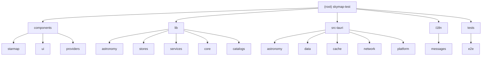

# CLAUDE.md

> **Last Updated:** 2025-01-31
> **Documentation Version:** 1.0.0

This file provides guidance to Claude Code (claude.ai/code) when working with code in this repository.

## Changelog

| Date | Version | Changes |
|------|---------|---------|
| 2025-01-31 | 1.0.0 | Initial comprehensive documentation with module structure diagram |

---

## Project Overview

A desktop star map and astronomy planning application built with **Next.js 16** + **Tauri 2.9**. The app integrates with Stellarium Web Engine for sky visualization and provides tools for observation planning, equipment management, and astronomical calculations.

**Tech Stack:**

- **Frontend:** Next.js 16, React 19, TypeScript, Tailwind CSS v4
- **Desktop:** Tauri 2.9 (Rust backend)
- **UI:** shadcn/ui, Radix UI, Lucide icons
- **State:** Zustand stores
- **i18n:** next-intl (English/Chinese)

---

## Module Structure



---

## Module Index

| Module | Path | Language | Description | Documentation |
|--------|------|----------|-------------|---------------|
| **starmap-ui** | `components/starmap/` | TSX | Star map UI components (core, overlays, planning, objects, management) | [CLAUDE.md](./components/starmap/CLAUDE.md) |
| **astronomy-calculations** | `lib/astronomy/` | TS | Pure astronomical calculations | [CLAUDE.md](./lib/astronomy/CLAUDE.md) |
| **state-management** | `lib/stores/` | TS | Zustand stores (settings, equipment, targets, markers) | [CLAUDE.md](./lib/stores/CLAUDE.md) |
| **rust-backend** | `src-tauri/src/` | Rust | Tauri backend entry point and module orchestration | [CLAUDE.md](./src-tauri/src/CLAUDE.md) |
| **rust-astronomy** | `src-tauri/src/astronomy/` | Rust | Astronomical calculations in Rust | [CLAUDE.md](./src-tauri/src/astronomy/CLAUDE.md) |
| **rust-storage** | `src-tauri/src/data/` | Rust | JSON storage for equipment, locations, targets, markers | [CLAUDE.md](./src-tauri/src/data/CLAUDE.md) |
| **rust-network** | `src-tauri/src/network/` | Rust | HTTP client with security and rate limiting | [CLAUDE.md](./src-tauri/src/network/CLAUDE.md) |
| **rust-cache** | `src-tauri/src/cache/` | Rust | Offline tile caching and unified cache | [CLAUDE.md](./src-tauri/src/cache/CLAUDE.md) |
| **rust-platform** | `src-tauri/src/platform/` | Rust | Desktop-only features (settings, updater, plate solver) | [CLAUDE.md](./src-tauri/src/platform/CLAUDE.md) |
| **frontend-services** | `lib/services/` | TS | Service layer for external APIs | [CLAUDE.md](./lib/services/CLAUDE.md) |
| **catalogs** | `lib/catalogs/` | TS | Astronomical catalog data and types | [CLAUDE.md](./lib/catalogs/CLAUDE.md) |
| **internationalization** | `i18n/` | JSON | English/Chinese translations | [CLAUDE.md](./i18n/CLAUDE.md) |
| **e2e-tests** | `tests/e2e/` | TS | Playwright end-to-end tests | [CLAUDE.md](./tests/e2e/CLAUDE.md) |

---

## Development Commands

```bash
# Frontend
pnpm dev                    # Start Next.js dev server (localhost:3000)
pnpm build                  # Build for production (outputs to out/)
pnpm lint                   # ESLint

# Desktop App (Tauri)
pnpm tauri dev              # Run desktop app with hot-reload
pnpm tauri build            # Build production desktop app

# Testing (Jest - Unit/Integration)
pnpm test                   # Run all tests
pnpm test:watch             # Watch mode
pnpm test:coverage          # With coverage (thresholds: 50% branches, 35% functions, 60% lines/statements)
pnpm test -- path/to/file   # Run specific test file

# Testing (Playwright - E2E)
pnpm exec playwright test                    # Run all E2E tests
pnpm exec playwright test --project=chromium # Single browser
pnpm exec playwright test tests/e2e/starmap/ # Specific directory

# Type checking
pnpm exec tsc --noEmit      # Check TypeScript without emitting

# Add shadcn/ui components
pnpm dlx shadcn@latest add [component-name]
```

**Important Build Note:** For Tauri production builds, Next.js must use static export mode. Ensure `output: "export"` is set in `next.config.ts` as `tauri.conf.json` expects the `out/` directory.

---

## Architecture

### Frontend-Backend Communication

The app uses Tauri's IPC for frontend-backend communication:

1. **Rust commands** are defined in `src-tauri/src/*.rs` modules (equipment, locations, astronomy, etc.)
2. **TypeScript APIs** in `lib/tauri/` wrap Tauri's `invoke()` calls with type safety
3. **Zustand stores** in `lib/stores/` manage client state and sync with Rust backend

```
React Component → Zustand Store → lib/tauri/*-api.ts → Tauri invoke() → Rust command
```

### Key Directories

**`lib/astronomy/`** - Pure astronomical calculations (no side effects):
- `coordinates/` - RA/Dec, Alt/Az, Galactic coordinate conversions
- `time/` - Julian date, sidereal time calculations
- `celestial/` - Sun, Moon position calculations
- `visibility/` - Target visibility, circumpolar calculations
- `twilight/` - Twilight times (civil, nautical, astronomical)
- `imaging/` - Exposure and imaging feasibility calculations

**`lib/stores/`** - Zustand state management:
- `settings-store` - App preferences and UI settings
- `equipment-store` - Telescopes, cameras, eyepieces with built-in presets
- `target-list-store` - Observation targets
- `marker-store` - Custom sky markers
- `onboarding-store` - First-run experience state

**`components/starmap/`** - Star map UI components:
- `canvas/` - Stellarium Web Engine canvas wrapper
- `view/` - Main sky view component
- `search/` - Object search and advanced search
- `settings/` - Settings panels and dialogs
- `controls/` - Zoom, navigation history, bookmarks, keyboard shortcuts
- `time/` - Time control and clock display
- `overlays/` - FOV simulator, satellite tracker, ocular simulator, sky markers
- `planning/` - Altitude charts, exposure calculator, session planning
- `objects/` - Object info panels, detail drawers, image galleries
- `management/` - Equipment, location, cache, and data managers
- `dialogs/` - About, credits, keyboard shortcuts dialogs
- `onboarding/` - Welcome dialog and tour components
- `setup-wizard/` - First-time setup wizard
- `plate-solving/` - Image capture and plate solving
- `feedback/` - Loading skeletons and splash screens
- `mount/` - Telescope mount control
- `map/` - Leaflet-based location picker

**`src-tauri/src/`** - Rust backend modules:
- `storage.rs` - Generic JSON storage system
- `equipment.rs`, `locations.rs` - Equipment and location management
- `astronomy/calculations.rs` - Coordinate transforms, visibility calculations
- `astronomy/events.rs` - Moon phases, meteor showers, astronomical events
- `cache/offline.rs` - Tile caching for sky surveys
- `cache/unified.rs` - General-purpose network cache
- `network/http_client.rs` - HTTP client with retries and progress
- `network/security.rs` - URL validation and SSRF protection
- `network/rate_limiter.rs` - Request rate limiting
- `platform/app_settings.rs` - App settings persistence
- `platform/app_control.rs` - App restart, quit, reload
- `platform/updater.rs` - Auto-update functionality
- `platform/plate_solver.rs` - Plate solving integration
- `observation_log.rs` - Observation logging and history
- `target_list.rs`, `target_io.rs` - Target list management and import/export
- `markers.rs` - Custom sky marker persistence

### Data Storage

- User data stored in platform-specific app data directory (`skymap/stores/`)
- Rust `storage.rs` provides generic JSON store operations
- Frontend syncs state via `TauriSyncProvider` component
- Known stores: `starmap-target-list`, `starmap-markers`, `starmap-settings`, `starmap-equipment`, `starmap-onboarding`, `skymap-offline`, `skymap-locale`

### Internationalization

- Translations in `i18n/messages/{en,zh}.json`
- `next-intl` for i18n with `lib/i18n/locale-store.ts` for persistence
- Use `useTranslations()` hook in components

---

## Path Aliases

```typescript
@/components  → components/
@/lib         → lib/
@/ui          → components/ui/
@/hooks       → hooks/
@/utils       → lib/utils.ts
```

---

## Testing Conventions

- Test files: `__tests__/*.test.ts(x)` or `*.test.ts(x)`
- Uses Jest with React Testing Library
- E2E tests in `tests/e2e/` using Playwright
- Mock Tauri APIs in tests (see `__mocks__/` directory)
- Coverage reports output to `coverage/`

### Coverage Thresholds

- Branches: 50%
- Functions: 35%
- Lines: 60%
- Statements: 60%

---

## Component Patterns

- Use `cn()` from `@/lib/utils` to merge Tailwind classes: `cn("base", conditional && "conditional", className)`
- Prefer composition with `asChild` for polymorphic components (Button as Link, etc.)
- Dark mode via class-based strategy (apply `.dark` class to parent)

---

## Security Features

- **Rate Limiting** - Sliding window algorithm prevents API abuse
- **Input Validation** - Size limits on JSON, CSV, and tile data
- **SSRF Protection** - URL validation blocks private IPs and dangerous protocols
- **Storage Security** - Path sandboxing prevents path traversal attacks

See `src-tauri/src/network/security.rs` for implementation details.

---

## AI Usage Guidelines

### When Working with This Codebase

1. **Respect the module structure** - Keep changes within the appropriate module boundaries
2. **Follow the data flow** - Understand how data flows between frontend stores and Rust backend via Tauri IPC
3. **Write tests** - Add tests for new features, following the existing test patterns
4. **Update documentation** - Keep module-level CLAUDE.md files in sync with code changes

### Common Tasks

| Task | Key Files |
|------|-----------|
| Add new UI component | `components/starmap/[category]/` |
| Add new setting | `lib/stores/settings-store.ts`, `components/starmap/settings/` |
| Add new calculation | `lib/astronomy/` or `src-tauri/src/astronomy/` |
| Add new Tauri command | `src-tauri/src/[module].rs`, `lib/tauri/[module]-api.ts` |
| Add translations | `i18n/messages/en.json`, `i18n/messages/zh.json` |

---

## Scan Coverage

- **Total Files:** ~450
- **Scanned Files:** ~420
- **Coverage:** 93%
- **Ignored:** node_modules, .git, build artifacts

### Known Gaps

- `src-tauri/src/cache/` - No unit tests yet
- `src-tauri/src/platform/` - No unit tests yet

---

## Related Files

- [package.json](./package.json) - Frontend dependencies and scripts
- [src-tauri/Cargo.toml](./src-tauri/Cargo.toml) - Rust dependencies
- [next.config.ts](./next.config.ts) - Next.js configuration
- [jest.config.ts](./jest.config.ts) - Jest test configuration
- [playwright.config.ts](./playwright.config.ts) - Playwright E2E configuration
- [.claude/index.json](./.claude/index.json) - Scan metadata and module index
