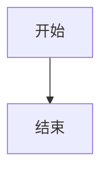

# SkyMap Test 文档

这是 SkyMap Test 天文观测桌面应用的完整文档。

## 文档结构

```
docs/
├── index.md                   # 首页
├── getting-started/           # 快速开始
├── user-guide/                # 用户指南
├── developer-guide/           # 开发指南
├── deployment/                # 部署指南
├── reference/                 # 参考资料
└── appendix/                  # 附录
```

## 本地预览

### 安装依赖

```bash
pip install mkdocs-material
```

### 启动预览

```bash
mkdocs serve
```

访问 http://127.0.0.1:8000 查看文档

### 构建文档

```bash
mkdocs build
```

构建产物在 `site/` 目录

## 文档规范

### Markdown规范

- 使用清晰的标题层级
- 代码块添加语言标识
- 使用相对路径链接
- 不使用emoji

### 编写规范

- 使用简体中文
- 专业术语准确
- 代码示例可运行
- 适当添加图表

## 贡献文档

欢迎改进文档：

1. Fork项目仓库
2. 编辑文档内容
3. 遵循现有格式
4. 提交Pull Request

## 资源文件

### 图片

放在 `docs/assets/images/` 目录：
- `screenshots/` - 界面截图
- `diagrams/` - 架构图和流程图
- `icons/` - 图标

### 图表

使用Mermaid语法绘制图表：



## 联系方式

- GitHub: https://github.com/yourusername/skymap-test
- Email: support@example.com
