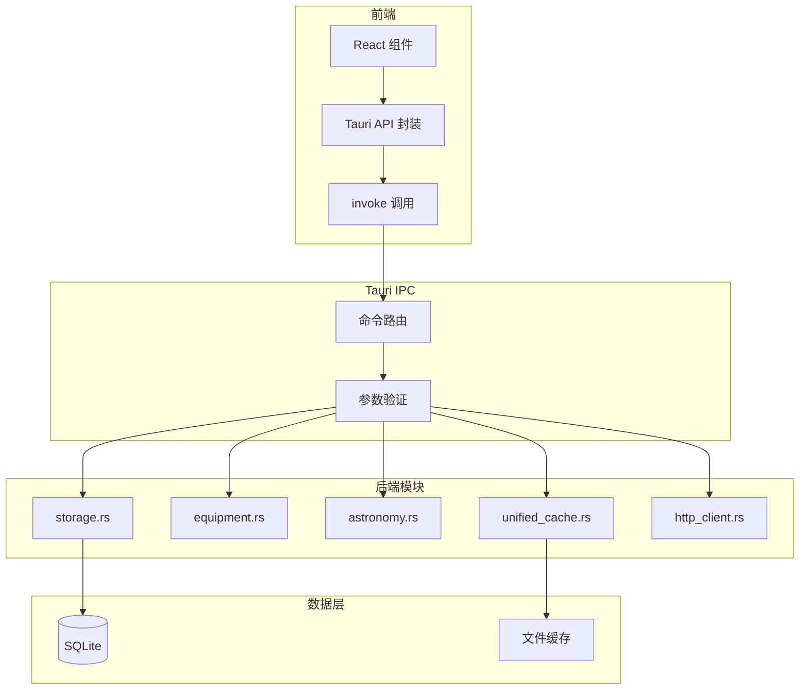

# 后端 API 概览

SkyMap Test 后端基于 Tauri 2.9 和 Rust 构建，提供高性能的桌面应用功能。

## 架构概述



## 模块列表

| 模块 | 文件 | 命令数 | 说明 |
|------|------|--------|------|
| **存储** | `storage.rs` | 9 | 通用数据存储 |
| **设备** | `equipment.rs` | 14 | 望远镜、相机等设备管理 |
| **位置** | `locations.rs` | 7 | 观测位置管理 |
| **观测日志** | `observation_log.rs` | 9 | 观测记录管理 |
| **天文计算** | `astronomy.rs` | 14 | 坐标转换、可见性等 |
| **离线缓存** | `offline_cache.rs` | 10 | HiPS 瓦片缓存 |
| **统一缓存** | `unified_cache.rs` | 10 | 通用缓存系统 |
| **天文事件** | `astro_events.rs` | 5 | 月相、流星雨等 |
| **目标列表** | `target_list.rs` | 17 | 观测目标管理 |
| **标记** | `markers.rs` | 13 | 天空标记管理 |
| **HTTP客户端** | `http_client.rs` | 10 | 安全HTTP请求 |
| **应用设置** | `app_settings.rs` | 9 | 窗口状态、偏好设置 |
| **导入导出** | `target_io.rs` | 2 | 目标列表导入导出 |

**总计: 120+ 个 Tauri 命令**

## API 分类

### 数据管理 API

- **[Tauri 命令](tauri-commands.md)** - 完整的 Tauri 命令参考
  - 存储 API
  - 设备管理 API
  - 位置管理 API
  - 观测日志 API
  - 目标列表 API
  - 标记 API

### 计算 API

- **[天文计算](tauri-commands.md#天文计算-api)** - 坐标转换、可见性计算
- **[天文事件](tauri-commands.md#天文事件-api)** - 月相、流星雨预测

### 基础设施 API

- **[缓存系统](tauri-commands.md#离线缓存-api)** - 离线缓存和统一缓存
- **[HTTP客户端](tauri-commands.md#http-客户端-api)** - 安全的网络请求

## 调用示例

### TypeScript 调用

```typescript
import { invoke } from '@tauri-apps/api/core';

// 直接调用
const result = await invoke<Equipment>('load_equipment');

// 带参数调用
await invoke('add_telescope', {
  telescope: {
    name: 'My Telescope',
    aperture: 200,
    focalLength: 800,
  }
});
```

### 使用封装的 API

```typescript
import { equipmentApi, astronomyApi, targetListApi } from '@/lib/tauri';

// 设备 API
const equipment = await equipmentApi.loadEquipment();
await equipmentApi.addTelescope(telescope);

// 天文计算 API
const { alt, az } = await astronomyApi.equatorialToHorizontal(ra, dec, lat, lon, date);

// 目标列表 API
const targets = await targetListApi.loadTargetList();
await targetListApi.addTarget(target);
```

## 错误处理

所有 Tauri 命令返回 `Result<T, String>`：

```typescript
try {
  const result = await invoke('some_command', { param: value });
} catch (error) {
  // error 是字符串类型的错误信息
  console.error('Command failed:', error);
  toast.error('操作失败', { description: error as string });
}
```

## 安全考虑

### 输入验证

所有命令参数在 Rust 端进行验证：

```rust
#[tauri::command]
pub fn add_telescope(telescope: Telescope) -> Result<Telescope, String> {
    // 验证口径
    if telescope.aperture <= 0.0 {
        return Err("口径必须大于 0".to_string());
    }
    // ...
}
```

### URL 白名单

HTTP 客户端仅允许访问白名单域名：

```rust
const ALLOWED_DOMAINS: &[&str] = &[
    "simbad.u-strasbg.fr",
    "vizier.u-strasbg.fr",
    "alasky.u-strasbg.fr",
    // ...
];
```

### 速率限制

防止 API 滥用：

```rust
// 默认速率限制
const DEFAULT_RATE_LIMIT: RateLimitConfig = RateLimitConfig {
    requests_per_second: 10,
    burst_size: 20,
};
```

## 性能优化

### 缓存策略

- **LRU 缓存** - 内存中的热数据缓存
- **TTL 过期** - 自动清理过期数据
- **磁盘缓存** - HiPS 瓦片持久化

### 批量操作

支持批量处理以提高效率：

```typescript
// 批量添加目标
await targetListApi.addTargetsBatch(targets);

// 批量设置状态
await targetListApi.setTargetsStatusBatch(ids, 'completed');
```

## 相关文档

- **[Tauri 命令详解](tauri-commands.md)** - 完整命令参考
- **[前端 API](../frontend-apis/stores.md)** - Zustand Stores
- **[数据存储](../../data-management/storage.md)** - 存储架构

---

返回：[API参考](../index.md)
