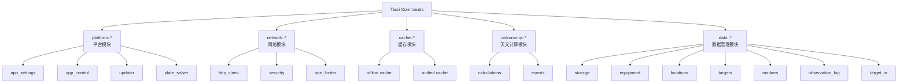

# Tauri 命令 API

本文档介绍 Tauri 后端提供的所有命令 API。

## API 概览

SkyMap Test 后端使用 Rust + Tauri 提供100+命令，按以下模块组织：



## 存储模块 API

### 命令列表

| 命令名 | 功能 | 参数 | 返回值 |
|--------|------|------|--------|
| `save_store_data` | 保存数据 | storeName, data | void |
| `load_store_data` | 加载数据 | storeName | string \| null |
| `delete_store_data` | 删除数据 | storeName | boolean |
| `list_stores` | 列出所有存储 | - | string[] |
| `export_all_data` | 导出所有数据 | exportPath | void |
| `import_all_data` | 导入数据 | importPath | ImportResult |
| `get_data_directory` | 获取数据目录 | - | string |
| `get_storage_stats` | 获取存储统计 | - | StorageStats |
| `clear_all_data` | 清除所有数据 | - | number |

### Rust 实现

**文件**: `src-tauri/src/storage.rs`

```rust
#[tauri::command]
async fn save_store_data(store_name: String, data: String) -> Result<(), String> {
    // 实现数据保存逻辑
    let db = open_database()?;
    db.save(&store_name, &data)?;
    Ok(())
}

#[tauri::command]
async fn load_store_data(store_name: String) -> Result<Option<String>, String> {
    let db = open_database()?;
    let data = db.load(&store_name)?;
    Ok(data)
}
```

### TypeScript 类型定义

```typescript
// lib/tauri/storage-api.ts

export interface StorageStats {
  total_size: number;
  store_count: number;
  stores: StoreInfo[];
  directory: string;
}

export interface ImportResult {
  imported_count: number;
  skipped_count: number;
  errors: string[];
  metadata: ExportMetadata;
}
```

### 前端调用示例

```typescript
import { storageApi } from '@/lib/tauri/storage-api';

// 保存数据
await storageApi.saveStoreData('targets', JSON.stringify(targets));

// 加载数据
const data = await storageApi.loadStoreData('targets');
if (data) {
  const targets = JSON.parse(data);
}

// 获取存储统计
const stats = await storageApi.getStorageStats();
console.log('总大小:', formatBytes(stats.total_size));
```

## 设备管理 API

### 命令列表

| 命令名 | 功能 | 参数 | 返回值 |
|--------|------|------|--------|
| `load_equipment` | 加载设备配置 | - | Equipment |
| `save_equipment` | 保存设备配置 | equipment | void |
| `add_telescope` | 添加望远镜 | telescope | Telescope |
| `update_telescope` | 更新望远镜 | id, data | Telescope |
| `delete_equipment` | 删除设备 | id, type | boolean |
| `set_default_telescope` | 设置默认望远镜 | id | void |
| `get_default_telescope` | 获取默认望远镜 | - | Telescope \| null |

### 数据结构

```typescript
interface Telescope {
  id: string;
  name: string;
  type: 'refractor' | 'reflector' | 'catadioptric';
  aperture: number;      // mm
  focalLength: number;   // mm
  isDefault?: boolean;
}

interface Camera {
  id: string;
  name: string;
  sensorWidth: number;   // mm
  sensorHeight: number;  // mm
  pixelWidth: number;    // μm
  pixelHeight: number;   // μm
  maxGain?: number;
  isDefault?: boolean;
}
```

### 使用示例

```typescript
import { equipmentApi } from '@/lib/tauri/equipment-api';

// 添加望远镜
await equipmentApi.addTelescope({
  id: 'tele-001',
  name: 'Celestron 8SE',
  type: 'catadioptric',
  aperture: 203,
  focalLength: 2032,
  isDefault: true
});

// 获取默认望远镜
const defaultTelescope = await equipmentApi.getDefaultTelescope();
console.log('默认望远镜:', defaultTelescope?.name);
```

## 天文计算 API

### 命令列表

| 命令名 | 功能 | 参数 | 返回值 |
|--------|------|------|--------|
| `equatorial_to_horizontal` | 赤道转地平坐标 | ra, dec, lat, lon | AltAz |
| `horizontal_to_equatorial` | 地平转赤道坐标 | alt, az, lat, lon | RaDec |
| `calculate_visibility` | 计算可见性 | objectId, location, time | Visibility |
| `calculate_twilight` | 计算曙暮光 | date, location | TwilightInfo |
| `calculate_moon_phase` | 计算月相 | date | MoonPhase |
| `calculate_fov` | 计算视野 | telescope, camera | FOVInfo |
| `angular_separation` | 计算角距离 | ra1, dec1, ra2, dec2 | number (degrees) |

### 数据结构

```typescript
interface AltAz {
  alt: number;  // 高度角 (degrees)
  az: number;   // 方位角 (degrees)
}

interface RaDec {
  ra: number;   // 赤经 (degrees)
  dec: number;  // 赤纬 (degrees)
}

interface Visibility {
  visible: boolean;
  riseTime?: Date;
  setTime?: Date;
  maxAlt?: number;
  bestTime?: Date;
}

interface MoonPhase {
  phase: number;        // 0-1 (0=new, 0.5=full, 1=old)
  illumination: number;  // 0-1
  age: number;          // days since new moon
}
```

### 使用示例

```typescript
import { astronomyApi } from '@/lib/tauri/astronomy-api';

// 坐标转换
const altAz = await astronomyApi.equatorialToHorizontal(
  83.633,  // RA (degrees)
  22.014,  // Dec (degrees)
  39.904,  // Latitude
  116.407  // Longitude
);

console.log(`高度角: ${altAz.alt}°, 方位角: ${altAz.az}°`);

// 计算可见性
const visibility = await astronomyApi.calculateVisibility(
  'M31',
  { lat: 39.904, lon: 116.407 },
  new Date()
);

if (visibility.visible) {
  console.log('升起时间:', visibility.riseTime);
  console.log('最高点:', visibility.maxAlt, '°');
}
```

## 离线缓存模块 API

### 命令列表

| 命令名 | 功能 | 参数 | 返回值 |
|--------|------|------|--------|
| `get_cache_stats` | 获取缓存统计 | - | CacheStats |
| `list_cache_regions` | 列出所有缓存区域 | - | CacheRegion[] |
| `create_cache_region` | 创建新缓存区域 | args: CreateRegionArgs | CacheRegion |
| `update_cache_region` | 更新区域状态 | regionId, status?, progress?, sizeBytes? | CacheRegion |
| `delete_cache_region` | 删除缓存区域 | regionId, deleteTiles | void |
| `save_cached_tile` | 保存瓦片到缓存 | surveyId, zoom, x, y, data | void |
| `load_cached_tile` | 从缓存加载瓦片 | surveyId, zoom, x, y | bytes \| null |
| `is_tile_cached` | 检查瓦片是否存在 | surveyId, zoom, x, y | boolean |
| `clear_survey_cache` | 清除特定星图缓存 | surveyId | number |
| `clear_all_cache` | 清除所有缓存数据 | - | number |
| `get_cache_directory` | 获取缓存目录路径 | - | string |

### 数据结构

```typescript
interface CreateRegionArgs {
  name: string;
  center_ra: number;
  center_dec: number;
  radius_deg: number;
  min_zoom: number;
  max_zoom: number;
  survey_id: string;
}

interface CacheRegion {
  id: string;
  name: string;
  center_ra: number;
  center_dec: number;
  radius_deg: number;
  min_zoom: number;
  max_zoom: number;
  survey_id: string;
  tile_count: number;
  size_bytes: number;
  status: 'pending' | 'downloading' | 'paused' | 'completed' | 'failed' | 'cancelled';
  progress: number;
  created_at: string; // ISO Date
  updated_at: string; // ISO Date
}
```

### 使用示例

```typescript
import { cacheApi } from '@/lib/tauri/cache-api';

// 创建新区域
const region = await cacheApi.createRegion(
  'Orion Nebula',
  83.82,   // RA
  -5.39,   // Dec
  2.0,     // Radius deg
  1,       // Min zoom
  12,      // Max zoom
  'dss'    // Survey ID
);
```

## 统一缓存 API

### 命令列表

| 命令名 | 功能 | 参数 | 返回值 |
|--------|------|------|--------|
| `get_unified_cache_entry` | 获取缓存条目 | key | string \| null |
| `put_unified_cache_entry` | 保存缓存条目 | key, value, ttl? | void |
| `delete_unified_cache_entry` | 删除缓存条目 | key | boolean |
| `get_unified_cache_stats` | 获取缓存统计 | - | CacheStats |
| `cleanup_unified_cache` | 清理过期缓存 | - | number (removed count) |
| `prefetch_url` | 预取URL | url | void |
| `prefetch_urls` | 批量预取 | urls[] | void |

### 使用示例

```typescript
import { unifiedCacheApi } from '@/lib/tauri/unified-cache-api';

// 保存到缓存
await unifiedCacheApi.putEntry(
  'object-info:M31',
  JSON.stringify(objectData),
  3600  // TTL: 1小时
);

// 从缓存读取
const cached = await unifiedCacheApi.getEntry('object-info:M31');
if (cached) {
  const data = JSON.parse(cached);
}

// 清理过期缓存
const removed = await unifiedCacheApi.cleanupCache();
console.log(`清理了 ${removed} 个过期条目`);
```

## 天文事件 API

### 命令列表

| 命令名 | 功能 | 参数 | 返回值 |
|--------|------|------|--------|
| `get_moon_phases_for_month` | 获取月相 | year, month | MoonPhase[] |
| `get_meteor_showers` | 获取流星雨 | year, month | MeteorShower[] |
| `get_seasonal_events` | 获取季节性事件 | year | SeasonalEvent[] |
| `get_tonight_highlights` | 今晚亮点 | date, location | Highlight[] |

### 数据结构

```typescript
interface MoonPhase {
  date: Date;
  phase: 'new' | 'waxing-crescent' | 'first-quarter' | 'waxing-gibbous' |
         'full' | 'waning-gibbous' | 'last-quarter' | 'waning-crescent';
  illumination: number;  // 0-1
}

interface MeteorShower {
  name: string;
  peakDate: Date;
  rate: number;  // meteors per hour
  parent: string;  // parent comet
}

interface Highlight {
  objectId: string;
  name: string;
  type: string;
  reason: string;  // 为什么要推荐
  bestTime: Date;
  maxAlt: number;
}
```

## 目标列表 API

### 命令列表

| 命令名 | 功能 | 参数 | 返回值 |
|--------|------|------|--------|
| `load_target_list` | 加载目标列表 | - | Target[] |
| `save_target_list` | 保存目标列表 | targets | void |
| `add_target` | 添加目标 | target | Target |
| `add_targets_batch` | 批量添加 | targets[] | Target[] |
| `update_target` | 更新目标 | id, data | Target |
| `remove_target` | 删除目标 | id | boolean |
| `toggle_target_favorite` | 切换收藏 | id | boolean |
| `set_targets_status_batch` | 批量设置状态 | ids[], status | number |
| `search_targets` | 搜索目标 | query | Target[] |
| `get_target_stats` | 获取统计 | - | TargetStats |

## 标记管理 API

### 命令列表

| 命令名 | 功能 | 参数 | 返回值 |
|--------|------|------|--------|
| `load_markers` | 加载标记 | - | Marker[] |
| `save_markers` | 保存标记 | markers | void |
| `add_marker` | 添加标记 | marker | Marker |
| `update_marker` | 更新标记 | id, data | Marker |
| `remove_marker` | 删除标记 | id | boolean |
| `toggle_marker_visibility` | 切换可见性 | id | boolean |
| `get_visible_markers` | 获取可见标记 | - | Marker[] |

## 错误处理

### Result 类型

所有命令返回 `Result<T, String>`：

```typescript
// 成功
Ok(data)

// 失败
Err(error_message)
```

### 前端错误处理

```typescript
try {
  const result = await invoke('command_name', { param1: value1 });
  // 处理成功结果
} catch (error) {
  // 处理错误
  console.error('命令执行失败:', error);
  toast.error('操作失败', {
    description: error as string
  });
}
```

## 性能考虑

### 异步执行

所有 Tauri 命令都是异步的：

```typescript
// ✅ 使用 await
const result = await invoke('command_name');

// ❌ 不要这样
const result = invoke('command_name');  // 返回 Promise
```

### 批量操作

对于大量操作，使用批量命令：

```typescript
// ✅ 批量添加
await invoke('add_targets_batch', {
  targets: largeArray
});

// ❌ 逐个添加（慢）
for (const target of largeArray) {
  await invoke('add_target', { target });
}
```

## 调试

### 启用日志

在 `src-tauri/src/lib.rs` 中：

```rust
#[cfg(debug_assertions)]
app.handle().plugin(
    tauri_plugin_log::Builder::default()
        .level(log::LevelFilter::Debug)
        .build(),
)?;
```

### 查看日志

**Windows**: `%APPDATA%\SkyMapTest\logs\`
**macOS**: `~/Library/Logs/SkyMapTest/`
**Linux**: `~/.local/state/SkyMapTest/logs/`

## 安全考虑

### 输入验证

后端验证所有输入：

```rust
#[tauri::command]
async fn add_telescope(telescope: Telescope) -> Result<Telescope, String> {
    // 验证数据
    if telescope.aperture <= 0 {
        return Err("口径必须大于0".to_string());
    }
    if telescope.focalLength <= 0 {
        return Err("焦距必须大于0".to_string());
    }

    // 处理逻辑
    Ok(telescope)
}
```

### SQL注入防护

使用参数化查询：

```rust
// ✅ 安全
db.execute(
    "SELECT * FROM telescopes WHERE id = ?",
    params![telescope_id]
)?;

// ❌ 危险
db.execute(&format!(
    "SELECT * FROM telescopes WHERE id = '{}'",
    telescope_id
))?;
```

## 最佳实践

### 1. 使用 TypeScript 类型

定义完整的类型：

```typescript
interface MyCommandParams {
  param1: string;
  param2: number;
}

interface MyCommandResult {
  result1: boolean;
  result2: string;
}

const result = await invoke<MyCommandResult>('my_command', {
  param1: 'value',
  param2: 42
} as MyCommandParams);
```

### 2. 封装 API 调用

创建 API 封装层：

```typescript
// lib/tauri/my-api.ts
export const myApi = {
  async doSomething(param: string): Promise<Result> {
    return invoke('my_command', { param });
  }
};
```

### 3. 错误处理

统一错误处理：

```typescript
export async function handleTauriCommand<T>(
  command: string,
  params?: any
): Promise<T> {
  try {
    return await invoke<T>(command, params);
  } catch (error) {
    const message = error as string;
    toast.error('操作失败', { description: message });
    throw new Error(message);
  }
}
```

## 位置管理 API

### 命令列表

| 命令名 | 功能 | 参数 | 返回值 |
|--------|------|------|--------|
| `load_locations` | 加载位置列表 | - | Location[] |
| `save_locations` | 保存位置列表 | locations | void |
| `add_location` | 添加位置 | location | Location |
| `update_location` | 更新位置 | id, data | Location |
| `delete_location` | 删除位置 | id | boolean |
| `set_current_location` | 设置当前位置 | id | void |
| `get_current_location` | 获取当前位置 | - | Location \| null |

### 数据结构

```typescript
interface Location {
  id: string;
  name: string;
  latitude: number;
  longitude: number;
  altitude: number;
  timezone: string;
  isCurrent?: boolean;
}
```

## 观测日志 API

### 命令列表

| 命令名 | 功能 | 参数 | 返回值 |
|--------|------|------|--------|
| `load_observation_log` | 加载观测日志 | - | ObservationLog |
| `save_observation_log` | 保存观测日志 | log | void |
| `create_session` | 创建观测会话 | session | Session |
| `add_observation` | 添加观测记录 | sessionId, observation | Observation |
| `update_session` | 更新会话 | id, data | Session |
| `end_session` | 结束会话 | id | Session |
| `delete_session` | 删除会话 | id | boolean |
| `get_observation_stats` | 获取统计 | - | ObservationStats |
| `search_observations` | 搜索记录 | query | Observation[] |

### 数据结构

```typescript
interface Session {
  id: string;
  startTime: Date;
  endTime?: Date;
  location: Location;
  conditions: {
    seeing: number;
    transparency: number;
    temperature: number;
    humidity: number;
    notes: string;
  };
  observations: Observation[];
}

interface Observation {
  id: string;
  sessionId: string;
  objectId: string;
  objectName: string;
  timestamp: Date;
  notes: string;
  rating: number;
  equipment?: {
    telescope: string;
    eyepiece?: string;
    camera?: string;
  };
  images?: string[];
}
```

## HTTP 客户端 API

安全的 HTTP 客户端，支持代理、速率限制和请求取消。

### 命令列表

| 命令名 | 功能 | 参数 | 返回值 |
|--------|------|------|--------|
| `get_http_config` | 获取配置 | - | HttpClientConfig |
| `set_http_config` | 设置配置 | config | void |
| `http_request` | 通用请求 | config | HttpResponse |
| `http_get` | GET 请求 | url, headers? | HttpResponse |
| `http_post` | POST 请求 | url, body, headers? | HttpResponse |
| `http_head` | HEAD 请求 | url | HttpResponse |
| `http_download` | 下载文件 | url, path | DownloadResult |
| `http_batch_download` | 批量下载 | urls[], path | BatchDownloadResult |
| `http_cancel_request` | 取消请求 | requestId | boolean |
| `http_cancel_all_requests` | 取消所有请求 | - | number |
| `http_check_url` | 检查 URL 可用性 | url | boolean |

### 数据结构

```typescript
interface HttpClientConfig {
  timeout: number;           // 超时时间 (ms)
  maxRetries: number;        // 最大重试次数
  retryDelay: number;        // 重试延迟 (ms)
  userAgent: string;         // User-Agent
  proxy?: {
    url: string;
    username?: string;
    password?: string;
  };
  rateLimits?: {
    requestsPerSecond: number;
    burstSize: number;
  };
}

interface HttpResponse {
  status: number;
  headers: Record<string, string>;
  body: Uint8Array;
}

interface DownloadProgress {
  downloaded: number;
  total: number | null;
  speed: number;            // bytes/s
}
```

### 使用示例

```typescript
import { httpApi } from '@/lib/tauri';

// GET 请求
const response = await httpApi.get('https://api.example.com/data');
const data = JSON.parse(new TextDecoder().decode(response.body));

// POST 请求
const result = await httpApi.post(
  'https://api.example.com/submit',
  JSON.stringify({ key: 'value' }),
  { 'Content-Type': 'application/json' }
);

// 下载文件
await httpApi.download(
  'https://example.com/large-file.zip',
  '/path/to/save/file.zip'
);

// 配置代理
await httpApi.setConfig({
  proxy: {
    url: 'http://proxy.example.com:8080',
  },
});
```

## 应用设置 API

### 命令列表

| 命令名 | 功能 | 参数 | 返回值 |
|--------|------|------|--------|
| `load_app_settings` | 加载设置 | - | AppSettings |
| `save_app_settings` | 保存设置 | settings | void |
| `save_window_state` | 保存窗口状态 | state | void |
| `restore_window_state` | 恢复窗口状态 | - | WindowState |
| `add_recent_file` | 添加最近文件 | path | void |
| `clear_recent_files` | 清除最近文件 | - | void |
| `get_system_info` | 获取系统信息 | - | SystemInfo |
| `open_path` | 打开路径 | path | void |
| `reveal_in_file_manager` | 在文件管理器中显示 | path | void |

## 目标导入导出 API

### 命令列表

| 命令名 | 功能 | 参数 | 返回值 |
|--------|------|------|--------|
| `export_targets` | 导出目标 | targets, format, path | void |
| `import_targets` | 导入目标 | path | Target[] |

### 支持格式

- **CSV**: 标准逗号分隔格式
- **JSON**: JSON 数组格式
- **Stellarium**: Stellarium 书签格式
- **SkySafari**: SkySafari 观测列表格式

```typescript
// 导出为 CSV
await targetListApi.exportTargets(targets, 'csv', '/path/to/targets.csv');

// 从 Stellarium 导入
const imported = await targetListApi.importTargets('/path/to/bookmarks.json');
```

## 完整命令索引

### 按模块分类

#### platform::app_settings (9 个命令)

- `load_app_settings`, `save_app_settings`
- `save_window_state`, `restore_window_state`
- `add_recent_file`, `clear_recent_files`
- `get_system_info`, `open_path`, `reveal_in_file_manager`

#### platform::app_control (4 个命令)

- `restart_app`, `quit_app`, `reload_webview`, `is_dev_mode`

#### platform::updater (7 个命令)

- `check_for_update`, `download_update`, `install_update`, `download_and_install_update`
- `get_current_version`, `has_pending_update`, `clear_pending_update`

#### platform::plate_solver (14 个命令)

- `detect_plate_solvers`, `get_solver_info`, `validate_solver_path`
- `solve_image_local`, `plate_solve`
- `get_available_indexes`, `get_installed_indexes`, `get_solver_indexes`
- `get_downloadable_indexes`, `get_recommended_indexes`
- `download_index`, `delete_index`, `get_default_index_path`
- `save_solver_config`, `load_solver_config`

#### network::http_client (11 个命令)

- `get_http_config`, `set_http_config`
- `http_request`, `http_get`, `http_post`, `http_head`
- `http_download`, `http_batch_download`
- `cancel_request`, `http_cancel_all_requests`, `get_active_requests`
- `http_check_url`

#### cache::offline (10 个命令)

- `get_cache_stats`, `list_cache_regions`
- `create_cache_region`, `update_cache_region`, `delete_cache_region`
- `save_cached_tile`, `load_cached_tile`, `is_tile_cached`
- `clear_survey_cache`, `clear_all_cache`, `get_cache_directory`

#### cache::unified (10 个命令)

- `get_unified_cache_entry`, `put_unified_cache_entry`, `delete_unified_cache_entry`
- `clear_unified_cache`, `get_unified_cache_size`, `list_unified_cache_keys`
- `get_unified_cache_stats`, `cleanup_unified_cache`
- `prefetch_url`, `prefetch_urls`

#### astronomy::calculations (14 个命令)

- `equatorial_to_horizontal`, `horizontal_to_equatorial`
- `equatorial_to_galactic`, `galactic_to_equatorial`
- `equatorial_to_ecliptic`, `ecliptic_to_equatorial`
- `calculate_visibility`, `calculate_twilight`
- `calculate_moon_phase`, `calculate_moon_position`, `calculate_sun_position`
- `calculate_fov`, `calculate_mosaic_coverage`, `angular_separation`
- `format_ra_hms`, `format_dec_dms`, `parse_ra_hms`, `parse_dec_dms`

#### astronomy::events (5 个命令)

- `get_moon_phases_for_month`, `get_meteor_showers`
- `get_seasonal_events`, `get_astro_events`, `get_tonight_highlights`

#### data::storage (9 个命令)

- `save_store_data`, `load_store_data`, `delete_store_data`
- `list_stores`, `export_all_data`, `import_all_data`
- `get_data_directory`, `get_storage_stats`, `clear_all_data`

#### data::equipment (14 个命令)

- `load_equipment`, `save_equipment`
- `add_telescope`, `update_telescope`, `delete_equipment`
- `add_camera`, `update_camera`
- `add_eyepiece`, `update_eyepiece`
- `add_barlow_reducer`, `update_barlow_reducer`
- `add_filter`, `update_filter`
- `set_default_telescope`, `set_default_camera`
- `get_default_telescope`, `get_default_camera`

#### data::locations (7 个命令)

- `load_locations`, `save_locations`
- `add_location`, `update_location`, `delete_location`
- `set_current_location`, `get_current_location`

#### data::targets (17 个命令)

- `load_target_list`, `save_target_list`
- `add_target`, `add_targets_batch`, `update_target`
- `remove_target`, `remove_targets_batch`
- `set_active_target`, `toggle_target_favorite`, `toggle_target_archive`
- `set_targets_status_batch`, `set_targets_priority_batch`
- `add_tag_to_targets`, `remove_tag_from_targets`
- `archive_completed_targets`, `clear_completed_targets`, `clear_all_targets`
- `search_targets`, `get_target_stats`

#### data::markers (13 个命令)

- `load_markers`, `save_markers`
- `add_marker`, `update_marker`, `remove_marker`
- `remove_markers_by_group`, `clear_all_markers`
- `toggle_marker_visibility`, `set_all_markers_visible`, `set_show_markers`
- `add_marker_group`, `remove_marker_group`, `rename_marker_group`
- `get_visible_markers`

#### data::observation_log (9 个命令)

- `load_observation_log`, `save_observation_log`
- `create_session`, `add_observation`, `update_session`
- `end_session`, `delete_session`
- `get_observation_stats`, `search_observations`

#### data::target_io (2 个命令)

- `export_targets`, `import_targets`

**总计: 130+ 个 Tauri 命令**

## 应用控制 API

### 命令列表

| 命令名 | 功能 | 参数 | 返回值 |
|--------|------|------|--------|
| `restart_app` | 重启应用 | - | void |
| `quit_app` | 退出应用 | exitCode? | void |
| `reload_webview` | 刷新 WebView | - | void |
| `is_dev_mode` | 检查开发模式 | - | boolean |

### TypeScript 类型定义

```typescript
// lib/tauri/app-control-api.ts

// 检查是否在 Tauri 环境
function isTauri(): boolean;

// 重启应用（保存窗口状态）
async function restartApp(): Promise<void>;

// 退出应用
async function quitApp(exitCode?: number): Promise<void>;

// 刷新 WebView（不重启后端）
async function reloadWebview(): Promise<void>;

// 检查是否开发模式
async function isDevMode(): Promise<boolean>;

// 窗口控制
async function closeWindow(): Promise<void>;
async function minimizeWindow(): Promise<void>;
async function toggleMaximizeWindow(): Promise<void>;
async function toggleFullscreen(): Promise<void>;
async function isWindowMaximized(): Promise<boolean>;
```

### 前端调用示例

```typescript
import {
  restartApp,
  quitApp,
  reloadWebview,
  toggleFullscreen,
  isDevMode
} from '@/lib/tauri/app-control-api';

// 重启应用
await restartApp();

// 切换全屏
await toggleFullscreen();

// 检查开发模式
if (await isDevMode()) {
  console.log('运行在开发模式');
}

// 退出应用
await quitApp(0);
```

## 自动更新 API

管理应用自动更新功能（仅桌面端）。

### 命令列表

| 命令名 | 功能 | 参数 | 返回值 |
|--------|------|------|--------|
| `check_for_update` | 检查更新 | - | UpdateStatus |
| `download_update` | 下载更新 | - | UpdateStatus |
| `install_update` | 安装更新 | - | void |
| `download_and_install_update` | 下载并安装 | - | void |
| `get_current_version` | 获取当前版本 | - | string |
| `has_pending_update` | 是否有待安装更新 | - | boolean |
| `clear_pending_update` | 清除待安装更新 | - | void |

### TypeScript 类型定义

```typescript
// lib/tauri/updater-api.ts

interface UpdateInfo {
  version: string;           // 新版本号
  current_version: string;   // 当前版本号
  date: string | null;       // 发布日期
  body: string | null;       // 更新说明
}

interface UpdateProgress {
  downloaded: number;        // 已下载字节数
  total: number | null;      // 总字节数
  percent: number;           // 下载进度百分比
}

type UpdateStatus =
  | { status: 'idle' }
  | { status: 'checking' }
  | { status: 'available'; data: UpdateInfo }
  | { status: 'not_available' }
  | { status: 'downloading'; data: UpdateProgress }
  | { status: 'ready'; data: UpdateInfo }
  | { status: 'error'; data: string };
```

### 前端调用示例

```typescript
import {
  checkForUpdate,
  downloadUpdate,
  installUpdate,
  onUpdateProgress,
  isUpdateAvailable,
  formatProgress
} from '@/lib/tauri/updater-api';

// 检查更新
const status = await checkForUpdate();

if (isUpdateAvailable(status)) {
  console.log(`发现新版本: ${status.data.version}`);

  // 监听下载进度
  const unlisten = await onUpdateProgress((progress) => {
    if (progress.status === 'downloading') {
      console.log(formatProgress(progress.data));
    }
  });

  // 开始下载
  await downloadUpdate();

  // 安装更新（会重启应用）
  await installUpdate();
}
```

### 更新事件

```typescript
// 监听更新进度事件
import { listen } from '@tauri-apps/api/event';

const unlisten = await listen<UpdateStatus>('update-progress', (event) => {
  switch (event.payload.status) {
    case 'downloading':
      console.log(`下载进度: ${event.payload.data.percent}%`);
      break;
    case 'ready':
      console.log('更新已就绪，准备安装');
      break;
    case 'error':
      console.error('更新失败:', event.payload.data);
      break;
  }
});
```

## 地理定位 API（移动端）

移动平台专用的设备定位 API。

### 平台支持

| 平台 | 支持状态 |
|------|----------|
| Android | ✅ 支持 |
| iOS | ✅ 支持 |
| Windows/macOS/Linux | ❌ 不支持 |

### TypeScript 类型定义

```typescript
// lib/tauri/geolocation-api.ts

interface Position {
  coords: {
    latitude: number;         // 纬度
    longitude: number;        // 经度
    accuracy: number;         // 精度（米）
    altitude: number | null;  // 海拔（米）
    altitudeAccuracy: number | null;
    heading: number | null;   // 方向（度）
    speed: number | null;     // 速度（米/秒）
  };
  timestamp: number;          // 时间戳
}

interface PositionOptions {
  enableHighAccuracy: boolean;  // 启用高精度
  timeout: number;              // 超时时间（毫秒）
  maximumAge: number;           // 缓存时间（毫秒）
}

type PermissionState = 'granted' | 'denied' | 'prompt' | 'prompt-with-rationale';

interface PermissionStatus {
  location: PermissionState;
  coarseLocation: PermissionState;
}
```

### API 方法

```typescript
const geolocationApi = {
  // 检查是否可用
  isAvailable(): boolean;

  // 检查权限状态
  checkPermissions(): Promise<PermissionStatus>;

  // 请求权限
  requestPermissions(permissions?: ('location' | 'coarseLocation')[]): Promise<PermissionStatus>;

  // 获取当前位置
  getCurrentPosition(options?: PositionOptions): Promise<Position>;

  // 监听位置变化
  watchPosition(options, callback): Promise<WatchId>;

  // 停止监听
  clearWatch(watchId: WatchId): Promise<void>;

  // 一键获取位置（自动处理权限）
  getPositionWithPermission(options?: PositionOptions): Promise<Position | null>;
};
```

### 前端调用示例

```typescript
import { geolocationApi } from '@/lib/tauri/geolocation-api';

// 检查是否可用
if (geolocationApi.isAvailable()) {
  // 获取位置（自动处理权限）
  const position = await geolocationApi.getPositionWithPermission({
    enableHighAccuracy: true,
    timeout: 10000,
    maximumAge: 0
  });

  if (position) {
    console.log(`纬度: ${position.coords.latitude}`);
    console.log(`经度: ${position.coords.longitude}`);
    console.log(`精度: ${position.coords.accuracy}米`);
  }
}

// 持续监听位置变化
const watchId = await geolocationApi.watchPosition(
  { enableHighAccuracy: true },
  (position, error) => {
    if (error) {
      console.error('定位错误:', error);
    } else if (position) {
      updateLocationOnMap(position.coords);
    }
  }
);

// 停止监听
await geolocationApi.clearWatch(watchId);
```

## 相关文档

- [前端API: Stores](../frontend-apis/stores.md) - 状态管理
- [前端API: Hooks](../frontend-apis/hooks.md) - React Hooks
- [后端模块架构](../../../src-tauri/src/CLAUDE.md) - Rust 模块结构
- [后端开发](../../backend-development/index.md)
- [数据存储](../../data-management/storage.md)

## 前端 API 封装文件

所有 Tauri 命令都有对应的 TypeScript API 封装，位于 `lib/tauri/` 目录：

| 模块 | 封装文件 | 说明 |
|------|---------|------|
| `platform::*` | `app-control-api.ts`, `updater-api.ts` | 应用控制和更新 |
| `platform::plate_solver` | `plate-solver-api.ts` | 天文定位求解 |
| `network::*` | `http-fetch.ts` | HTTP 客户端 |
| `cache::*` | (集成在各功能模块) | 缓存管理 |
| `astronomy::*` | `astronomy-api.ts` | 天文计算 |
| `data::storage` | `storage-api.ts` | 通用存储 |
| `data::equipment` | `equipment-api.ts` | 设备管理 |
| `data::locations` | `locations-api.ts` | 位置管理 |
| `data::targets` | `target-list-api.ts` | 目标列表 |
| `data::markers` | `markers-api.ts` | 标记管理 |
| `data::observation_log` | (待添加) | 观测日志 |

### 使用示例

```typescript
// 平台命令
import { restartApp, quitApp } from '@/lib/tauri/app-control-api';

// 天文定位
import { plateSolverApi } from '@/lib/tauri/plate-solver-api';
const solvers = await plateSolverApi.detectPlateSolvers();

// HTTP 请求
import { httpGet } from '@/lib/tauri/http-fetch';
const response = await httpGet('https://api.example.com/data');

// 存储
import { storageApi } from '@/lib/tauri/storage-api';
await storageApi.saveStoreData('my-store', JSON.stringify(data));
```

---

返回：[API参考](../index.md)
