# React Hooks API

SkyMap Test 提供了一系列自定义 React Hooks，封装常用的业务逻辑。

## Hooks 概览

```mermaid
graph TD
    A[React Hooks] --> B[设备 Hooks]
    A --> C[搜索 Hooks]
    A --> D[规划 Hooks]
    A --> E[翻译 Hooks]
    A --> F[缓存 Hooks]
    A --> G[HTTP Hooks]
    A --> H[导航 Hooks]
    A --> I[动画 Hooks]
    A --> J[更新 Hooks]

    B --> B1[useGeolocation]
    B --> B2[useDeviceOrientation]
    B --> B3[useOrientation]

    C --> C1[useObjectSearch]
    C --> C2[useCelestialName]

    D --> D1[useTonightRecommendations]
    D --> D2[useTargetPlanner]

    E --> E1[useCelestialNames]
    E --> E2[useSkyCultureLanguage]

    F --> F1[useCacheInit]

    G --> G1[useHttpClient]
    G --> G2[useFetch]

    H --> H1[useNavigationHistory]
    H --> H2[useKeyboardShortcuts]

    I --> I1[useAnimationFrame]
    I --> I2[useThrottledUpdate]
    I --> I3[useGlobalAnimationLoop]

    J --> J1[useUpdater]
    J --> J2[useAutoUpdater]
```



### Hooks 列表

| Hook | 文件 | 说明 |
|------|------|------|
| `useGeolocation` | `use-geolocation.ts` | 获取用户地理位置 |
| `useDeviceOrientation` | `use-device-orientation.ts` | 设备方向传感器 |
| `useOrientation` | `use-orientation.ts` | 屏幕方向检测 |
| `useObjectSearch` | `use-object-search.ts` | 天体搜索 |
| `useCelestialName` | `use-celestial-name.ts` | 天体名称翻译 |
| `useTonightRecommendations` | `use-tonight-recommendations.ts` | 今晚观测推荐 |
| `useTargetPlanner` | `use-target-planner.ts` | 目标规划器 |
| `useCacheInit` | `use-cache-init.ts` | 缓存初始化 |
| `useHttpClient` | `use-http-client.ts` | HTTP 客户端 |
| `useFetch` | `use-http-client.ts` | 数据获取 |
| `useNavigationHistory` | `use-navigation-history.ts` | 导航历史 |
| `useKeyboardShortcuts` | `use-keyboard-shortcuts.ts` | 键盘快捷键 |
| `useAnimationFrame` | `use-animation-frame.ts` | 动画帧 |
| `useThrottledUpdate` | `use-animation-frame.ts` | 节流更新 |
| `useUpdater` | `lib/tauri/updater-hooks.ts` | 应用更新 |

## 设备 Hooks

### useGeolocation

获取用户地理位置，支持高精度定位和自动更新。

**文件**: `lib/hooks/use-geolocation.ts`

```typescript
interface UseGeolocationOptions {
  enableHighAccuracy?: boolean;  // 高精度模式
  timeout?: number;              // 超时时间 (ms)
  maximumAge?: number;           // 缓存时间 (ms)
  watchPosition?: boolean;       // 持续监听
}

interface GeolocationState {
  latitude: number | null;
  longitude: number | null;
  altitude: number | null;
  accuracy: number | null;
  loading: boolean;
  error: GeolocationPositionError | null;
  timestamp: number | null;
}

function useGeolocation(options?: UseGeolocationOptions): UseGeolocationReturn;
```

**使用示例**:

```typescript
import { useGeolocation } from '@/lib/hooks';

function LocationDisplay() {
  const { latitude, longitude, loading, error, refresh } = useGeolocation({
    enableHighAccuracy: true,
    timeout: 10000,
  });

  if (loading) return <div>获取位置中...</div>;
  if (error) return <div>定位失败: {error.message}</div>;

  return (
    <div>
      <p>纬度: {latitude?.toFixed(4)}°</p>
      <p>经度: {longitude?.toFixed(4)}°</p>
      <Button onClick={refresh}>刷新位置</Button>
    </div>
  );
}
```

**辅助函数**:

```typescript
// 获取位置，支持 Tauri 和浏览器回退
import { getLocationWithFallback } from '@/lib/hooks';

const position = await getLocationWithFallback();
```

### useDeviceOrientation

获取设备方向传感器数据，支持指向天空计算。

**文件**: `lib/hooks/use-device-orientation.ts`

```typescript
interface DeviceOrientation {
  alpha: number | null;   // 绕 Z 轴旋转 (0-360)
  beta: number | null;    // 绕 X 轴旋转 (-180 to 180)
  gamma: number | null;   // 绕 Y 轴旋转 (-90 to 90)
  absolute: boolean;
}

interface SkyDirection {
  azimuth: number;        // 方位角 (0-360, 北=0)
  altitude: number;       // 高度角 (-90 to 90)
}

function useDeviceOrientation(): {
  orientation: DeviceOrientation;
  skyDirection: SkyDirection | null;
  isSupported: boolean;
  requestPermission: () => Promise<boolean>;
};
```

**使用示例**:

```typescript
import { useDeviceOrientation } from '@/lib/hooks';

function CompassView() {
  const { orientation, skyDirection, isSupported, requestPermission } = 
    useDeviceOrientation();

  if (!isSupported) {
    return <div>设备不支持方向传感器</div>;
  }

  return (
    <div>
      <p>指向天空: Alt {skyDirection?.altitude.toFixed(1)}°, 
         Az {skyDirection?.azimuth.toFixed(1)}°</p>
      <Button onClick={requestPermission}>请求权限</Button>
    </div>
  );
}
```

## 搜索 Hooks

### useObjectSearch

天体搜索 Hook，支持模糊搜索、筛选和排序。

**文件**: `lib/hooks/use-object-search.ts`

```typescript
type ObjectType = 
  | 'star' | 'galaxy' | 'nebula' | 'cluster' 
  | 'planet' | 'moon' | 'comet' | 'asteroid'
  | 'double_star' | 'variable_star';

type SortOption = 
  | 'relevance' | 'magnitude' | 'altitude' 
  | 'name' | 'type' | 'size';

type SearchMode = 'fuzzy' | 'exact' | 'prefix';

interface UseObjectSearchOptions {
  objectTypes?: ObjectType[];
  minMagnitude?: number;
  maxMagnitude?: number;
  minAltitude?: number;
  sortBy?: SortOption;
  searchMode?: SearchMode;
  limit?: number;
}

function useObjectSearch(
  query: string,
  options?: UseObjectSearchOptions
): {
  results: SearchResult[];
  loading: boolean;
  error: Error | null;
  totalCount: number;
  hasMore: boolean;
  loadMore: () => void;
};
```

**使用示例**:

```typescript
import { useObjectSearch, getDetailedMatch } from '@/lib/hooks';

function SearchPanel() {
  const [query, setQuery] = useState('');
  
  const { results, loading, totalCount } = useObjectSearch(query, {
    objectTypes: ['galaxy', 'nebula', 'cluster'],
    minAltitude: 30,
    sortBy: 'altitude',
    limit: 50,
  });

  return (
    <div>
      <Input 
        value={query} 
        onChange={(e) => setQuery(e.target.value)}
        placeholder="搜索天体..."
      />
      
      {loading && <Spinner />}
      
      <p>找到 {totalCount} 个结果</p>
      
      {results.map(result => (
        <SearchResultItem 
          key={result.id} 
          result={result}
          match={getDetailedMatch(result, query)}
        />
      ))}
    </div>
  );
}
```

### useCelestialName

获取天体的本地化名称。

**文件**: `lib/hooks/use-celestial-name.ts`

```typescript
function useCelestialName(
  objectId: string,
  options?: { fallback?: string }
): string;

function useCelestialNames(
  objectIds: string[]
): Record<string, string>;

function useCelestialNameWithOriginal(
  objectId: string
): { translated: string; original: string };

function useSkyCultureLanguage(): {
  language: SkyCultureLanguage;
  setLanguage: (lang: SkyCultureLanguage) => void;
  availableLanguages: SkyCultureLanguage[];
};

type SkyCultureLanguage = 'latin' | 'english' | 'chinese' | 'native';
```

**使用示例**:

```typescript
import { 
  useCelestialName, 
  useCelestialNameWithOriginal,
  useSkyCultureLanguage 
} from '@/lib/hooks';

function ObjectName({ objectId }: { objectId: string }) {
  const name = useCelestialName(objectId);
  return <span>{name}</span>;
}

function ObjectNameWithOriginal({ objectId }: { objectId: string }) {
  const { translated, original } = useCelestialNameWithOriginal(objectId);
  
  return (
    <div>
      <span className="font-bold">{translated}</span>
      {translated !== original && (
        <span className="text-muted-foreground ml-2">({original})</span>
      )}
    </div>
  );
}

function LanguageSelector() {
  const { language, setLanguage, availableLanguages } = useSkyCultureLanguage();
  
  return (
    <Select value={language} onValueChange={setLanguage}>
      {availableLanguages.map(lang => (
        <SelectItem key={lang} value={lang}>{lang}</SelectItem>
      ))}
    </Select>
  );
}
```

## 规划 Hooks

### useTonightRecommendations

获取今晚的观测目标推荐。

**文件**: `lib/hooks/use-tonight-recommendations.ts`

```typescript
interface RecommendedTarget {
  id: string;
  name: string;
  type: string;
  ra: number;
  dec: number;
  magnitude: number;
  size?: number;
  score: number;           // 推荐分数 0-100
  reasons: string[];       // 推荐原因
  bestTime: Date;          // 最佳观测时间
  visibleWindow: {
    start: Date;
    end: Date;
    maxAltitude: number;
  };
}

interface TonightConditions {
  moonPhase: number;
  moonIllumination: number;
  twilight: TwilightInfo;
  weatherSuitable: boolean;
}

interface TwilightInfo {
  sunset: Date;
  civilDusk: Date;
  nauticalDusk: Date;
  astronomicalDusk: Date;
  astronomicalDawn: Date;
  nauticalDawn: Date;
  civilDawn: Date;
  sunrise: Date;
}

function useTonightRecommendations(options?: {
  location?: { lat: number; lon: number };
  date?: Date;
  equipment?: EquipmentConfig;
  preferences?: {
    objectTypes?: string[];
    minAltitude?: number;
    avoidMoon?: boolean;
    maxMagnitude?: number;
  };
}): {
  recommendations: RecommendedTarget[];
  conditions: TonightConditions;
  loading: boolean;
  error: Error | null;
  refresh: () => void;
};
```

**使用示例**:

```typescript
import { useTonightRecommendations } from '@/lib/hooks';

function TonightPanel() {
  const { 
    recommendations, 
    conditions, 
    loading,
    refresh 
  } = useTonightRecommendations({
    preferences: {
      objectTypes: ['galaxy', 'nebula'],
      minAltitude: 40,
      avoidMoon: true,
    },
  });

  return (
    <div>
      <div className="flex justify-between">
        <h2>今晚推荐</h2>
        <Button onClick={refresh}>刷新</Button>
      </div>
      
      <div className="text-sm text-muted-foreground">
        月相: {(conditions.moonIllumination * 100).toFixed(0)}%
        天文昏影: {format(conditions.twilight.astronomicalDusk, 'HH:mm')}
      </div>

      {loading ? (
        <Spinner />
      ) : (
        <div className="space-y-2">
          {recommendations.map(target => (
            <RecommendationCard key={target.id} target={target} />
          ))}
        </div>
      )}
    </div>
  );
}
```

### useTargetPlanner

目标规划器，计算可见性和最佳观测时段。

**文件**: `lib/hooks/use-target-planner.ts`

```typescript
interface TargetVisibility {
  targetId: string;
  isVisible: boolean;
  riseTime: Date | null;
  setTime: Date | null;
  transitTime: Date;
  maxAltitude: number;
  currentAltitude: number;
  isCircumpolar: boolean;
  neverRises: boolean;
}

interface SessionPlan {
  targets: TargetScheduleSlot[];
  totalDuration: number;
  conflicts: SessionConflict[];
  efficiency: number;
}

interface TargetScheduleSlot {
  targetId: string;
  startTime: Date;
  endTime: Date;
  priority: number;
  altitude: number;
}

interface SessionConflict {
  type: 'overlap' | 'twilight' | 'moon' | 'altitude';
  targetIds: string[];
  message: string;
}

function useTargetPlanner(targets: Target[], options?: {
  location?: { lat: number; lon: number };
  date?: Date;
  sessionStart?: Date;
  sessionEnd?: Date;
  constraints?: {
    minAltitude?: number;
    twilightLimit?: 'civil' | 'nautical' | 'astronomical';
    moonDistance?: number;
  };
}): {
  visibility: Map<string, TargetVisibility>;
  plan: SessionPlan | null;
  optimizePlan: () => void;
  reorderTargets: (order: string[]) => void;
  loading: boolean;
  error: Error | null;
};
```

**使用示例**:

```typescript
import { useTargetPlanner } from '@/lib/hooks';

function SessionPlanner({ targets }: { targets: Target[] }) {
  const { 
    visibility, 
    plan, 
    optimizePlan,
    loading 
  } = useTargetPlanner(targets, {
    constraints: {
      minAltitude: 30,
      twilightLimit: 'astronomical',
      moonDistance: 30,
    },
  });

  return (
    <div>
      <Button onClick={optimizePlan} disabled={loading}>
        优化观测顺序
      </Button>

      {plan && (
        <div>
          <p>总时长: {Math.round(plan.totalDuration / 60)} 分钟</p>
          <p>效率: {(plan.efficiency * 100).toFixed(0)}%</p>
          
          {plan.conflicts.length > 0 && (
            <Alert variant="warning">
              {plan.conflicts.map((c, i) => (
                <p key={i}>{c.message}</p>
              ))}
            </Alert>
          )}
          
          <Timeline slots={plan.targets} />
        </div>
      )}
    </div>
  );
}
```

## 缓存 Hooks

### useCacheInit

初始化缓存系统。

**文件**: `lib/hooks/use-cache-init.ts`

```typescript
function useCacheInit(): {
  isInitialized: boolean;
  isLoading: boolean;
  error: Error | null;
  stats: CacheStats | null;
  reinitialize: () => Promise<void>;
};

interface CacheStats {
  totalSize: number;
  entryCount: number;
  hitRate: number;
  lastCleanup: Date | null;
}
```

**使用示例**:

```typescript
import { useCacheInit } from '@/lib/hooks';

function App() {
  const { isInitialized, isLoading, stats } = useCacheInit();

  if (isLoading) {
    return <SplashScreen message="初始化缓存..." />;
  }

  if (!isInitialized) {
    return <ErrorScreen message="缓存初始化失败" />;
  }

  return <MainApp />;
}
```

## HTTP Hooks

### useHttpClient

完整的 HTTP 客户端 Hook，支持 Tauri 和浏览器环境。

**文件**: `lib/hooks/use-http-client.ts`

```typescript
interface UseHttpClientOptions {
  baseUrl?: string;              // 基础 URL
  timeout?: number;              // 超时时间
  defaultHeaders?: Record<string, string>;
  allowHttp?: boolean;           // 允许 HTTP
}

interface UseHttpClientReturn {
  get: <T>(url: string, options?: FetchOptions) => Promise<T>;
  post: <T>(url: string, body?: unknown, options?: FetchOptions) => Promise<T>;
  put: <T>(url: string, body?: unknown, options?: FetchOptions) => Promise<T>;
  del: <T>(url: string, options?: FetchOptions) => Promise<T>;
  download: (url: string, onProgress?: (progress: DownloadProgress) => void) => Promise<FetchResponse>;
  batchDownload: (urls: string[], options?: { concurrency?: number }) => Promise<{ success: number; failed: number }>;
  checkUrl: (url: string) => Promise<boolean>;
  cancel: () => void;
  cancelAll: () => void;
  state: HttpRequestState;
  isTauriEnv: boolean;
}
```

**使用示例**:

```typescript
import { useHttpClient } from '@/lib/hooks';

function DataFetcher() {
  const { get, post, state, cancel } = useHttpClient({
    baseUrl: 'https://api.example.com',
    timeout: 10000,
  });

  const fetchData = async () => {
    try {
      const data = await get<MyData>('/endpoint');
      console.log(data);
    } catch (error) {
      console.error('请求失败:', error);
    }
  };

  return (
    <div>
      {state.loading && <Spinner />}
      <Button onClick={fetchData}>获取数据</Button>
      <Button onClick={cancel}>取消</Button>
    </div>
  );
}
```

### useFetch

简化的数据获取 Hook，支持自动请求。

```typescript
function useFetch<T = unknown>(
  url: string | null,
  options?: UseHttpClientOptions & { enabled?: boolean }
): {
  data: T | null;
  loading: boolean;
  error: Error | null;
  refetch: () => Promise<T | null>;
};
```

**使用示例**:

```typescript
import { useFetch } from '@/lib/hooks';

function UserProfile({ userId }: { userId: string }) {
  const { data, loading, error, refetch } = useFetch<User>(
    `/api/users/${userId}`,
    { enabled: !!userId }
  );

  if (loading) return <Spinner />;
  if (error) return <ErrorMessage error={error} />;
  if (!data) return null;

  return (
    <div>
      <h1>{data.name}</h1>
      <Button onClick={refetch}>刷新</Button>
    </div>
  );
}
```

## 导航 Hooks

### useNavigationHistory

管理星图视图的导航历史，支持后退/前进。

**文件**: `lib/hooks/use-navigation-history.ts`

```typescript
interface NavigationPoint {
  id: string;
  ra: number;
  dec: number;
  fov: number;
  name?: string;
  timestamp: number;
}

function useNavigationHistory(): {
  history: NavigationPoint[];
  currentIndex: number;
  historyCount: number;
  push: (point: Omit<NavigationPoint, 'id' | 'timestamp'>) => void;
  pushWithDebounce: (point: Omit<NavigationPoint, 'id' | 'timestamp'>) => void;
  back: () => NavigationPoint | null;
  forward: () => NavigationPoint | null;
  canGoBack: () => boolean;
  canGoForward: () => boolean;
  clear: () => void;
  getCurrent: () => NavigationPoint | null;
};
```

**使用示例**:

```typescript
import { useNavigationHistory, formatNavigationPoint } from '@/lib/hooks';

function NavigationControls() {
  const {
    back,
    forward,
    canGoBack,
    canGoForward,
    history
  } = useNavigationHistory();

  const handleBack = () => {
    const point = back();
    if (point) {
      stellariumStore.setViewDirection(point.ra, point.dec);
      stellariumStore.setFov(point.fov);
    }
  };

  return (
    <div>
      <Button onClick={handleBack} disabled={!canGoBack()}>
        ← 后退
      </Button>
      <Button onClick={() => forward()} disabled={!canGoForward()}>
        前进 →
      </Button>
      <DropdownMenu>
        {history.map(point => (
          <DropdownItem key={point.id}>
            {formatNavigationPoint(point)}
          </DropdownItem>
        ))}
      </DropdownMenu>
    </div>
  );
}
```

### useKeyboardShortcuts

全局键盘快捷键管理。

**文件**: `lib/hooks/use-keyboard-shortcuts.ts`

```typescript
interface KeyboardShortcut {
  key: string;
  ctrl?: boolean;
  shift?: boolean;
  alt?: boolean;
  meta?: boolean;
  description: string;
  action: () => void;
  ignoreInputs?: boolean;  // 输入框聚焦时忽略（默认 true）
}

function useKeyboardShortcuts(options: {
  shortcuts: KeyboardShortcut[];
  enabled?: boolean;
}): void;
```

**预定义快捷键**:

```typescript
const STARMAP_SHORTCUT_KEYS = {
  // 导航
  ZOOM_IN: '+',
  ZOOM_OUT: '-',
  RESET_VIEW: 'r',
  CENTER_VIEW: 'c',

  // 面板
  TOGGLE_SEARCH: 'f',
  TOGGLE_SETTINGS: ',',
  TOGGLE_FOV: 'o',

  // 显示
  TOGGLE_CONSTELLATIONS: 'l',
  TOGGLE_GRID: 'g',
  TOGGLE_DSO: 'd',

  // 时间
  PAUSE_TIME: ' ', // 空格
  SPEED_UP: ']',
  SLOW_DOWN: '[',
  RESET_TIME: 't',
};
```

**使用示例**:

```typescript
import {
  useKeyboardShortcuts,
  STARMAP_SHORTCUT_KEYS,
  formatShortcut
} from '@/lib/hooks';

function StarmapView() {
  const shortcuts = useMemo(() => [
    {
      key: STARMAP_SHORTCUT_KEYS.ZOOM_IN,
      description: '放大',
      action: () => zoomIn(),
    },
    {
      key: STARMAP_SHORTCUT_KEYS.TOGGLE_SEARCH,
      description: '打开搜索',
      action: () => setSearchOpen(true),
    },
    {
      key: 's',
      ctrl: true,
      description: '保存设置',
      action: () => saveSettings(),
    },
  ], []);

  useKeyboardShortcuts({ shortcuts, enabled: true });

  return <StarmapCanvas />;
}
```

## 动画 Hooks

### useAnimationFrame

高性能动画帧 Hook，支持 FPS 控制。

**文件**: `lib/hooks/use-animation-frame.ts`

```typescript
interface AnimationFrameOptions {
  fps?: number;           // 目标 FPS（默认 60）
  enabled?: boolean;      // 是否启用
  callback: (deltaTime: number, timestamp: number) => void;
}

function useAnimationFrame(options: AnimationFrameOptions): void;
```

**使用示例**:

```typescript
import { useAnimationFrame } from '@/lib/hooks';

function AnimatedComponent() {
  const [rotation, setRotation] = useState(0);

  useAnimationFrame({
    fps: 30,
    callback: (deltaTime) => {
      setRotation(r => r + deltaTime * 0.01);
    },
  });

  return (
    <div style={{ transform: `rotate(${rotation}deg)` }}>
      旋转元素
    </div>
  );
}
```

### useThrottledUpdate

节流更新 Hook，适合不需要平滑动画的定期更新。

```typescript
function useThrottledUpdate(
  callback: () => void,
  intervalMs: number,
  enabled?: boolean
): void;
```

**使用示例**:

```typescript
import { useThrottledUpdate } from '@/lib/hooks';

function TimeDisplay() {
  const [time, setTime] = useState(new Date());

  useThrottledUpdate(() => {
    setTime(new Date());
  }, 1000, true);

  return <div>{time.toLocaleTimeString()}</div>;
}
```

### useGlobalAnimationLoop

订阅全局动画循环，多个组件共享一个 RAF 循环。

```typescript
function useGlobalAnimationLoop(
  id: string,
  callback: (deltaTime: number, timestamp: number) => void,
  enabled?: boolean
): void;
```

**使用示例**:

```typescript
import { useGlobalAnimationLoop } from '@/lib/hooks';

function MultipleAnimations() {
  useGlobalAnimationLoop('stars', (dt) => {
    updateStarPositions(dt);
  });

  useGlobalAnimationLoop('satellites', (dt) => {
    updateSatellitePositions(dt);
  });

  return <Canvas />;
}
```

## 更新 Hooks

### useUpdater

应用更新管理 Hook（仅桌面端）。

**文件**: `lib/tauri/updater-hooks.ts`

**API 导出**: `lib/tauri/index.ts` → `useUpdater`, `useAutoUpdater`

```typescript
interface UseUpdaterOptions {
  autoCheck?: boolean;       // 自动检查
  checkInterval?: number;    // 检查间隔（毫秒）
  onUpdateAvailable?: (info: UpdateInfo) => void;
  onUpdateReady?: (info: UpdateInfo) => void;
  onError?: (error: string) => void;
}

interface UseUpdaterReturn {
  status: UpdateStatus;
  currentVersion: string | null;
  isChecking: boolean;
  isDownloading: boolean;
  isReady: boolean;
  hasUpdate: boolean;
  updateInfo: UpdateInfo | null;
  progress: UpdateProgress | null;
  error: string | null;
  checkForUpdate: () => Promise<void>;
  downloadUpdate: () => Promise<void>;
  installUpdate: () => Promise<void>;
  downloadAndInstall: () => Promise<void>;
  dismissUpdate: () => void;
}
```

**使用示例**:

```typescript
import { useUpdater, useAutoUpdater } from '@/lib/tauri/updater-hooks';

function UpdatePanel() {
  const {
    hasUpdate,
    updateInfo,
    progress,
    isDownloading,
    checkForUpdate,
    downloadAndInstall,
    dismissUpdate,
  } = useUpdater({
    onUpdateAvailable: (info) => {
      toast.info(`发现新版本 ${info.version}`);
    },
  });

  return (
    <div>
      <Button onClick={checkForUpdate}>检查更新</Button>

      {hasUpdate && updateInfo && (
        <Card>
          <h3>新版本 {updateInfo.version}</h3>
          <p>{updateInfo.body}</p>

          {isDownloading ? (
            <Progress value={progress?.percent ?? 0} />
          ) : (
            <div>
              <Button onClick={downloadAndInstall}>
                下载并安装
              </Button>
              <Button variant="ghost" onClick={dismissUpdate}>
                稍后提醒
              </Button>
            </div>
          )}
        </Card>
      )}
    </div>
  );
}

// 自动检查更新
function App() {
  const { hasUpdate } = useAutoUpdater({
    checkInterval: 3600000, // 每小时检查
  });

  return (
    <div>
      {hasUpdate && <UpdateBadge />}
      <MainContent />
    </div>
  );
}
```

## 最佳实践

### 1. 条件调用

React Hooks 不能条件调用，使用 enabled 参数：

```typescript
// ❌ 错误
if (shouldSearch) {
  const results = useObjectSearch(query);
}

// ✅ 正确
const results = useObjectSearch(query, {
  enabled: shouldSearch,
});
```

### 2. 依赖优化

避免不必要的重新计算：

```typescript
// ❌ 每次渲染都创建新对象
const { results } = useObjectSearch(query, {
  objectTypes: ['galaxy', 'nebula'],
});

// ✅ 使用 useMemo
const options = useMemo(() => ({
  objectTypes: ['galaxy', 'nebula'],
}), []);

const { results } = useObjectSearch(query, options);
```

### 3. 错误处理

始终处理 error 状态：

```typescript
const { data, loading, error } = useSomeHook();

if (error) {
  return <ErrorBoundary error={error} />;
}
```

### 4. 清理副作用

Hooks 内部已处理清理，但如果需要：

```typescript
useEffect(() => {
  const subscription = someService.subscribe();
  return () => subscription.unsubscribe();
}, []);
```

## 相关文档

- [Stores API](stores.md) - 状态管理
- [Tauri 命令 API](../backend-apis/tauri-commands.md) - 后端命令
- [核心模块](../../core-modules/index.md) - 核心模块文档
- [天文计算](../../core-modules/astronomy-engine.md) - 天文计算引擎

## 平台专用 APIs

以下 API 仅在特定平台可用：

### 桌面端 (Tauri)

- **应用控制**: `lib/tauri/app-control-api.ts` - 重启、退出、窗口控制
- **自动更新**: `lib/tauri/updater-api.ts`, `lib/tauri/updater-hooks.ts` - 更新检查和安装
- **天文定位**: `lib/tauri/plate-solver-api.ts` - 图像天文定位求解

### 移动端

- **地理定位**: `lib/tauri/geolocation-api.ts` - 设备位置 API

---

返回：[API参考](../index.md)
