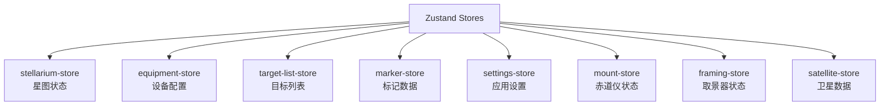

# Zustand Stores API

SkyMap Test 使用 Zustand 进行状态管理。本文档介绍所有可用的 Stores。

## Store 概览

应用包含以下 Stores：



## Stellarium Store

管理星图引擎和视图状态。

**文件**: `lib/stores/stellarium-store.ts`

### State 接口

```typescript
interface StellariumState {
  // 引擎实例
  stel: StellariumEngine | null;
  baseUrl: string;

  // 搜索状态
  search: {
    RAangle: number;        // 赤经角度
    DECangle: number;       // 赤纬角度
    RAangleString: string;  // 赤经字符串
    DECangleString: string; // 赤纬字符串
  };

  // 辅助函数
  getCurrentViewDirection: (() => {
    ra: number;    // 赤经
    dec: number;   // 赤纬
    alt: number;   // 高度角
    az: number;    // 方位角
  }) | null;

  setViewDirection: ((raDeg: number, decDeg: number) => void) | null;
}
```

### Actions

#### setStel

设置星图引擎实例。

```typescript
setStel: (stel: StellariumEngine | null) => void
```

**示例**:

```typescript
import { useStellariumStore } from '@/lib/stores';

const setStel = useStellariumStore(state => state.setStel);

// 设置引擎
setStel(engineInstance);
```

#### setSearch

更新搜索状态。

```typescript
setSearch: (search: Partial<StellariumState['search']>) => void
```

**示例**:

```typescript
const setSearch = useStellariumStore(state => state.setSearch);

// 更新赤经赤纬
setSearch({
  RAangle: 45.5,
  DECangle: -12.3,
  RAangleString: '3h 2m',
  DECangleString: '-12° 18\''
});
```

#### updateStellariumCore

更新星图核心设置。

```typescript
updateStellariumCore: (settings: StellariumSettings) => void
```

**参数**:

```typescript
interface StellariumSettings {
  constellationsLinesVisible: boolean;    // 星座连线
  constellationArtVisible: boolean;        // 星座艺术图
  azimuthalLinesVisible: boolean;          // 地平网格
  equatorialLinesVisible: boolean;         // 赤道网格
  meridianLinesVisible: boolean;           // 子午线
  eclipticLinesVisible: boolean;           // 黄道
  atmosphereVisible: boolean;              // 大气层
  dsosVisible: boolean;                    // 深空天体
  landscapesVisible: boolean;              // 地平景观
  surveyEnabled: boolean;                  // 星图survey
  surveyId: string;                        // survey ID
  surveyUrl?: string;                      // survey URL
  skyCultureLanguage: string;              // 星座文化语言
}
```

**示例**:

```typescript
const updateStellariumCore = useStellariumStore(
  state => state.updateStellariumCore
);

// 启用星座连线
updateStellariumCore({
  constellationsLinesVisible: true,
  equatorialLinesVisible: true
});
```

## Equipment Store

管理观测设备配置（望远镜、相机等）。

**文件**: `lib/stores/equipment-store.ts`

### 主要功能

```typescript
interface EquipmentState {
  // 望远镜列表
  telescopes: Telescope[];
  // 相机列表
  cameras: Camera[];
  // 当前选择的设备
  selectedTelescope: Telescope | null;
  selectedCamera: Camera | null;

  // Actions
  addTelescope: (telescope: Telescope) => void;
  removeTelescope: (id: string) => void;
  updateTelescope: (id: string, data: Partial<Telescope>) => void;
  selectTelescope: (telescope: Telescope | null) => void;

  addCamera: (camera: Camera) => void;
  removeCamera: (id: string) => void;
  updateCamera: (id: string, data: Partial<Camera>) => void;
  selectCamera: (camera: Camera | null) => void;
}
```

### 使用示例

```typescript
import { useEquipmentStore } from '@/lib/stores';

// 添加望远镜
const addTelescope = useEquipmentStore(state => state.addTelescope);

addTelescope({
  id: 'tele-001',
  name: 'Celestron 8SE',
  type: 'schmidt-cassegrain',
  aperture: 203,        // mm
  focalLength: 2032,    // mm
});

// 计算放大倍数
const telescope = useEquipmentStore(state => state.selectedTelescope);
const eyepiece = { focalLength: 25 }; // 25mm目镜
const magnification = telescope.focalLength / eyepiece.focalLength;
console.log(`放大倍数: ${magnification}x`);
```

## Target List Store

管理观测目标列表。

**文件**: `lib/stores/target-list-store.ts`

### 主要功能

```typescript
interface TargetListState {
  // 目标列表
  targets: Target[];

  // Actions
  addTarget: (target: Target) => void;
  removeTarget: (id: string) => void;
  updateTarget: (id: string, data: Partial<Target>) => void;
  toggleTargetStatus: (id: string) => void;
  setTargetPriority: (id: string, priority: Priority) => void;
  clearCompleted: () => void;
  sortBy: (criteria: SortCriteria) => void;
}
```

### 使用示例

```typescript
import { useTargetListStore } from '@/lib/stores';

// 添加目标
const addTarget = useTargetListStore(state => state.addTarget);

addTarget({
  id: 'tgt-001',
  objectId: 'M31',
  name: '仙女座星系',
  ra: 10.6847,
  dec: 41.2687,
  priority: 'high',
  status: 'pending',
  notes: '最佳观测时间：23:00-01:00'
});

// 更新目标状态
const updateTarget = useTargetListStore(state => state.updateTarget);

updateTarget('tgt-001', { status: 'completed' });
```

## Marker Store

管理天空标记。

**文件**: `lib/stores/marker-store.ts`

### 主要功能

```typescript
interface MarkerState {
  // 标记列表
  markers: Marker[];
  // 标记分组
  groups: MarkerGroup[];

  // Actions
  addMarker: (marker: Marker) => void;
  removeMarker: (id: string) => void;
  updateMarker: (id: string, data: Partial<Marker>) => void;
  toggleMarkerVisibility: (id: string) => void;
  addMarkerGroup: (group: MarkerGroup) => void;
}
```

### 使用示例

```typescript
import { useMarkerStore } from '@/lib/stores';

// 添加标记
const addMarker = useMarkerStore(state => state.addMarker);

addMarker({
  id: 'marker-001',
  name: '有趣的目标',
  ra: 180.5,
  dec: 45.2,
  color: '#ff0000',
  visible: true
});
```

## Settings Store

管理应用全局设置。

**文件**: `lib/stores/settings-store.ts`

### 主要功能

```typescript
interface SettingsState {
  // 观测位置
  location: {
    latitude: number;
    longitude: number;
    altitude: number;
    timezone: string;
    name: string;
  };

  // 显示设置
  display: {
    theme: 'light' | 'dark' | 'auto';
    magnitudeLimit: number;
    starSize: number;
    constellations: boolean;
  };

  // Actions
  updateLocation: (location: Partial<Location>) => void;
  updateDisplay: (display: Partial<Display>) => void;
  resetSettings: () => void;
  exportSettings: () => string;
  importSettings: (json: string) => void;
}
```

## Store 使用最佳实践

### 1. 选择性订阅

只订阅需要的状态片段，避免不必要的重渲染：

```typescript
// ❌ 不好：订阅整个 store
const store = useStellariumStore();
console.log(store.stel);

// ✅ 好：只订阅需要的字段
const stel = useStellariumStore(state => state.stel);
console.log(stel);
```

### 2. 派生状态

使用 useMemo 计算派生状态：

```typescript
const telescopes = useEquipmentStore(state => state.telescopes);
const selectedId = useEquipmentStore(state => state.selectedTelescope?.id);

// 派生：当前选择的望远镜
const selectedTelescope = useMemo(
  () => telescopes.find(t => t.id === selectedId),
  [telescopes, selectedId]
);
```

### 3. Actions 复用

将常用的 action 组合封装成自定义 hook：

```typescript
function useStellariumSettings() {
  const updateStellariumCore = useStellariumStore(
    state => state.updateStellariumCore
  );

  const enableGrids = useCallback(() => {
    updateStellariumCore({
      equatorialLinesVisible: true,
      azimuthalLinesVisible: true
    });
  }, [updateStellariumCore]);

  const disableGrids = useCallback(() => {
    updateStellariumCore({
      equatorialLinesVisible: false,
      azimuthalLinesVisible: false
    });
  }, [updateStellariumCore]);

  return { enableGrids, disableGrids };
}
```

### 4. 持久化

使用中间件持久化 store 到本地存储：

```typescript
import { persist } from 'zustand/middleware';

export const useSettingsStore = create(
  persist<SettingsState>(
    (set) => ({
      // ... store implementation
    }),
    {
      name: 'skymap-settings',
      partialize: (state) => ({
        // 只持久化部分字段
        location: state.location,
        display: state.display
      })
    }
  )
);
```

## Store 开发工具

### Zustand DevTools

集成 Redux DevTools：

```typescript
import { devtools } from 'zustand/middleware';

export const useStellariumStore = create(
  devtools<StellariumState>(
    (set, get) => ({
      // ... store implementation
    }),
    { name: 'StellariumStore' }
  )
);
```

### 调试技巧

```typescript
// 监听 store 变化
useStellariumStore.subscribe(
  (state) => state.search,
  (search) => {
    console.log('搜索状态更新:', search);
  }
);

// 获取完整状态
const state = useStellariumStore.getState();
console.log('完整状态:', state);
```

## 相关文档

- [状态管理](../architecture/state-management.md)
- [数据流设计](../architecture/data-flow.md)
- [组件开发](../frontend-development/react-components.md)

---

返回：[API参考](../index.md)
