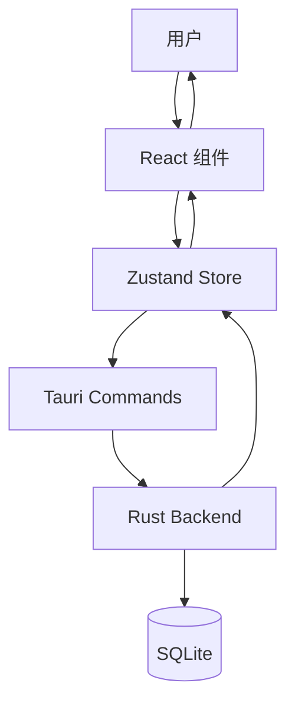

# 数据流设计

本文档介绍 SkyMap Test 的数据流架构。

## 整体数据流



## 状态管理流程

### 单向数据流

1. **用户操作** → 触发事件
2. **组件** → 调用 Store Action
3. **Store** → 更新状态（乐观更新）
4. **Store** → 调用 Tauri 命令持久化
5. **Backend** → 写入数据库
6. **Store** → 确认或回滚

### 示例流程

```typescript
// 添加望远镜的数据流
function TelescopeForm() {
  const addTelescope = useEquipmentStore(s => s.addTelescope);
  
  const handleSubmit = async (data) => {
    // 1. 乐观更新 UI
    const tempId = generateTempId();
    addTelescope({ ...data, id: tempId });
    
    try {
      // 2. 持久化到后端
      const result = await invoke('add_telescope', { telescope: data });
      // 3. 更新为真实 ID
      updateTelescopeId(tempId, result.id);
    } catch (error) {
      // 4. 失败时回滚
      removeTelescope(tempId);
      toast.error('添加失败');
    }
  };
}
```

## 数据同步策略

### 本地优先

- 所有数据先存储在本地
- 离线时完全可用
- 在线时同步到云端（如果启用）

### 缓存策略

| 数据类型 | 缓存位置 | TTL |
|---------|---------|-----|
| 星表数据 | 内存 + 磁盘 | 永久 |
| 用户设置 | Zustand + SQLite | 永久 |
| HiPS 瓦片 | 磁盘缓存 | 7天 |
| 天体信息 | 内存缓存 | 1小时 |

## Store 架构

### Store 职责划分

```
stores/
├── stellarium-store.ts   # 星图引擎状态
├── equipment-store.ts    # 设备管理
├── target-list-store.ts  # 目标列表
├── settings-store.ts     # 应用设置
└── marker-store.ts       # 标记管理
```

### Store 间通信

```typescript
// 使用 subscribe 监听其他 store
useEffect(() => {
  const unsubscribe = useSettingsStore.subscribe(
    (state) => state.location,
    (location) => {
      // 位置变化时更新可见性计算
      recalculateVisibility(location);
    }
  );
  return unsubscribe;
}, []);
```

## 前后端通信

### Tauri IPC

```typescript
// 前端调用
const result = await invoke<ReturnType>('command_name', { param1, param2 });

// 后端实现
#[tauri::command]
async fn command_name(param1: Type1, param2: Type2) -> Result<ReturnType, String> {
    // 处理逻辑
}
```

### 事件系统

```typescript
// 后端发送事件
app.emit_all("event_name", payload)?;

// 前端监听
const unlisten = await listen<PayloadType>('event_name', (event) => {
  console.log(event.payload);
});
```

## 数据持久化

### 持久化时机

- **即时持久化**：关键数据立即保存
- **延迟持久化**：频繁变化的数据防抖保存
- **退出持久化**：应用关闭时批量保存

### 实现示例

```typescript
// 延迟持久化
const saveSettings = useMemo(
  () => debounce(async (settings) => {
    await invoke('save_settings', { settings });
  }, 1000),
  []
);

// 监听变化并保存
useEffect(() => {
  saveSettings(settings);
}, [settings]);
```

## 错误处理

### 错误边界

```typescript
// 组件级错误边界
<ErrorBoundary fallback={<ErrorFallback />}>
  <FeatureComponent />
</ErrorBoundary>

// Store 级错误处理
const store = create((set, get) => ({
  error: null,
  setError: (error) => set({ error }),
  clearError: () => set({ error: null }),
}));
```

## 相关文档

- [前端架构](frontend-architecture.md)
- [后端架构](backend-architecture.md)
- [Stores API](../apis/frontend-apis/stores.md)
