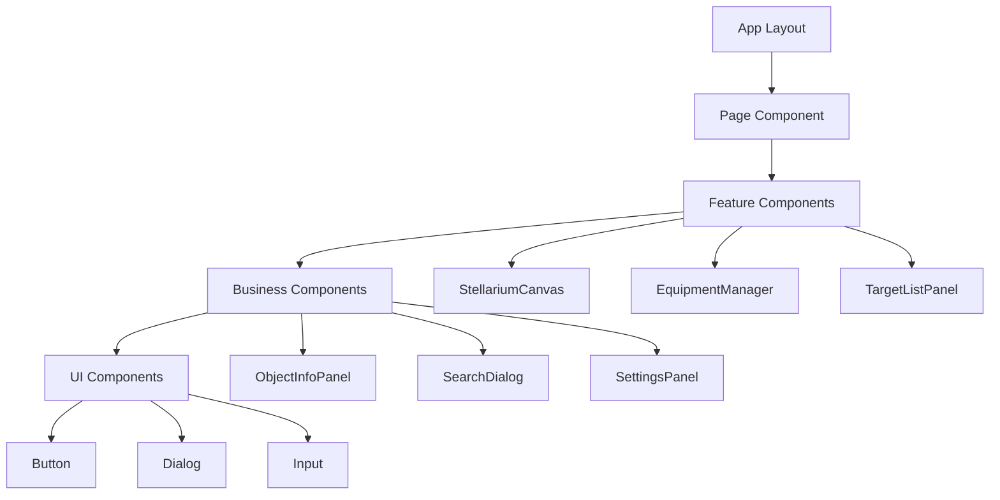
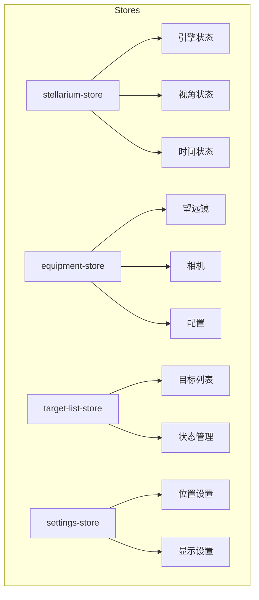
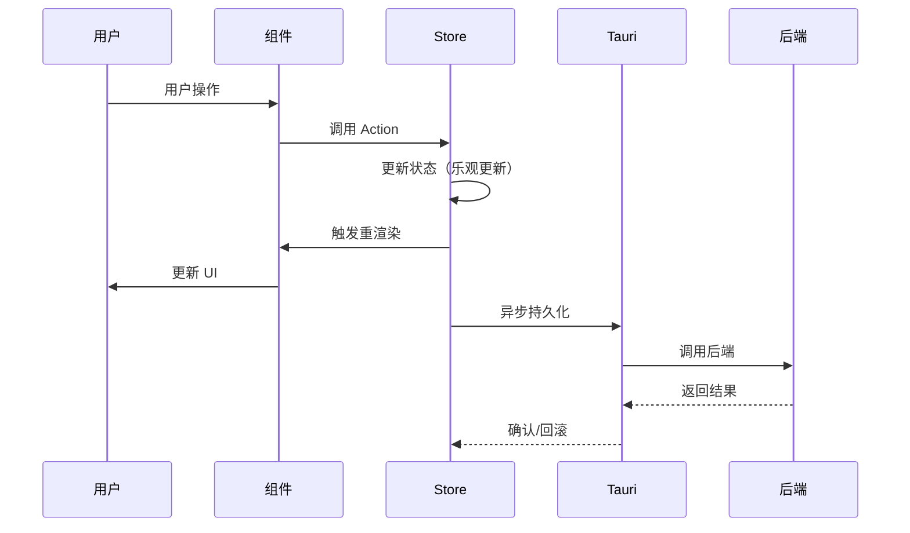

# 前端架构

本文档详细介绍 SkyMap Test 的前端架构设计。

## 技术栈

### 核心框架

- **Next.js 16**：React 框架，使用 App Router
- **React 19**：UI 库
- **TypeScript**：类型安全

### UI 相关

- **Tailwind CSS v4**：原子化 CSS 框架
- **shadcn/ui**：UI 组件库
- **Radix UI**：无障碍基础组件
- **Lucide Icons**：图标库

### 状态管理

- **Zustand**：轻量级状态管理
- **持久化中间件**：状态持久化到本地存储

### 国际化

- **next-intl**：Next.js 国际化方案

## 目录结构

```
├── app/                      # Next.js App Router
│   ├── layout.tsx           # 根布局
│   ├── page.tsx             # 首页
│   ├── globals.css          # 全局样式
│   └── starmap/             # 星图页面
│       ├── page.tsx
│       └── layout.tsx
├── components/               # React 组件
│   ├── ui/                  # shadcn/ui 基础组件
│   ├── starmap/             # 星图相关组件
│   │   ├── canvas/          # 画布组件
│   │   ├── controls/        # 控制组件
│   │   ├── dialogs/         # 对话框组件
│   │   ├── management/      # 管理组件
│   │   ├── objects/         # 天体组件
│   │   ├── overlays/        # 覆盖层组件
│   │   ├── planning/        # 规划组件
│   │   ├── search/          # 搜索组件
│   │   └── settings/        # 设置组件
│   └── providers/           # Context 提供者
├── lib/                      # 工具库
│   ├── astronomy/           # 天文计算
│   ├── catalogs/            # 星表数据
│   ├── hooks/               # React Hooks
│   ├── services/            # 业务服务
│   ├── stores/              # Zustand Stores
│   ├── storage/             # 存储抽象
│   └── tauri/               # Tauri API 封装
└── i18n/                    # 国际化
```

## 组件架构

### 组件层次



### 组件分类

#### 页面组件

`app/` 目录下的页面组件：

```tsx
// app/starmap/page.tsx
export default function StarmapPage() {
  return (
    <div className="h-screen flex flex-col">
      <Header />
      <main className="flex-1 flex">
        <StellariumCanvas />
        <Sidebar />
      </main>
      <StatusBar />
    </div>
  );
}
```

#### 功能组件

封装完整功能的组件：

```tsx
// components/starmap/management/equipment-manager.tsx
export function EquipmentManager() {
  const { telescopes, cameras, addTelescope } = useEquipmentStore();
  
  return (
    <Sheet>
      <SheetTrigger asChild>
        <Button>设备管理</Button>
      </SheetTrigger>
      <SheetContent>
        <TelescopeList telescopes={telescopes} />
        <CameraList cameras={cameras} />
        <AddEquipmentForm onAdd={addTelescope} />
      </SheetContent>
    </Sheet>
  );
}
```

#### UI 组件

基础 UI 组件（shadcn/ui）：

```tsx
// components/ui/button.tsx
import { cva } from "class-variance-authority";

const buttonVariants = cva(
  "inline-flex items-center justify-center rounded-md text-sm font-medium",
  {
    variants: {
      variant: {
        default: "bg-primary text-primary-foreground",
        destructive: "bg-destructive text-destructive-foreground",
        outline: "border border-input bg-background",
      },
      size: {
        default: "h-10 px-4 py-2",
        sm: "h-9 rounded-md px-3",
        lg: "h-11 rounded-md px-8",
      },
    },
  }
);
```

## 状态管理

### Zustand Store 架构



### Store 实现模式

```typescript
// lib/stores/equipment-store.ts
import { create } from 'zustand';
import { persist } from 'zustand/middleware';

interface EquipmentState {
  telescopes: Telescope[];
  cameras: Camera[];
  selectedTelescope: Telescope | null;
  
  // Actions
  addTelescope: (telescope: Telescope) => void;
  removeTelescope: (id: string) => void;
  selectTelescope: (id: string) => void;
}

export const useEquipmentStore = create<EquipmentState>()(
  persist(
    (set) => ({
      telescopes: [],
      cameras: [],
      selectedTelescope: null,
      
      addTelescope: (telescope) =>
        set((state) => ({
          telescopes: [...state.telescopes, telescope]
        })),
        
      removeTelescope: (id) =>
        set((state) => ({
          telescopes: state.telescopes.filter((t) => t.id !== id)
        })),
        
      selectTelescope: (id) =>
        set((state) => ({
          selectedTelescope: state.telescopes.find((t) => t.id === id) ?? null
        })),
    }),
    {
      name: 'equipment-storage',
    }
  )
);
```

### Store 使用最佳实践

```tsx
// 选择性订阅
const telescopes = useEquipmentStore((state) => state.telescopes);
const addTelescope = useEquipmentStore((state) => state.addTelescope);

// 使用选择器避免不必要的重渲染
const selectedTelescope = useEquipmentStore(
  useCallback((state) => state.telescopes.find(t => t.id === selectedId), [selectedId])
);
```

## 数据流

### 单向数据流



### 数据获取模式

```tsx
// 使用 React Query 或自定义 Hook
function useObjectInfo(objectId: string) {
  const [data, setData] = useState<ObjectInfo | null>(null);
  const [loading, setLoading] = useState(true);
  const [error, setError] = useState<Error | null>(null);

  useEffect(() => {
    let cancelled = false;
    
    async function fetchData() {
      try {
        setLoading(true);
        const result = await invoke<ObjectInfo>('get_object_info', { objectId });
        if (!cancelled) {
          setData(result);
          setError(null);
        }
      } catch (e) {
        if (!cancelled) {
          setError(e as Error);
        }
      } finally {
        if (!cancelled) {
          setLoading(false);
        }
      }
    }
    
    fetchData();
    
    return () => {
      cancelled = true;
    };
  }, [objectId]);

  return { data, loading, error };
}
```

## 服务层

### 服务模块组织

```
lib/services/
├── index.ts                    # 统一导出
├── hips-service.ts             # HiPS 图像服务
├── object-info-service.ts      # 天体信息服务
├── satellite-propagator.ts     # 卫星轨道计算
├── connectivity-checker.ts     # 网络连接检测
└── astro-events/               # 天文事件服务
    ├── index.ts
    ├── lunar.ts
    ├── meteor.ts
    └── aggregator.ts
```

### 服务实现示例

```typescript
// lib/services/object-info-service.ts
class ObjectInfoService {
  private cache = new Map<string, ObjectInfo>();
  
  async getObjectInfo(objectId: string): Promise<ObjectInfo> {
    // 检查缓存
    if (this.cache.has(objectId)) {
      return this.cache.get(objectId)!;
    }
    
    // 从后端获取
    const info = await invoke<ObjectInfo>('get_object_info', { objectId });
    
    // 缓存结果
    this.cache.set(objectId, info);
    
    return info;
  }
  
  clearCache() {
    this.cache.clear();
  }
}

export const objectInfoService = new ObjectInfoService();
```

## Hooks 层

### 自定义 Hooks 组织

```
lib/hooks/
├── index.ts
├── use-geolocation.ts          # 地理位置
├── use-device-orientation.ts   # 设备方向
├── use-object-search.ts        # 天体搜索
├── use-tonight-recommendations.ts  # 今晚推荐
├── use-target-planner.ts       # 目标规划
└── use-celestial-name.ts       # 天体名称翻译
```

### Hook 实现示例

```typescript
// lib/hooks/use-geolocation.ts
export function useGeolocation() {
  const [location, setLocation] = useState<GeolocationPosition | null>(null);
  const [error, setError] = useState<GeolocationPositionError | null>(null);
  const [loading, setLoading] = useState(false);

  const requestLocation = useCallback(async () => {
    if (!navigator.geolocation) {
      setError({ code: 0, message: 'Geolocation not supported' } as any);
      return;
    }

    setLoading(true);
    
    try {
      const position = await new Promise<GeolocationPosition>(
        (resolve, reject) => {
          navigator.geolocation.getCurrentPosition(resolve, reject, {
            enableHighAccuracy: true,
            timeout: 10000,
          });
        }
      );
      setLocation(position);
      setError(null);
    } catch (e) {
      setError(e as GeolocationPositionError);
    } finally {
      setLoading(false);
    }
  }, []);

  return { location, error, loading, requestLocation };
}
```

## 性能优化

### React 优化

```tsx
// 使用 React.memo 避免不必要的重渲染
const ObjectItem = React.memo(function ObjectItem({ object, onClick }) {
  return (
    <div onClick={() => onClick(object.id)}>
      {object.name}
    </div>
  );
});

// 使用 useMemo 缓存计算结果
const sortedObjects = useMemo(() => {
  return objects.sort((a, b) => a.name.localeCompare(b.name));
}, [objects]);

// 使用 useCallback 缓存回调函数
const handleClick = useCallback((id: string) => {
  setSelected(id);
}, []);
```

### 懒加载

```tsx
// 组件懒加载
const EquipmentManager = dynamic(
  () => import('@/components/starmap/management/equipment-manager'),
  { loading: () => <Skeleton className="h-[400px]" /> }
);

// 路由懒加载（Next.js 自动处理）
```

### 虚拟化

```tsx
// 大列表虚拟化
import { useVirtual } from '@tanstack/react-virtual';

function VirtualizedList({ items }) {
  const parentRef = useRef<HTMLDivElement>(null);
  
  const rowVirtualizer = useVirtual({
    size: items.length,
    parentRef,
    estimateSize: useCallback(() => 50, []),
  });

  return (
    <div ref={parentRef} className="h-[400px] overflow-auto">
      <div style={{ height: `${rowVirtualizer.totalSize}px` }}>
        {rowVirtualizer.virtualItems.map((virtualRow) => (
          <div
            key={virtualRow.index}
            style={{
              transform: `translateY(${virtualRow.start}px)`,
            }}
          >
            {items[virtualRow.index].name}
          </div>
        ))}
      </div>
    </div>
  );
}
```

## 错误处理

### 错误边界

```tsx
// components/error-boundary.tsx
class ErrorBoundary extends React.Component<
  { children: React.ReactNode },
  { hasError: boolean }
> {
  constructor(props) {
    super(props);
    this.state = { hasError: false };
  }

  static getDerivedStateFromError() {
    return { hasError: true };
  }

  componentDidCatch(error, errorInfo) {
    console.error('Error caught:', error, errorInfo);
  }

  render() {
    if (this.state.hasError) {
      return <ErrorFallback />;
    }
    return this.props.children;
  }
}
```

### 全局错误处理

```tsx
// 处理 Tauri 命令错误
async function handleTauriCommand<T>(
  command: string,
  args?: Record<string, unknown>
): Promise<T> {
  try {
    return await invoke<T>(command, args);
  } catch (error) {
    toast.error('操作失败', {
      description: error as string,
    });
    throw error;
  }
}
```

## 相关文档

- [系统架构](overview.md)
- [后端架构](backend-architecture.md)
- [数据流设计](data-flow.md)
- [Stores API](../apis/frontend-apis/stores.md)
