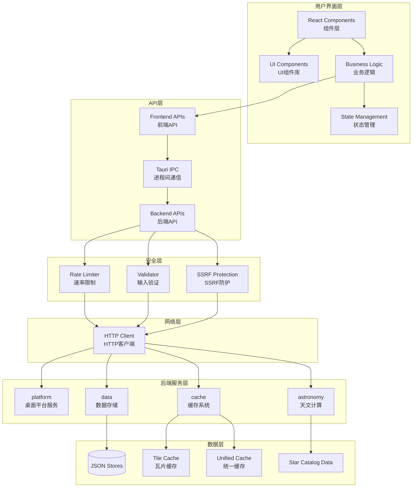
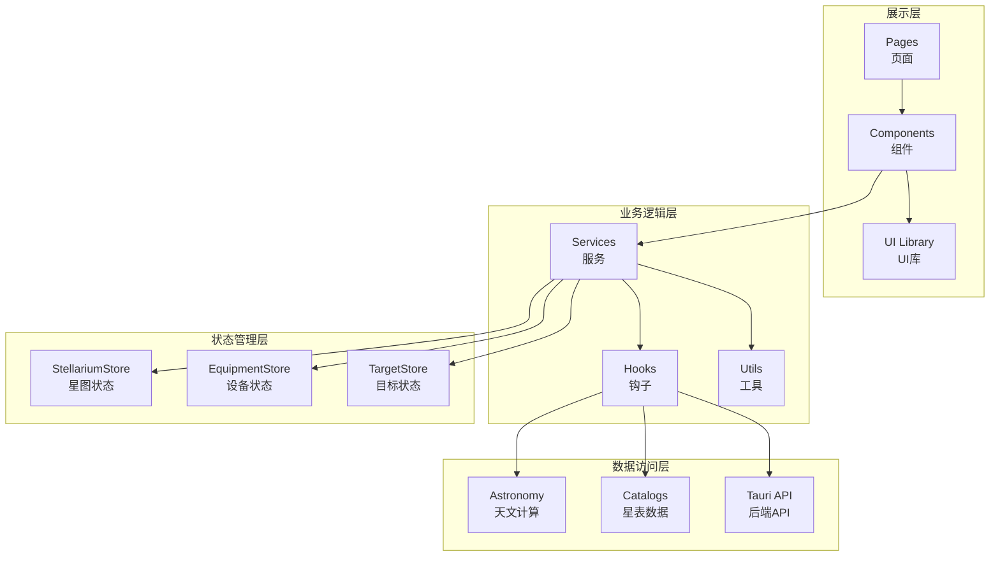
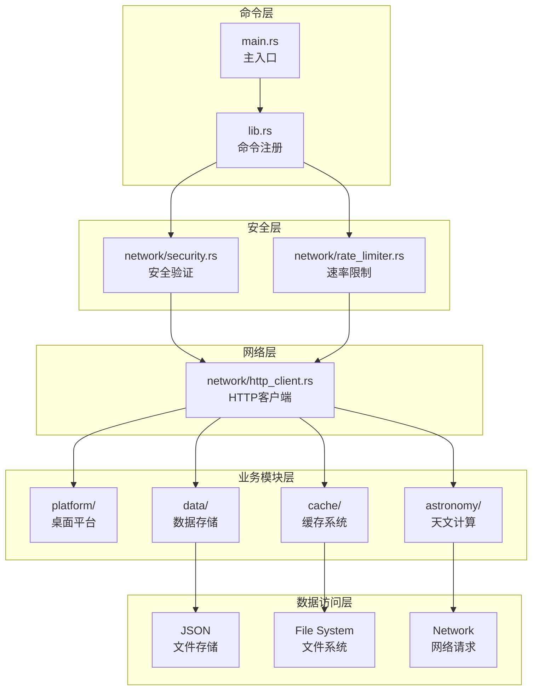
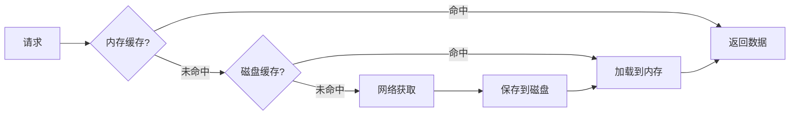
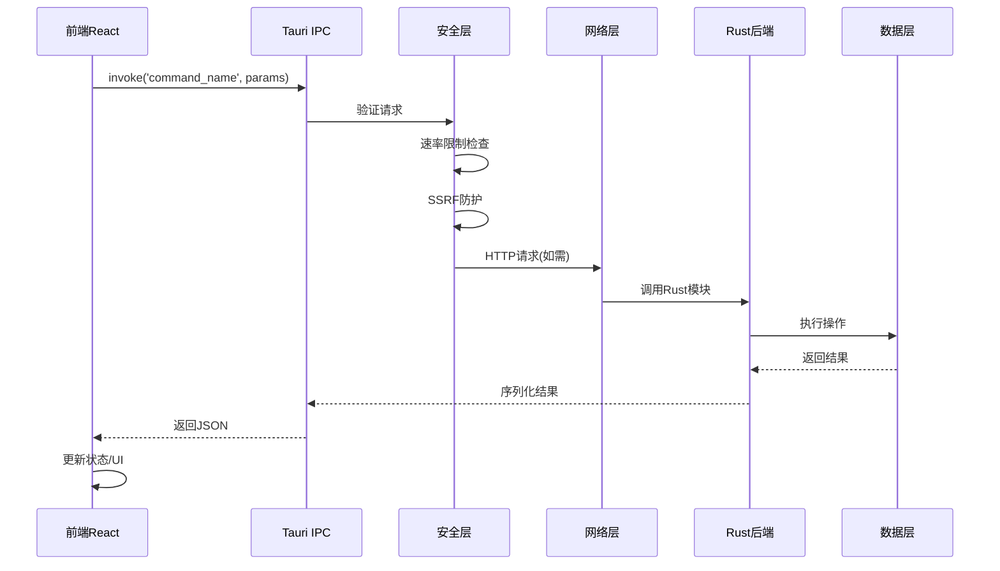
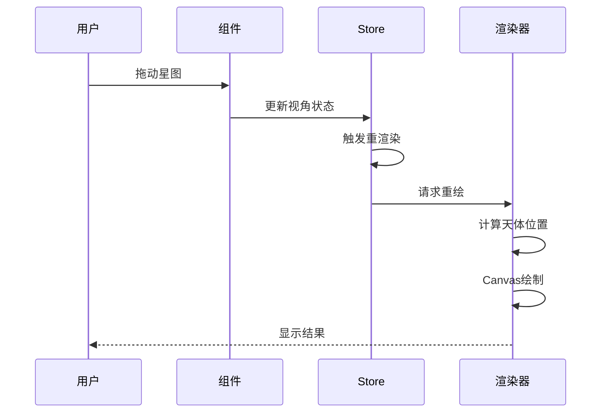
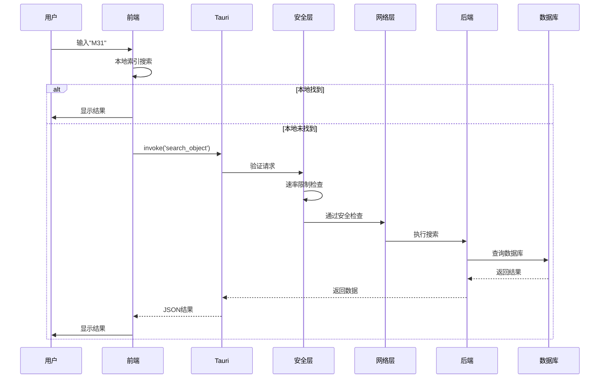
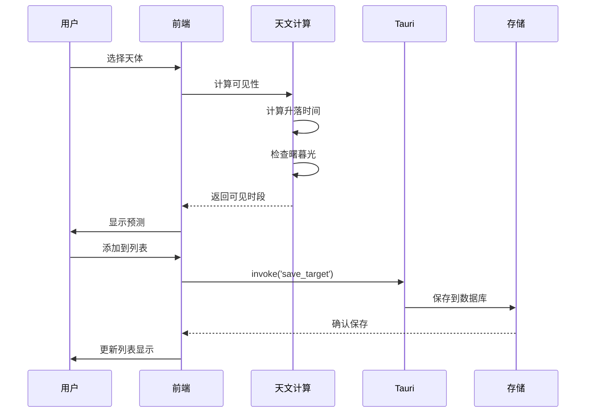
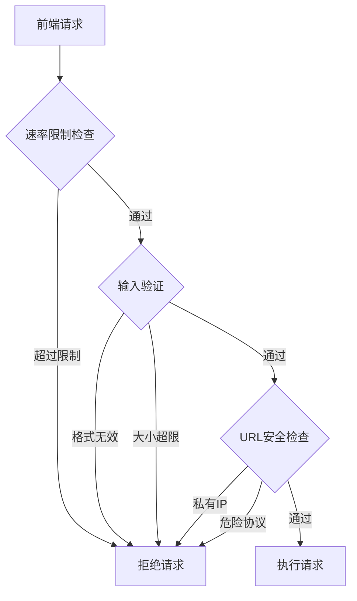
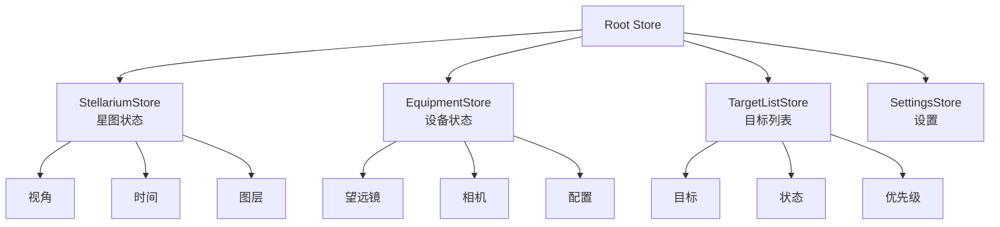

# 系统架构

本文档从宏观角度介绍 SkyMap Test 的整体系统架构设计。

## 架构概览

SkyMap Test 采用前后端分离的架构，通过 Tauri 框架将 Web 技术栈与原生桌面能力结合。

## 整体架构图



## 前端架构

### 技术栈

- **框架**: Next.js 16 (App Router)
- **UI库**: React 19
- **样式**: Tailwind CSS v4
- **组件**: shadcn/ui + Radix UI
- **状态**: Zustand
- **国际化**: next-intl

### 前端分层结构



### 前端核心模块

#### 1. 星图渲染模块

**位置**: `components/starmap/core/`

**职责**:
- Canvas/WebGL 星图渲染
- 天体位置计算与投影
- 交互事件处理
- 性能优化

**关键组件**:
- `StellariumCanvas` - 主渲染组件
- `StellariumView` - 视图控制
- `StellariumMount` - 赤道仪模拟
- `ZoomControls` - 缩放控制

#### 2. 业务逻辑模块

**位置**: `lib/services/`

**职责**:
- 封装业务逻辑
- 协调多个组件
- 处理数据转换

**关键服务**:
- `hips-service` - HiPS图像服务
- `object-info-service` - 天体信息查询
- `astro-events-service` - 天文事件计算
- `satellite-service` - 卫星跟踪

#### 3. 状态管理模块

**位置**: `lib/stores/`

**职责**:
- 全局状态管理
- 跨组件通信
- 持久化状态

**关键Store**:
- `stellarium-store` - 星图状态
- `equipment-store` - 设备状态
- `target-list-store` - 目标列表
- `settings-store` - 应用设置

## 后端架构

### 技术栈

- **框架**: Tauri 2.9
- **语言**: Rust
- **存储**: JSON File Storage
- **序列化**: Serde
- **HTTP客户端**: reqwest 0.12
- **异步运行时**: tokio

### 后端模块结构

后端代码按功能域组织为以下模块：

| 模块 | 路径 | 职责 |
|------|------|------|
| `platform` | `src-tauri/src/platform/` | 桌面平台功能 (应用设置、控制、更新、板求解) |
| `cache` | `src-tauri/src/cache/` | 缓存系统 (瓦片缓存、统一缓存) |
| `astronomy` | `src-tauri/src/astronomy/` | 天文计算与事件 |
| `data` | `src-tauri/src/data/` | 数据存储 (设备、位置、目标、标记、日志) |
| `network` | `src-tauri/src/network/` | 网络与安全 (HTTP客户端、速率限制、验证) |
| `utils` | `src-tauri/src/utils.rs` | 通用工具函数 |

### 后端模块组织



### 后端核心模块

#### 1. platform 模块 (桌面平台)

**位置**: `src-tauri/src/platform/`

**职责**:
- 应用设置与窗口管理
- 应用控制 (重启、退出、刷新)
- 更新管理
- 板求解器集成

**关键文件**:
- `app_settings.rs` - 应用配置
- `app_control.rs` - 应用控制
- `updater.rs` - 自动更新
- `plate_solver.rs` - 天文板求解

#### 2. cache 模块 (缓存系统)

**位置**: `src-tauri/src/cache/`

**职责**:
- HiPS瓦片离线缓存
- 统一网络缓存
- 缓存策略管理
- 存储空间管理

**关键文件**:
- `offline.rs` - 瓦片缓存
- `unified.rs` - 统一缓存

**缓存层次**:



#### 3. astronomy 模块 (天文计算)

**位置**: `src-tauri/src/astronomy/`

**职责**:
- 天体位置计算
- 坐标转换
- 升落时间计算
- 可见性判断
- 天文事件计算

**关键文件**:
- `calculations.rs` - 天文计算
- `events.rs` - 天文事件

#### 4. data 模块 (数据存储)

**位置**: `src-tauri/src/data/`

**职责**:
- JSON 文件存储管理
- CRUD操作
- 数据持久化

**关键文件**:
- `storage.rs` - 通用存储
- `equipment.rs` - 设备管理
- `locations.rs` - 位置管理
- `targets.rs` - 目标列表
- `markers.rs` - 自定义标记
- `observation_log.rs` - 观测日志
- `target_io.rs` - 导入导出

**详见**: [数据模块架构](../data-management/data-module.md)

#### 5. network 模块 (网络与安全)

**位置**: `src-tauri/src/network/`

**职责**:
- HTTP 请求处理
- 速率限制 (滑动窗口算法)
- URL 验证 (SSRF 防护)
- 输入大小限制

**关键文件**:
- `http_client.rs` - HTTP 客户端
- `security.rs` - 安全验证
- `rate_limiter.rs` - 速率限制

## 前后端通信

### Tauri IPC机制



### API调用示例

**前端调用**:

```typescript
import { invoke } from '@tauri-apps/api/core';

// 调用后端命令
const result = await invoke('get_object_info', {
  objectId: 'M31'
});
```

**后端定义**:

```rust
#[tauri::command]
async fn get_object_info(object_id: String) -> Result<ObjectInfo, String> {
    // 实现逻辑
    Ok(object_info)
}
```

## 数据流设计

### 典型数据流

#### 场景1: 星图渲染



#### 场景2: 搜索天体



#### 场景3: 观测规划



## 安全层架构

### 安全防护机制

SkyMap 在后端实现了多层安全防护，所有网络请求和用户输入都经过严格的验证和限制。

### 安全组件



### 1. 速率限制 (Rate Limiting)

**算法**: 滑动窗口 (Sliding Window)

**限制**:
- 全局: 100 请求/60秒
- 每个命令可配置独立限制

**实现**: `src-tauri/src/network/rate_limiter.rs`

### 2. 输入验证

**限制**:
- `MAX_JSON_SIZE`: 10 MB
- `MAX_CSV_SIZE`: 50 MB
- `MAX_TILE_SIZE`: 5 MB
- `MAX_URL_LENGTH`: 2048 字节

**实现**: `src-tauri/src/network/security.rs`

### 3. SSRF 防护

**阻止的地址**:
- 私有 IP (127.0.0.0/8, 10.0.0.0/8, 172.16.0.0/12, 192.168.0.0/16)
- Localhost 变体
- 危险协议 (javascript:, data:, file: 等)

**允许的协议**:
- `https://` (默认)
- `http://` (可配置)

### 4. 存储安全

**路径沙箱**:
- 所有文件操作限制在应用数据目录
- 路径遍历防护
- 文件大小限制

## 状态管理

### Zustand Store架构



### 状态同步策略

1. **单向数据流**: 用户操作 → 状态更新 → UI渲染
2. **乐观更新**: 前端先更新，后端异步确认
3. **最终一致性**: 允许短暂的UI与数据不一致
4. **错误回滚**: 后端失败时恢复前端状态

## 架构优势

### 1. 模块化设计

- 前后端清晰分离
- 功能模块独立
- 便于并行开发

### 2. 性能优化

- 前端虚拟化渲染
- 后端异步处理
- 多层缓存策略

### 3. 可维护性

- TypeScript类型安全
- Rust内存安全
- 清晰的模块边界

### 4. 可扩展性

- 插件化架构
- 服务层抽象
- 易于添加新功能

## 技术决策理由

### 为什么选择 Next.js?

- 优秀的开发体验
- App Router支持
- 服务端渲染能力（预留）
- 丰富的生态系统

### 为什么选择 Tauri?

- 更小的安装包
- 更好的性能
- Rust的安全性和性能
- 原生API访问

### 为什么选择 Zustand?

- 轻量级
- 简单的API
- 无需Provider包裹
- 良好的TypeScript支持

### 为什么选择 JSON 存储?

- 零配置
- 轻量级
- 易于调试和人工检查数据
- 适合桌面应用配置与轻量级数据存储
- 跨平台
- 适合桌面应用

## 性能考虑

### 前端性能

- **虚拟化**: 长列表虚拟化
- **懒加载**: 组件和路由懒加载
- **memoization**: React.memo、useMemo
- **Web Workers**: 耗时计算移到Worker

### 后端性能

- **异步处理**: tokio异步运行时
- **缓存策略**: 多级缓存
- **批量操作**: 减少IO次数
- **索引优化**: 数据库索引

## 未来架构演进

### 短期计划

- [ ] 增加后台任务队列
- [ ] 实现插件系统
- [ ] 优化缓存策略

### 长期计划

- [ ] 支持云同步
- [ ] 多设备协作
- [ ] AI辅助观测规划

## 相关文档

- [前端架构详解](frontend-architecture.md)
- [后端架构详解](backend-architecture.md)
- [数据流设计](data-flow.md)
- [状态管理](../project-structure/index.md)
