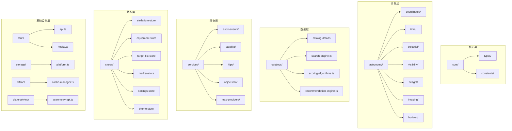

# 核心模块

本章节介绍 SkyMap Test 的核心模块架构和实现细节。

## 模块概览

SkyMap Test 的核心业务逻辑位于 `lib/` 目录，采用模块化架构设计：



## 核心模块列表

### 基础模块

| 模块 | 路径 | 说明 |
|------|------|------|
| **core** | `lib/core/` | 核心类型定义和常量 |
| **astronomy** | `lib/astronomy/` | 纯函数天文计算库 |
| **catalogs** | `lib/catalogs/` | DSO 目录和搜索系统 |

### 服务模块

| 模块 | 路径 | 说明 |
|------|------|------|
| **services** | `lib/services/` | 外部数据服务集成 |
| **hooks** | `lib/hooks/` | React 自定义 Hooks |
| **stores** | `lib/stores/` | Zustand 状态管理 |

### 基础设施模块

| 模块 | 路径 | 说明 |
|------|------|------|
| **tauri** | `lib/tauri/` | Tauri 后端 API 封装 |
| **storage** | `lib/storage/` | 跨平台存储抽象 |
| **offline** | `lib/offline/` | 离线缓存管理 |
| **plate-solving** | `lib/plate-solving/` | 解析天文图像坐标 |
| **translations** | `lib/translations/` | 天体名称翻译 |
| **i18n** | `lib/i18n/` | 国际化支持 |

## 模块依赖关系

```
core/ ─────────────────────────────────────────────────┐
   │                                                    │
   ▼                                                    │
astronomy/ ──────────────────────────────────────────┐  │
   │                                                 │  │
   ▼                                                 │  │
services/ ◄──────────────────────────────────────────┤  │
   │                                                 │  │
   ▼                                                 │  │
catalogs/ ◄──────────────────────────────────────────┤  │
   │                                                 │  │
   ▼                                                 │  │
stores/ ◄────────────────────────────────────────────┤  │
   │                                                 │  │
   ▼                                                 │  │
hooks/ ◄─────────────────────────────────────────────┘  │
   │                                                    │
   ▼                                                    │
translations/ ◄────────────────────────────────────────┘
   │
   ▼
storage/ ◄─────── i18n/, offline/, tauri/, plate-solving/
```

## 详细文档

- **[星图核心](starmap-core.md)** - Stellarium 引擎集成和星图渲染
- **[天文计算](astronomy-engine.md)** - 天文计算引擎详解

## 快速导入

```typescript
// 状态管理
import { useStellariumStore, useSettingsStore } from '@/lib/stores';
import { useEquipmentStore, useTargetListStore } from '@/lib/stores';
import { useMarkerStore, useThemeStore } from '@/lib/stores';

// React Hooks
import { useGeolocation, useObjectSearch } from '@/lib/hooks';
import { useTonightRecommendations, useTargetPlanner } from '@/lib/hooks';
import { useCelestialName, useDeviceOrientation } from '@/lib/hooks';

// 天文计算
import { raDecToAltAz, formatRA, formatDec } from '@/lib/astronomy';
import { calculateTwilightTimes, getMoonPhase } from '@/lib/astronomy';
import { calculateVisibility, isCircumpolar } from '@/lib/astronomy';

// DSO 目录
import { useSkyAtlasStore, searchDeepSkyObjects } from '@/lib/catalogs';
import { getAdvancedRecommendations } from '@/lib/catalogs';

// 翻译
import { translateCelestialName } from '@/lib/translations';

// 外部服务
import { fetchObjectInfo, predictSatellitePasses } from '@/lib/services';
import { hipsService, geocodingService } from '@/lib/services';

// Tauri API
import { tauriApi, astronomyApi, storageApi } from '@/lib/tauri';
import { targetListApi, markersApi, httpApi } from '@/lib/tauri';

// 离线缓存
import { cacheManager, useOfflineStore } from '@/lib/offline';

// Plate Solving
import { solveImage, parseFITS } from '@/lib/plate-solving';
```

## 设计原则

### 1. 模块化设计

每个模块有明确的职责边界：
- **astronomy**: 纯函数计算，无副作用
- **services**: 外部 API 集成
- **stores**: 全局状态管理
- **hooks**: React 业务逻辑封装

### 2. 类型安全

所有模块使用 TypeScript 强类型：
- 共享类型定义在 `core/types/`
- 模块内部类型在各自目录

### 3. 可测试性

- 纯函数便于单元测试
- 服务层支持 Mock
- Store 支持测试工具

### 4. 平台抽象

- `storage/` 抽象存储接口
- `tauri/` 封装桌面 API
- 支持 Web 和桌面平台

---

下一步：[星图核心](starmap-core.md)
