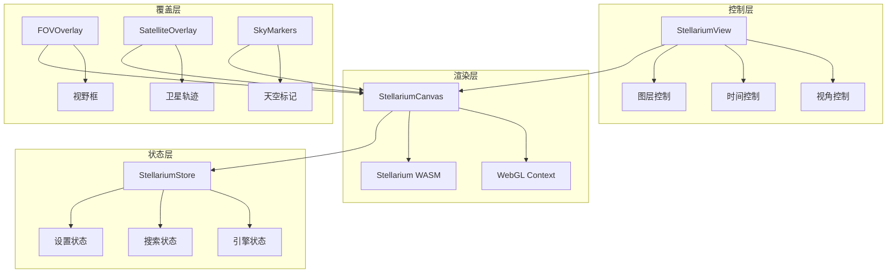
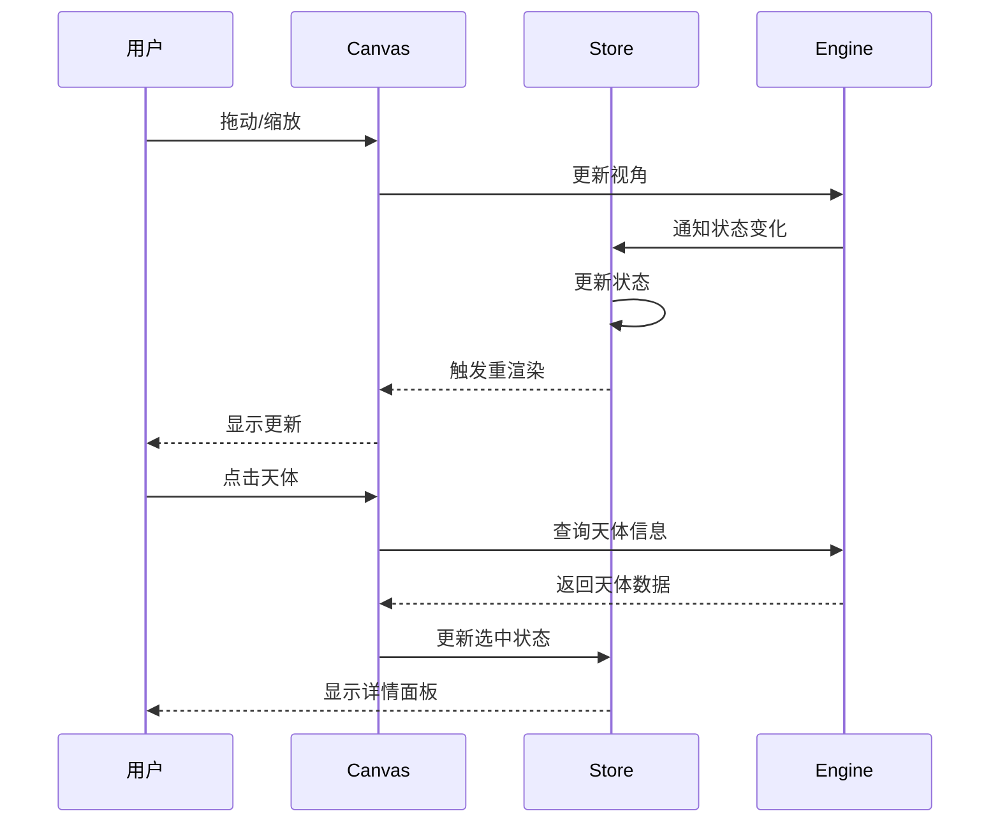

# 星图核心

本文档介绍 SkyMap Test 的星图渲染核心模块。

## 概述

星图核心模块基于 Stellarium Web Engine 构建，提供高性能的交互式星图渲染能力。

## 架构



## 核心组件

### StellariumCanvas

星图主渲染组件，封装 Stellarium Web Engine。

**位置**: `components/starmap/canvas/stellarium-canvas.tsx`

```typescript
interface StellariumCanvasRef {
  // 获取引擎实例
  getEngine(): StellariumEngine | null;
  // 设置视角
  setViewDirection(ra: number, dec: number): void;
  // 获取当前视角
  getCurrentView(): { ra: number; dec: number; fov: number };
  // 截图
  takeScreenshot(): Promise<Blob>;
}

// 使用示例
const canvasRef = useRef<StellariumCanvasRef>(null);

// 定位到 M31
canvasRef.current?.setViewDirection(10.6847, 41.2687);
```

### StellariumView

星图视图容器，整合所有星图相关组件。

**位置**: `components/starmap/view/stellarium-view.tsx`

**功能**:
- 整合 Canvas、控件、覆盖层
- 处理用户交互
- 管理视图状态

### StellariumStore

星图状态管理，使用 Zustand。

**位置**: `lib/stores/stellarium-store.ts`

```typescript
interface StellariumState {
  // 引擎实例
  stel: StellariumEngine | null;
  baseUrl: string;

  // 搜索状态
  search: {
    RAangle: number;
    DECangle: number;
    RAangleString: string;
    DECangleString: string;
  };

  // 辅助函数
  getCurrentViewDirection: (() => ViewDirection) | null;
  setViewDirection: ((ra: number, dec: number) => void) | null;

  // Actions
  setStel: (stel: StellariumEngine | null) => void;
  setSearch: (search: Partial<SearchState>) => void;
  updateStellariumCore: (settings: StellariumSettings) => void;
}
```

## 覆盖层组件

### FOVOverlay

视野框覆盖层，显示望远镜/相机视野。

**位置**: `components/starmap/overlays/fov-overlay.tsx`

**功能**:
- 显示设备视野框
- 支持马赛克模式
- 实时更新位置

### FOVSimulator

视野模拟器，配置和预览视野。

**位置**: `components/starmap/overlays/fov-simulator.tsx`

```typescript
interface MosaicSettings {
  rows: number;
  cols: number;
  overlap: number;      // 重叠百分比
  rotation: number;     // 旋转角度
  gridType: GridType;   // 网格类型
}

type GridType = 'rectangular' | 'honeycomb' | 'spiral';
```

### SatelliteOverlay

卫星轨迹覆盖层。

**位置**: `components/starmap/overlays/satellite-overlay.tsx`

**功能**:
- 显示卫星实时位置
- 绘制轨道路径
- 预测过境时间

### SkyMarkers

天空标记覆盖层。

**位置**: `components/starmap/overlays/sky-markers.tsx`

**功能**:
- 显示用户自定义标记
- 支持分组管理
- 可配置图标和颜色

## 控制组件

### ZoomControls

缩放控制组件。

**位置**: `components/starmap/controls/zoom-controls.tsx`

**功能**:
- 缩放滑块
- 预设缩放级别
- 键盘快捷键支持

### StellariumClock

时间控制组件。

**位置**: `components/starmap/time/stellarium-clock.tsx`

**功能**:
- 显示当前时间
- 时间快进/回退
- 跳转到指定时间

### StellariumMount

赤道仪模拟控制。

**位置**: `components/starmap/mount/stellarium-mount.tsx`

**功能**:
- 模拟赤道仪运动
- 跟踪目标
- 导星辅助

## 搜索组件

### StellariumSearch

天体搜索组件。

**位置**: `components/starmap/search/stellarium-search.tsx`

**功能**:
- 实时搜索
- 模糊匹配
- 多语言支持

### AdvancedSearchDialog

高级搜索对话框。

**位置**: `components/starmap/search/advanced-search-dialog.tsx`

**功能**:
- 高级筛选条件
- 目录选择
- 属性筛选

## 设置组件

### StellariumSettings

星图设置面板。

**位置**: `components/starmap/settings/stellarium-settings.tsx`

**可配置项**:
- 星座连线/艺术图
- 坐标网格（地平/赤道）
- 子午线/黄道
- 大气效果
- 深空天体显示
- 地平景观

### StellariumSurveySelector

巡天数据源选择器。

**位置**: `components/starmap/settings/stellarium-survey-selector.tsx`

**支持的巡天**:
- DSS (Digitized Sky Survey)
- 2MASS
- WISE
- Gaia DR3
- 自定义 HiPS 源

## 引导组件

### OnboardingTour

新手引导教程。

**位置**: `components/starmap/onboarding/`

**功能**:
- 交互式教程
- 功能亮点展示
- 可跳过/重启

### SetupWizard

首次设置向导。

**位置**: `components/starmap/setup-wizard/`

**步骤**:
1. 欢迎介绍
2. 位置设置
3. 设备配置
4. 偏好设置
5. 完成

## 数据流



## 性能优化

### 渲染优化

- **WebGL 硬件加速**: 利用 GPU 渲染
- **瓦片缓存**: HiPS 瓦片本地缓存
- **视锥剔除**: 只渲染可见区域
- **LOD 系统**: 根据缩放级别调整细节

### 状态优化

- **选择性订阅**: 只订阅需要的状态
- **批量更新**: 合并多个状态更新
- **防抖处理**: 减少频繁更新

### 内存优化

- **瓦片淘汰**: LRU 策略管理瓦片
- **组件懒加载**: 按需加载覆盖层
- **Web Worker**: 计算密集型任务离线处理

## 扩展开发

### 添加新覆盖层

```typescript
// 1. 创建覆盖层组件
export function MyOverlay() {
  const stel = useStellariumStore(state => state.stel);

  useEffect(() => {
    if (!stel) return;

    // 注册渲染回调
    const cleanup = stel.on('render', () => {
      // 自定义渲染逻辑
    });

    return cleanup;
  }, [stel]);

  return null; // 或返回 DOM 元素
}

// 2. 在 StellariumView 中注册
<StellariumCanvas>
  <MyOverlay />
</StellariumCanvas>
```

### 添加新控件

```typescript
// 1. 创建控件组件
export function MyControl() {
  const setViewDirection = useStellariumStore(
    state => state.setViewDirection
  );

  const handleClick = () => {
    setViewDirection?.(0, 90); // 定位到北天极
  };

  return (
    <Button onClick={handleClick}>
      定位北天极
    </Button>
  );
}

// 2. 添加到控件区域
```

## 相关文档

- [天文计算](astronomy-engine.md) - 天文计算引擎
- [Stores API](../apis/frontend-apis/stores.md) - 状态管理 API
- [组件开发](../frontend-development/index.md) - 前端组件开发

---

返回：[核心模块](index.md)
