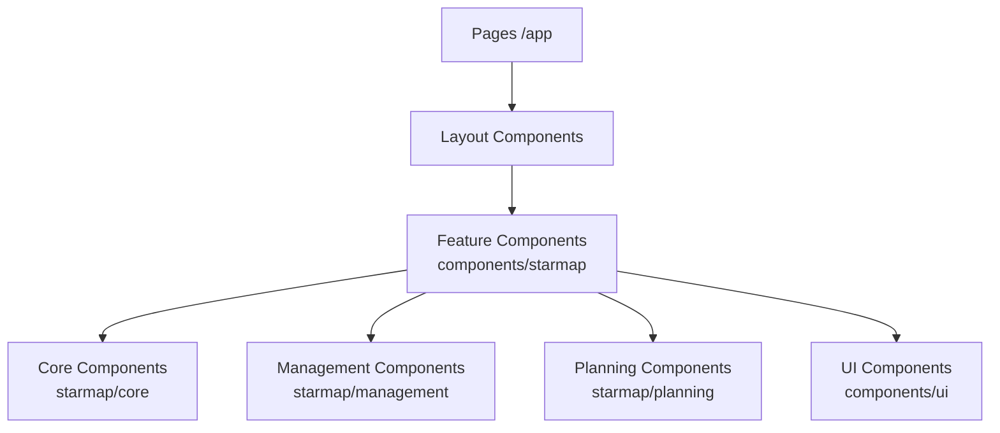

# React 组件开发

本文档介绍如何开发 SkyMap Test 的 React 组件。

## 组件架构

### 组件层级结构



## 组件开发规范

### 1. 组件文件结构

使用 TypeScript 和 'use client' 指令：

```typescript
'use client';

import { useState, useEffect } from 'react';
import { useTranslations } from 'next-intl';

interface ComponentProps {
  // props 定义
}

export function ComponentName({ prop1, prop2 }: ComponentProps) {
  // 组件实现

  return (
    <div>
      {/* JSX */}
    </div>
  );
}
```

### 2. 命名约定

- **组件文件**: kebab-case（如 `data-manager.tsx`）
- **组件名称**: PascalCase（如 `DataManager`）
- **hook 函数**: camelCase，以 use 开头（如 `useStellarium`）

### 3. 类型定义

明确定义 Props 类型：

```typescript
interface ButtonProps {
  variant?: 'default' | 'outline' | 'destructive';
  size?: 'sm' | 'md' | 'lg';
  disabled?: boolean;
  loading?: boolean;
  onClick?: () => void;
  children: React.ReactNode;
}

export function Button({
  variant = 'default',
  size = 'md',
  disabled = false,
  loading = false,
  onClick,
  children
}: ButtonProps) {
  // 实现
}
```

## 核心 Components

### 数据管理器 (DataManager)

**文件**: `components/starmap/management/data-manager.tsx`

**功能**:
- 导出/导入应用数据
- 查看存储统计
- 清除所有数据
- 复制数据目录路径

**关键特性**:

```typescript
// 支持 Tauri 和 Web 两种环境
const isDesktop = isTauri();

// Tauri 环境
if (isDesktop && storageApi.isAvailable()) {
  await storageApi.getStorageStats();
}
// Web 环境
else {
  await storage.getStorageStats();
}
```

**使用示例**:

```typescript
import { DataManager } from '@/components/starmap/management/data-manager';

// 基础使用
<DataManager />

// 自定义触发按钮
<DataManager
  trigger={
    <Button>我的数据</Button>
  }
/>
```

### 星图画布 (StellariumCanvas)

**文件**: `components/starmap/core/stellarium-canvas.tsx`

**功能**:
- 渲染星图
- 处理用户交互
- 集成 Stellarium Web Engine

**关键实现**:

```typescript
const canvasRef = useRef<HTMLCanvasElement>(null);
const { stel, setStel } = useStellariumStore();

useEffect(() => {
  // 初始化 Stellarium 引擎
  const initEngine = async () => {
    const engine = await StellariumEngine.create({
      canvas: canvasRef.current,
      // 配置选项
    });
    setStel(engine);
  };

  initEngine();
}, []);
```

## 状态管理集成

### 使用 Zustand Store

```typescript
import { useStellariumStore } from '@/lib/stores';

export function ViewControl() {
  // 订阅特定状态
  const viewDirection = useStellariumStore(
    state => state.getCurrentViewDirection?.()
  );

  // 订阅 actions
  const setSearch = useStellariumStore(state => state.setSearch);

  return (
    <div>
      <p>RA: {viewDirection?.ra}</p>
      <p>Dec: {viewDirection?.dec}</p>
    </div>
  );
}
```

### 最佳实践

1. **选择性订阅**: 只订阅需要的状态
2. **使用 useMemo**: 缓存计算结果
3. **使用 useCallback**: 缓存事件处理器

```typescript
// ✅ 好的做法
const isVisible = useStellariumStore(state => state.settings.dsosVisible);
const toggleVisibility = useStellariumStore(
  state => state.updateStellariumCore
);

const handleToggle = useCallback(() => {
  toggleVisibility({ dsosVisible: !isVisible });
}, [isVisible, toggleVisibility]);

// ❌ 不好的做法
const store = useStellariumStore();
```

## 国际化 (i18n)

### 使用翻译

```typescript
import { useTranslations } from 'next-intl';

export function MyComponent() {
  const t = useTranslations();

  return (
    <div>
      <h1>{t('dataManager.title')}</h1>
      <p>{t('dataManager.description')}</p>
    </div>
  );
}

// 使用命名空间
const t = useTranslations('dataManager');
```

### 翻译文件结构

```
i18n/
├── en/
│   └── common.json
├── zh/
│   └── common.json
└── ...
```

## UI 组件库

### shadcn/ui 组件

项目使用 shadcn/ui 组件库：

```typescript
import {
  Button,
  Dialog,
  AlertDialog,
  toast
} from '@/components/ui';

// 使用 Toast
import { toast } from 'sonner';

toast.success('操作成功', {
  description: '数据已保存'
});

toast.error('操作失败', {
  description: error.message
});
```

### 样式系统

使用 Tailwind CSS：

```typescript
<div className="
  flex items-center gap-2
  rounded-lg border p-4
  text-sm
">
  <Icon className="h-4 w-4" />
  <span>内容</span>
</div>
```

自定义样式（CSS变量）：

```css
/* 在 globals.css 中定义 */
:root {
  --primary-color: #6366f1;
  --border-radius: 0.5rem;
}
```

## 异步处理

### 处理异步操作

```typescript
const [loading, setLoading] = useState(false);
const [error, setError] = useState<string | null>(null);

const handleAsyncAction = async () => {
  setLoading(true);
  setError(null);

  try {
    const result = await someAsyncOperation();
    toast.success('成功');
    return result;
  } catch (err) {
    const message = err instanceof Error ? err.message : '未知错误';
    setError(message);
    toast.error('失败', { description: message });
  } finally {
    setLoading(false);
  }
};
```

### 显示加载状态

```typescript
<Button onClick={handleAsyncAction} disabled={loading}>
  {loading ? (
    <>
      <Loader2 className="h-4 w-4 mr-2 animate-spin" />
      处理中...
    </>
  ) : (
    '执行操作'
  )}
</Button>
```

## 事件处理

### 表单处理

```typescript
const [formData, setFormData] = useState({
  name: '',
  type: 'refractor',
  aperture: '',
  focalLength: ''
});

const handleChange = (
  e: React.ChangeEvent<HTMLInputElement | HTMLSelectElement>
) => {
  const { name, value } = e.target;
  setFormData(prev => ({ ...prev, [name]: value }));
};

const handleSubmit = async (e: React.FormEvent) => {
  e.preventDefault();
  // 处理表单提交
};
```

### 文件处理

```typescript
const fileInputRef = useRef<HTMLInputElement>(null);

const handleFileSelect = async (
  event: React.ChangeEvent<HTMLInputElement>
) => {
  const file = event.target.files?.[0];
  if (!file) return;

  try {
    const text = await readFileAsText(file);
    const data = JSON.parse(text);
    // 处理数据
  } catch (error) {
    toast.error('文件解析失败');
  }
};

<input
  ref={fileInputRef}
  type="file"
  accept=".json"
  onChange={handleFileSelect}
  className="hidden"
/>
```

## 组件通信

### 父子组件通信

```typescript
// 父组件
function Parent() {
  const [value, setValue] = useState('initial');

  return (
    <Child
      value={value}
      onChange={setValue}
    />
  );
}

// 子组件
interface ChildProps {
  value: string;
  onChange: (value: string) => void;
}

function Child({ value, onChange }: ChildProps) {
  return (
    <input
      value={value}
      onChange={(e) => onChange(e.target.value)}
    />
  );
}
```

### 跨组件通信

使用 Zustand store 进行跨组件通信：

```typescript
// 组件 A：更新状态
const setSearch = useStellariumStore(state => state.setSearch);
setSearch({ RAangle: 45 });

// 组件 B：订阅状态
const search = useStellariumStore(state => state.search);
console.log(search.RAangle); // 45
```

## 性能优化

### React.memo

避免不必要的重渲染：

```typescript
export const ExpensiveComponent = React.memo<Props>(
  function ExpensiveComponent({ data }) {
    // 复杂渲染
  },
  (prevProps, nextProps) => {
    // 自定义比较函数
    return prevProps.data.id === nextProps.data.id;
  }
);
```

### useMemo 和 useCallback

```typescript
function MyComponent({ items }: { items: Item[] }) {
  // 缓存计算结果
  const sortedItems = useMemo(
    () => items.sort((a, b) => a.name.localeCompare(b.name)),
    [items]
  );

  // 缓存事件处理器
  const handleClick = useCallback(
    (id: string) => {
      console.log('Clicked:', id);
    },
    [] // 依赖为空，函数只创建一次
  );

  return (
    <div>
      {sortedItems.map(item => (
        <Item
          key={item.id}
          item={item}
          onClick={handleClick}
        />
      ))}
    </div>
  );
}
```

### 虚拟化长列表

对于大量数据，使用虚拟化：

```typescript
import { useVirtualizer } from '@tanstack/react-virtual';

function LongList({ items }: { items: Item[] }) {
  const parentRef = useRef<HTMLDivElement>(null);

  const virtualizer = useVirtualizer({
    count: items.length,
    getScrollElement: () => parentRef.current,
    estimateSize: () => 50, // 每项高度
  });

  return (
    <div ref={parentRef} className="h-screen overflow-auto">
      <div
        style={{
          height: `${virtualizer.getTotalSize()}px`,
        }}
      >
        {virtualizer.getVirtualItems().map(virtualItem => (
          <div
            key={virtualItem.key}
            style={{
              position: 'absolute',
              top: 0,
              left: 0,
              width: '100%',
              height: `${virtualItem.size}px`,
              transform: `translateY(${virtualItem.start}px)`,
            }}
          >
            {items[virtualItem.index].name}
          </div>
        ))}
      </div>
    </div>
  );
}
```

## 测试组件

### 单元测试

```typescript
import { render, screen, fireEvent } from '@testing-library/react';
import { Button } from './button';

describe('Button', () => {
  it('renders correctly', () => {
    render(<Button>Click me</Button>);
    expect(screen.getByText('Click me')).toBeInTheDocument();
  });

  it('calls onClick when clicked', () => {
    const handleClick = jest.fn();
    render(<Button onClick={handleClick}>Click me</Button>);

    fireEvent.click(screen.getByText('Click me'));
    expect(handleClick).toHaveBeenCalledTimes(1);
  });

  it('is disabled when loading', () => {
    render(<Button loading>Click me</Button>);
    expect(screen.getByRole('button')).toBeDisabled();
  });
});
```

## 组件文档

### JSDoc 注释

为组件添加文档注释：

```typescript
/**
 * 数据管理器组件
 *
 * 提供数据导入、导出和清理功能。
 * 支持 Tauri 桌面环境和 Web 浏览器环境。
 *
 * @param trigger - 可选的自定义触发按钮
 *
 * @example
 * ```tsx
 * <DataManager />
 *
 * <DataManager
 *   trigger={<Button>管理数据</Button>}
 * />
 * ```
 */
export function DataManager({ trigger }: DataManagerProps) {
  // 实现
}
```

## 最佳实践总结

1. **类型安全**: 始终使用 TypeScript 类型
2. **性能优化**: 使用 memo、useMemo、useCallback
3. **状态管理**: 合理使用 Zustand store
4. **错误处理**: 添加 try-catch 和用户反馈
5. **可访问性**: 使用语义化 HTML 和 ARIA 属性
6. **代码组织**: 保持组件小而专注
7. **测试**: 编写单元测试和集成测试

## 相关文档

- [前端架构](../architecture/frontend-architecture.md)
- [Styling Guide](styling-guide.md)
- [UI Components](ui-components.md)
- [Stores API](../apis/frontend-apis/stores.md)

---

返回：[前端开发](index.md)
