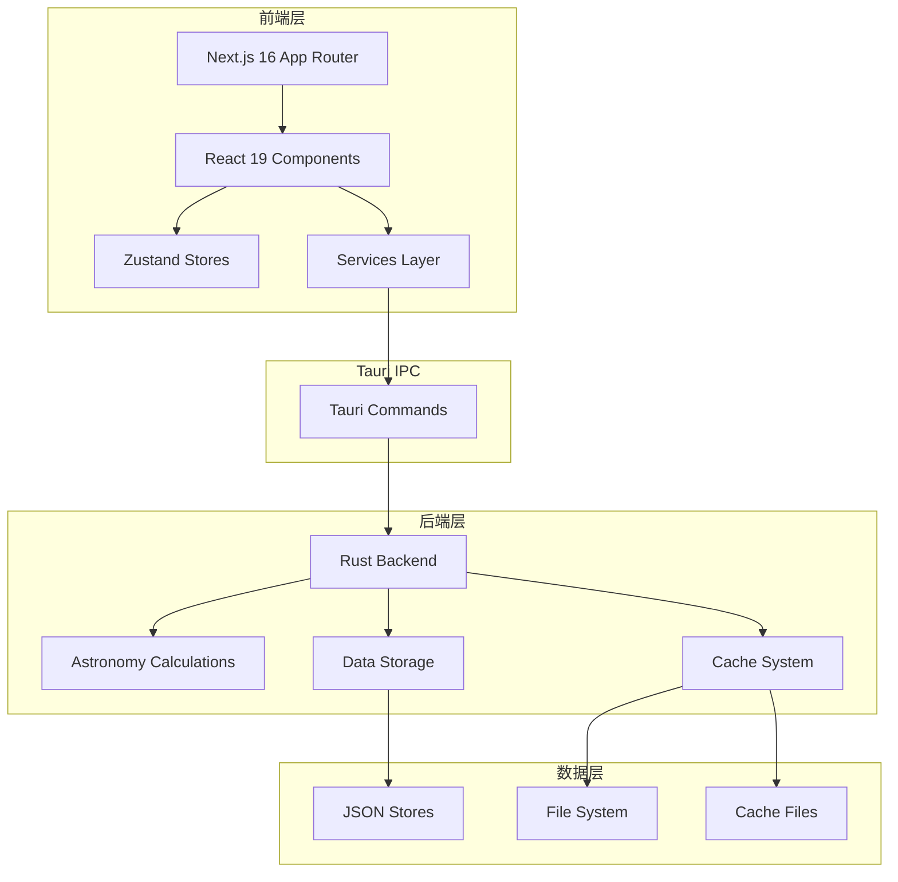
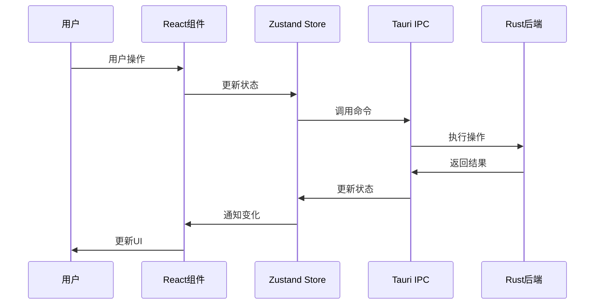

# 开发指南

欢迎来到 SkyMap Test 开发指南！本章节面向希望参与开发或扩展应用功能的开发者。

## 章节内容

### 架构设计

了解应用的系统架构：

- **[架构概览](architecture/index.md)** - 架构设计概述
- **[系统架构](architecture/overview.md)** - 整体系统架构（含架构图）
- **[前端架构](architecture/frontend-architecture.md)** - Next.js + React 前端架构
- **[后端架构](architecture/backend-architecture.md)** - Tauri + Rust 后端架构
- **[数据流](architecture/data-flow.md)** - 前后端数据流设计

### 开发环境

搭建开发环境：

- **[环境概览](development-environment/index.md)** - 开发环境介绍
- **[前置要求](development-environment/prerequisites.md)** - 必需的软件和工具
- **[环境搭建](development-environment/setup.md)** - 详细的环境配置步骤

### 项目结构

了解项目组织：

- **[结构概览](project-structure/index.md)** - 项目结构概述
- **[目录布局](project-structure/directory-layout.md)** - 详细的目录说明

### 核心模块

深入核心模块：

- **[模块概览](core-modules/index.md)** - 核心模块介绍
- **[星图核心](core-modules/starmap-core.md)** - 星图渲染核心
- **[天文计算](core-modules/astronomy-engine.md)** - 天文计算引擎

### API参考

查看API文档：

- **[API概览](apis/index.md)** - API文档导航
- **[前端API](apis/frontend-apis/stores.md)** - Zustand Stores API
- **[后端API](apis/backend-apis/tauri-commands.md)** - Tauri命令API

## 技术栈

### 前端技术

- **Next.js 16** - React框架
- **React 19** - UI库
- **TypeScript** - 类型安全
- **Tailwind CSS** - 样式框架
- **shadcn/ui** - UI组件库
- **Zustand** - 状态管理

### 后端技术

- **Tauri 2.9** - 桌面应用框架
- **Rust** - 系统编程语言
- **JSON File Storage** - 数据存储

## 快速开始

### 前置要求

在开始开发之前，您需要：

- Node.js 20+
- Rust 1.70+
- pnpm 或 npm
- Git

### 克隆仓库

```bash
git clone https://github.com/yourusername/skymap-test.git
cd skymap-test
```

### 安装依赖

```bash
pnpm install
```

### 启动开发

```bash
# Web开发模式
pnpm dev

# 桌面应用模式
pnpm tauri dev
```

## 开发工作流

### 1. 创建功能分支

```bash
git checkout -b feature/your-feature-name
```

### 2. 进行开发

- 修改前端代码
- 添加后端命令
- 编写测试
- 更新文档

### 3. 测试

```bash
# 运行测试
pnpm test

# 类型检查
pnpm build
```

### 4. 提交代码

```bash
git add .
git commit -m "feat: add your feature"
```

### 5. 推送和PR

```bash
git push origin feature/your-feature-name
```

然后在GitHub上创建Pull Request。

## 编码规范

### 代码风格

- 使用TypeScript编写代码
- 遵循ESLint规则
- 使用Prettier格式化代码
- 添加有意义的注释

### 命名约定

- **组件**：PascalCase（如 `StarMap.tsx`）
- **函数**：camelCase（如 `calculatePosition`）
- **常量**：UPPER_SNAKE_CASE（如 `MAX_MAGNITUDE`）
- **类型/接口**：PascalCase（如 `Coordinate`）

### Git提交

使用约定式提交：

- `feat:` 新功能
- `fix:` 修复bug
- `docs:` 文档更新
- `style:` 代码格式调整
- `refactor:` 重构
- `test:` 测试相关
- `chore:` 构建/工具相关

## 架构概览



## 模块组织

### 前端模块

```
app/                          # Next.js页面
components/                   # React组件
  ├── starmap/               # 星图相关组件
  │   ├── core/              # 核心组件
  │   ├── management/        # 管理组件
  │   └── planning/          # 规划组件
  └── ui/                    # UI组件库
lib/                         # 工具库
  ├── astronomy/            # 天文计算
  ├── stores/               # 状态管理
  └── tauri/                # Tauri API
```

### 后端模块

```
src-tauri/src/
  ├── main.rs               # 主入口
  ├── lib.rs                # 库入口
  ├── astronomy.rs          # 天文计算
  ├── storage.rs            # 数据存储
  └── cache.rs              # 缓存管理
```

## 数据流

### 前端到后端



## 测试

### 测试类型

- **单元测试**：测试独立函数和组件
- **集成测试**：测试模块间交互
- **E2E测试**：测试完整流程

### 运行测试

```bash
# 运行所有测试
pnpm test

# 运行特定测试
pnpm test -- StarMapCanvas

# 生成覆盖率报告
pnpm test:coverage
```

## 调试

### 前端调试

- 使用Chrome DevTools
- React DevTools
- Console日志

### 后端调试

- 使用`println!`调试
- VS Code Rust调试器
- 日志文件

## 性能优化

### 前端优化

- React.memo优化组件
- useMemo/useCallback优化hooks
- 虚拟化长列表
- 懒加载组件

### 后端优化

- 异步处理
- 缓存计算结果
- 批量操作
- 索引优化

## 贡献指南

详细的贡献指南请参考：

- [工作流程](contributing/workflow.md)
- [编码规范](contributing/coding-standards.md)
- [提交约定](contributing/commit-conventions.md)
- [PR指南](contributing/pull-requests.md)

## 获取帮助

### 文档

- [API参考](apis/index.md)
- [架构设计](architecture/index.md)
- [项目结构](project-structure/index.md)

### 社区

- [GitHub Discussions](https://github.com/yourusername/skymap-test/discussions)
- [GitHub Issues](https://github.com/yourusername/skymap-test/issues)

## 相关资源

- [Next.js文档](https://nextjs.org/docs)
- [React文档](https://react.dev)
- [Tauri文档](https://tauri.app/)
- [Rust文档](https://doc.rust-lang.org/)

---

开始开发：[架构概览](architecture/index.md)
