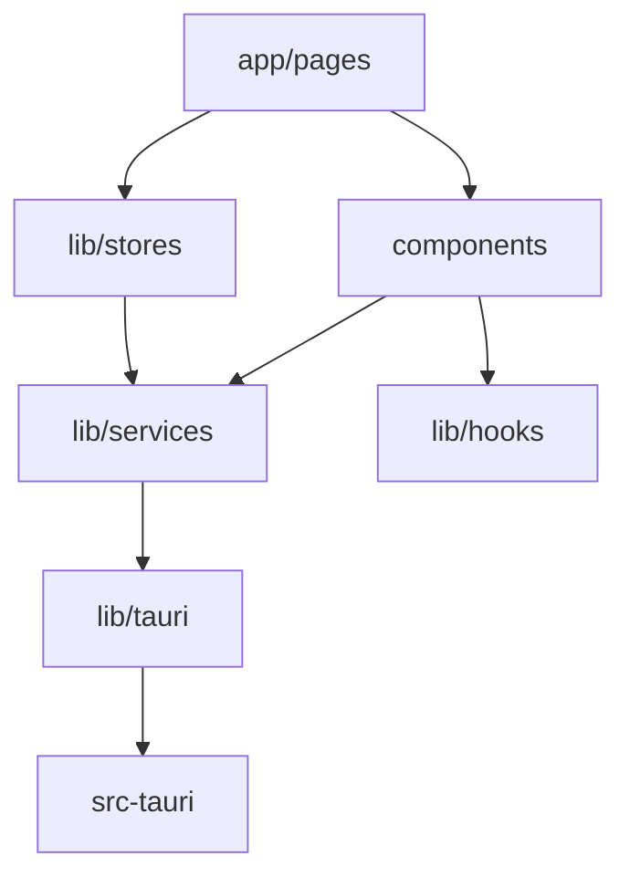

# 目录布局

本文档详细说明 SkyMap Test 项目的目录结构和各模块的职责。

## 项目根目录

```
skymap-test/
├── app/                      # Next.js App Router 页面
├── components/               # React 组件
│   ├── starmap/             # 星图功能组件
│   ├── ui/                  # shadcn/ui 基础组件
│   └── providers/           # Context 提供者
├── lib/                      # 核心业务逻辑库
│   ├── astronomy/           # 天文计算模块
│   ├── catalogs/            # DSO 目录系统
│   ├── core/                # 核心类型和常量
│   ├── hooks/               # React 自定义 Hooks
│   ├── i18n/                # 国际化工具
│   ├── offline/             # 离线缓存管理
│   ├── plate-solving/       # 图像解析
│   ├── security/            # 安全工具
│   ├── services/            # 外部数据服务
│   ├── storage/             # 存储抽象层
│   ├── stores/              # Zustand 状态管理
│   ├── tauri/               # Tauri API 封装
│   └── translations/        # 天体名称翻译
├── public/                   # 静态资源
│   ├── stellarium-data/     # Stellarium 数据文件
│   └── stellarium-js/       # Stellarium WASM 引擎
├── src-tauri/               # Tauri 后端（Rust）
├── i18n/                    # 国际化消息文件
│   └── messages/            # en.json, zh.json
├── tests/                   # 测试文件
│   └── e2e/                 # Playwright E2E 测试
└── docs/                    # MkDocs 文档
```

## 前端目录详解

### app/ - Next.js 页面

```
app/
├── layout.tsx               # 根布局
├── page.tsx                 # 首页
├── globals.css              # 全局样式
└── starmap/                 # 星图页面
    ├── page.tsx             # 星图主页面
    └── layout.tsx           # 星图布局
```

**职责**:
- 定义应用路由
- 配置全局布局
- 服务端渲染配置

### components/ - React 组件

```text
components/
├── ui/                      # shadcn/ui 基础组件 (36个)
│   ├── button.tsx
│   ├── dialog.tsx
│   ├── dropdown-menu.tsx
│   ├── tabs.tsx
│   └── ...
├── starmap/                 # 星图功能组件
│   ├── canvas/              # 星图画布
│   │   └── stellarium-canvas.tsx
│   ├── view/                # 视图容器
│   │   └── stellarium-view.tsx
│   ├── controls/            # 控制组件
│   │   └── zoom-controls.tsx
│   ├── search/              # 搜索组件
│   │   ├── stellarium-search.tsx
│   │   └── advanced-search-dialog.tsx
│   ├── settings/            # 设置组件
│   │   ├── stellarium-settings.tsx
│   │   └── stellarium-survey-selector.tsx
│   ├── time/                # 时间控制
│   │   └── stellarium-clock.tsx
│   ├── mount/               # 赤道仪控制
│   │   └── stellarium-mount.tsx
│   ├── objects/             # 天体信息组件
│   │   ├── info-panel.tsx
│   │   ├── object-detail-drawer.tsx
│   │   ├── object-image-gallery.tsx
│   │   └── object-info-sources-config.tsx
│   ├── overlays/            # 覆盖层组件
│   │   ├── fov-overlay.tsx
│   │   ├── fov-simulator.tsx
│   │   ├── ocular-simulator.tsx
│   │   ├── satellite-overlay.tsx
│   │   ├── satellite-tracker.tsx
│   │   └── sky-markers.tsx
│   ├── planning/            # 观测规划组件
│   │   ├── altitude-chart.tsx
│   │   ├── astro-events-calendar.tsx
│   │   ├── astro-session-panel.tsx
│   │   ├── exposure-calculator.tsx
│   │   ├── observation-log.tsx
│   │   ├── shot-list.tsx
│   │   ├── sky-atlas-panel.tsx
│   │   └── tonight-recommendations.tsx
│   ├── management/          # 管理组件
│   │   ├── data-manager.tsx
│   │   ├── equipment-manager.tsx
│   │   ├── location-manager.tsx
│   │   ├── marker-manager.tsx
│   │   ├── offline-cache-manager.tsx
│   │   └── unified-settings.tsx
│   ├── onboarding/          # 新手引导
│   │   ├── onboarding-tour.tsx
│   │   ├── welcome-dialog.tsx
│   │   └── tour-*.tsx
│   ├── setup-wizard/        # 设置向导
│   │   └── setup-wizard.tsx
│   ├── plate-solving/       # 图像解析
│   │   ├── image-capture.tsx
│   │   └── plate-solver.tsx
│   ├── dialogs/             # 对话框
│   │   ├── about-dialog.tsx
│   │   └── stellarium-credits.tsx
│   └── feedback/            # 反馈组件
│       └── splash-screen.tsx
└── providers/               # Context 提供者
    ├── i18n-provider.tsx
    └── theme-provider.tsx
```

**职责**:

- **ui/**: shadcn/ui 基础组件库，提供一致的 UI 风格
- **starmap/**: 星图核心功能组件，按功能模块组织
- **providers/**: React Context 提供者，管理全局状态

### lib/ - 核心业务逻辑库

```text
lib/
├── core/                      # 核心类型和常量
│   ├── types/                 # 类型定义
│   │   ├── stellarium.ts      # Stellarium 引擎类型
│   │   ├── search.ts          # 搜索相关类型
│   │   ├── equipment.ts       # 设备相关类型
│   │   └── astronomy.ts       # 天文相关类型
│   └── constants/             # 常量定义
│       └── sky-surveys.ts     # 天空巡天配置
├── astronomy/                 # 天文计算模块
│   ├── coordinates/           # 坐标系统
│   │   ├── conversions.ts     # 坐标转换
│   │   ├── formats.ts         # 格式化
│   │   └── transforms.ts      # 坐标系变换
│   ├── time/                  # 时间计算
│   │   ├── julian.ts          # 儒略日
│   │   ├── sidereal.ts        # 恒星时
│   │   └── formats.ts         # 时间格式化
│   ├── celestial/             # 天体位置
│   │   ├── sun.ts             # 太阳位置
│   │   ├── moon.ts            # 月球位置和月相
│   │   └── separation.ts      # 角距离
│   ├── twilight/              # 薄暮计算
│   ├── visibility/            # 可见性计算
│   ├── imaging/               # 成像评估
│   └── horizon/               # 自定义地平线
├── catalogs/                  # DSO 目录系统
│   ├── catalog-data.ts        # 目录数据
│   ├── search-engine.ts       # 搜索引擎
│   ├── fuzzy-search.ts        # 模糊搜索
│   ├── scoring-algorithms.ts  # 评分算法
│   ├── advanced-recommendation-engine.ts  # 推荐引擎
│   ├── nighttime-calculator.ts # 夜间计算
│   └── sky-atlas-store.ts     # 星图集状态
├── services/                  # 外部数据服务
│   ├── astro-events/          # 天文事件服务
│   │   ├── lunar.ts           # 月相事件
│   │   ├── meteor.ts          # 流星雨
│   │   ├── eclipse.ts         # 日月食
│   │   └── aggregator.ts      # 事件聚合
│   ├── satellite/             # 卫星服务
│   │   ├── propagator.ts      # SGP4/SDP4 轨道计算
│   │   └── data-sources.ts    # TLE 数据源
│   ├── hips/                  # HiPS 巡天服务
│   ├── object-info/           # 天体信息服务
│   ├── map-providers/         # 地图提供商
│   ├── geocoding-service.ts   # 地理编码
│   └── connectivity-checker.ts # 连接检测
├── stores/                    # Zustand 状态管理
│   ├── stellarium-store.ts    # 星图引擎状态
│   ├── settings-store.ts      # 应用设置
│   ├── equipment-store.ts     # 设备配置
│   ├── target-list-store.ts   # 目标列表
│   ├── marker-store.ts        # 天空标记
│   ├── satellite-store.ts     # 卫星追踪
│   ├── framing-store.ts       # 取景框
│   ├── mount-store.ts         # 赤道仪
│   ├── onboarding-store.ts    # 新手引导
│   ├── setup-wizard-store.ts  # 设置向导
│   └── theme-store.ts         # 主题定制
├── hooks/                     # React 自定义 Hooks
│   ├── use-geolocation.ts     # 地理位置
│   ├── use-device-orientation.ts # 设备方向
│   ├── use-object-search.ts   # 天体搜索
│   ├── use-tonight-recommendations.ts # 今晚推荐
│   ├── use-target-planner.ts  # 目标规划
│   ├── use-celestial-name.ts  # 天体名称翻译
│   └── use-cache-init.ts      # 缓存初始化
├── tauri/                     # Tauri API 封装
│   ├── api.ts                 # 通用 API
│   ├── astronomy-api.ts       # 天文计算 API
│   ├── cache-api.ts           # 缓存 API
│   ├── events-api.ts          # 事件 API
│   ├── target-list-api.ts     # 目标列表 API
│   ├── markers-api.ts         # 标记 API
│   ├── storage-api.ts         # 存储 API
│   ├── http-api.ts            # HTTP 客户端 API
│   ├── unified-cache-api.ts   # 统一缓存 API
│   ├── geolocation-api.ts     # 地理位置 API
│   ├── hooks.ts               # Tauri React Hooks
│   └── types.ts               # 类型定义
├── storage/                   # 存储抽象层
│   ├── platform.ts            # 平台检测
│   ├── web-storage.ts         # Web localStorage
│   ├── tauri-storage.ts       # Tauri 文件系统
│   └── zustand-storage.ts     # Zustand 持久化
├── offline/                   # 离线缓存
│   ├── cache-manager.ts       # 缓存管理器
│   ├── unified-cache.ts       # 统一缓存
│   └── offline-store.ts       # 离线状态
├── plate-solving/             # 图像解析
│   ├── astrometry-api.ts      # Astrometry.net API
│   ├── fits-parser.ts         # FITS 文件解析
│   └── types.ts               # 类型定义
├── translations/              # 天体名称翻译
│   ├── constellations.ts      # 星座翻译
│   ├── stars.ts               # 恒星翻译
│   └── dso-types.ts           # DSO 类型翻译
├── i18n/                      # 国际化
│   └── locale-store.ts        # 语言偏好
├── security/                  # 安全工具
└── utils.ts                   # 通用工具 (Tailwind CSS cn())
```

**模块职责**:

- **core/**: 共享类型定义和常量，避免循环依赖
- **astronomy/**: 纯函数天文计算库，无副作用
- **catalogs/**: DSO 目录系统，包含搜索和推荐引擎
- **services/**: 外部 API 集成和数据获取
- **stores/**: Zustand 全局状态管理
- **hooks/**: React 业务逻辑封装
- **tauri/**: Tauri 后端 API TypeScript 封装
- **storage/**: 跨平台存储抽象
- **offline/**: 离线缓存管理
- **plate-solving/**: 天文图像坐标解析
- **translations/**: 天体名称多语言翻译

## 后端目录详解

### src-tauri/ - Tauri 后端

```text
src-tauri/
├── src/                      # Rust 源代码
│   ├── main.rs              # 主入口
│   ├── lib.rs               # 库入口，注册所有命令
│   ├── data/                # 数据持久化模块
│   │   ├── storage.rs       # 通用 JSON 存储
│   │   ├── equipment.rs     # 设备管理
│   │   ├── locations.rs     # 位置管理
│   │   ├── observation_log.rs # 观测日志
│   │   ├── target_io.rs     # 目标导入导出
│   │   ├── target_list.rs   # 目标列表管理
│   │   └── markers.rs       # 天空标记
│   ├── astronomy/           # 天文计算模块
│   │   ├── calculations.rs  # 坐标转换、可见性
│   │   └── events.rs        # 天文事件
│   ├── cache/               # 缓存模块
│   │   ├── offline.rs       # 离线瓦片缓存
│   │   └── unified.rs       # 统一缓存系统
│   ├── network/             # 网络通信模块
│   │   ├── http_client.rs   # HTTP 客户端
│   │   ├── security.rs      # 安全模块（URL 验证、输入验证）
│   │   └── rate_limiter.rs  # 速率限制
│   ├── platform/            # 桌面特定功能
│   │   ├── app_settings.rs  # 应用设置
│   │   ├── app_control.rs   # 应用控制
│   │   ├── updater.rs       # 自动更新
│   │   └── plate_solver.rs  # 天文定位解算
│   └── utils.rs             # 工具函数
├── capabilities/            # 权限配置
│   ├── default.json         # 默认权限
│   └── mobile.json          # 移动端权限
├── icons/                   # 应用图标
├── Cargo.toml              # Rust 依赖
├── Cargo.lock              # 依赖锁定
├── tauri.conf.json         # Tauri 配置
└── build.rs                # 构建脚本
```

**Rust 模块职责**:

- **data/**: 数据持久化层
  - `storage.rs`: JSON 文件存储管理，通用 CRUD 操作
  - `equipment.rs`: 望远镜、相机、目镜等设备管理
  - `locations.rs`: 观测位置管理
  - `observation_log.rs`: 观测日志记录
  - `target_list.rs`: 目标列表 CRUD 和批量操作
  - `markers.rs`: 天空标记管理
- **astronomy/**: 天文计算和事件
  - `calculations.rs`: 坐标转换、可见性、月相等计算
  - `events.rs`: 天文事件（流星雨、月相等）
- **cache/**: 缓存系统
  - `offline.rs`: HiPS 瓦片缓存
  - `unified.rs`: 统一缓存系统，支持 TTL
- **network/**: 网络通信和安全
  - `http_client.rs`: 安全的 HTTP 客户端，支持代理和速率限制
  - `security.rs`: 输入验证、URL 白名单、SSRF 防护
  - `rate_limiter.rs`: 滑动窗口速率限制器
- **platform/**: 桌面特定功能
  - `app_settings.rs`: 应用设置和窗口状态
  - `app_control.rs`: 应用生命周期控制
  - `updater.rs`: 自动更新
  - `plate_solver.rs`: 天文图像定位解算

## 配置文件

### 根目录配置

```
skymap-test/
├── package.json          # Node.js 依赖
├── tsconfig.json         # TypeScript 配置
├── next.config.ts        # Next.js 配置
├── tailwind.config.ts    # Tailwind CSS 配置
├── jest.config.ts        # Jest 测试配置
├── playwright.config.ts  # Playwright E2E 配置
├── components.json       # shadcn/ui 配置
└── eslint.config.mjs     # ESLint 配置
```

### 配置文件说明

#### package.json

定义项目依赖和脚本：

```json
{
  "name": "skymap-test",
  "version": "0.1.0",
  "scripts": {
    "dev": "next dev",
    "build": "next build",
    "tauri": "tauri",
    "test": "jest"
  },
  "dependencies": {
    "next": "16.0.0",
    "react": "19.2.0",
    "@tauri-apps/api": "^2.5.0",
    "zustand": "^5.0.8"
  }
}
```

#### tsconfig.json

TypeScript 编译配置：

```json
{
  "compilerOptions": {
    "target": "ES2020",
    "lib": ["ES2020", "DOM", "DOM.Iterable"],
    "jsx": "preserve",
    "module": "ESNext",
    "moduleResolution": "bundler",
    "paths": {
      "@/*": ["./*"],
      "@/components/*": ["components/*"],
      "@/lib/*": ["lib/*"]
    }
  }
}
```

#### next.config.ts

Next.js 配置：

```typescript
import type { NextConfig } from 'next';

const nextConfig: NextConfig = {
  // 输出目录（Tauri 需要）
  output: 'export',
  // 输出目录
  distDir: 'out',
  // 图片优化配置
  images: {
    unoptimized: true
  }
};

export default nextConfig;
```

## 资源文件

### public/ - 静态资源

```
public/
├── images/               # 图片
├── icons/                # 图标
└── fonts/                # 字体
```

### i18n/ - 国际化

```
i18n/
├── en/                   # 英文
│   └── common.json
├── zh/                   # 中文
│   └── common.json
└── config.ts            # i18n 配置
```

## 测试目录

### tests/ - 测试文件

```
tests/
├── unit/                 # 单元测试
│   ├── coordinates.test.ts
│   └── utils.test.ts
├── integration/          # 集成测试
│   └── storage.test.ts
└── e2e/                  # E2E 测试
    └── starmap.spec.ts
```

## 文件命名约定

### TypeScript/React

- **组件**: PascalCase（如 `DataManager.tsx`）
- **工具函数**: kebab-case（如 `format-coordinates.ts`）
- **类型**: kebab-case（如 `stellarium-types.ts`）
- **Hooks**: camelCase（如 `useStellarium.ts`）

### Rust

- **模块**: snake_case（如 `storage.rs`）
- **类型**: PascalCase（如 `StorageManager`）
- **函数**: snake_case（如 `get_storage_stats`）

## 导入路径别名

配置在 `tsconfig.json` 中：

```typescript
// 使用别名导入
import { Button } from '@/components/ui/button';
import { useStellariumStore } from '@/lib/stores/stellarium-store';

// 等同于
import { Button } from '../../components/ui/button';
import { useStellariumStore } from '../../lib/stores/stellarium-store';
```

## 模块依赖关系



## 添加新功能

### 1. 添加新页面

```bash
# 在 app/ 目录创建
app/new-feature/
├── page.tsx
└── layout.tsx
```

### 2. 添加新组件

```bash
# 在 components/ 目录创建
components/new-feature/
└── my-component.tsx
```

### 3. 添加新 Store

```bash
# 在 lib/stores/ 目录创建
lib/stores/new-store.ts
```

### 4. 添加新的 Tauri 命令

```bash
# 在 src-tauri/src/ 创建
src-tauri/src/new_module.rs

# 在 lib.rs 中注册
mod new_module;
```

## 代码组织原则

### 1. 按功能分组

相关文件放在一起：
- 星图相关：`components/starmap/`
- 设备相关：`components/starmap/management/`

### 2. 保持扁平

避免过深的嵌套：
- ✅ `components/starmap/core/`
- ❌ `components/starmap/features/core/render/`

### 3. 清晰的职责

每个模块有明确的职责：
- `lib/stores/`: 只负责状态管理
- `lib/services/`: 只负责业务逻辑
- `components/`: 只负责 UI 渲染

## 性能考虑

### 代码分割

Next.js 自动进行代码分割：

```typescript
// 动态导入大组件
const HeavyComponent = dynamic(
  () => import('./HeavyComponent'),
  { loading: () => <Loader /> }
);
```

### 路由级代码分割

每个页面自动分割：
- `app/page.tsx` → 独立的 chunk
- `app/starmap/page.tsx` → 独立的 chunk

## 相关文档

- [前端模块组织](frontend-modules.md)
- [后端模块组织](backend-modules.md)
- [共享代码管理](shared-code.md)

---

返回：[项目结构](index.md)
