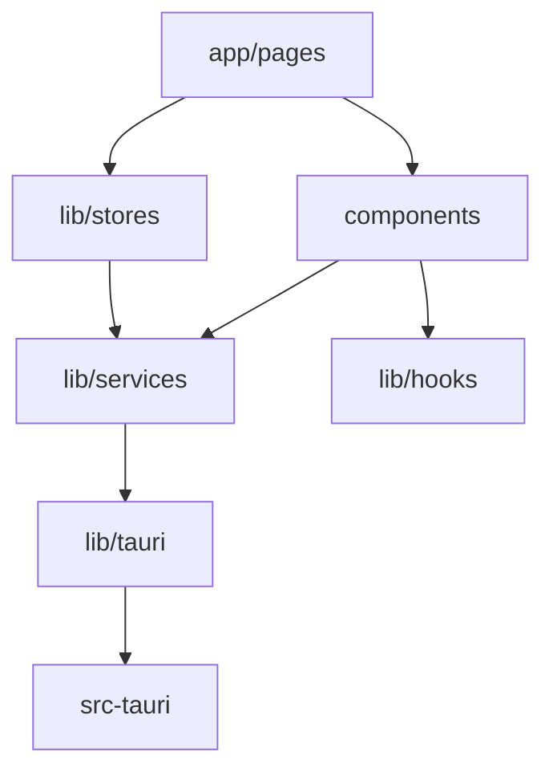

# 目录布局

本文档详细说明 SkyMap Test 项目的目录结构和各模块的职责。

## 项目根目录

```
skymap-test/
├── app/                      # Next.js App Router 页面
├── components/               # React 组件
├── lib/                      # 工具函数和库
├── public/                   # 静态资源
├── src-tauri/               # Tauri 后端（Rust）
├── i18n/                    # 国际化配置
├── tests/                   # 测试文件
└── docs/                    # 文档
```

## 前端目录详解

### app/ - Next.js 页面

```
app/
├── layout.tsx               # 根布局
├── page.tsx                 # 首页
├── globals.css              # 全局样式
└── starmap/                 # 星图页面
    ├── page.tsx             # 星图主页面
    └── layout.tsx           # 星图布局
```

**职责**:
- 定义应用路由
- 配置全局布局
- 服务端渲染配置

### components/ - React 组件

```
components/
├── ui/                      # shadcn/ui 基础组件
│   ├── button.tsx
│   ├── dialog.tsx
│   └── ...
├── starmap/                 # 星图相关组件
│   ├── core/                # 核心组件
│   │   ├── stellarium-canvas.tsx
│   │   ├── stellarium-view.tsx
│   │   └── zoom-controls.tsx
│   ├── management/          # 管理组件
│   │   ├── data-manager.tsx
│   │   ├── equipment-manager.tsx
│   │   └── offline-cache-manager.tsx
│   ├── objects/             # 天体对象组件
│   ├── overlays/            # 覆盖层组件
│   └── planning/            # 规划组件
└── providers/               # Context 提供者
    ├── TauriSyncProvider.tsx
    └── ThemeProvider.tsx
```

**职责**:
- 可复用的 UI 组件
- 业务逻辑组件
- 布局组件

### lib/ - 工具库

```
lib/
├── astronomy/              # 天文学计算
│   ├── coordinates/        # 坐标转换
│   ├── time/              # 时间系统
│   └── visibility/        # 可见性计算
├── catalogs/              # 星表数据
│   ├── hipparcos.ts
│   └── messier.ts
├── core/                  # 核心功能
│   ├── types.ts          # 类型定义
│   └── constants.ts      # 常量
├── hooks/                # 自定义 Hooks
│   ├── useStellarium.ts
│   └── useObjectDetails.ts
├── services/             # 服务层
│   ├── hips-service.ts  # HiPS 图像服务
│   └── object-info-service.ts
├── storage/              # 存储抽象
│   ├── index.ts
│   └── platform.ts
├── stores/               # Zustand 状态管理
│   ├── stellarium-store.ts
│   ├── equipment-store.ts
│   └── target-list-store.ts
├── tauri/               # Tauri API 封装
│   ├── api.ts
│   ├── types.ts
│   └── storage-api.ts
└── utils.ts             # 通用工具函数
```

**职责**:
- 业务逻辑
- 数据处理
- API 封装
- 状态管理

## 后端目录详解

### src-tauri/ - Tauri 后端

```
src-tauri/
├── src/                  # Rust 源代码
│   ├── main.rs          # 主入口
│   ├── lib.rs           # 库入口
│   ├── storage.rs       # 数据存储
│   ├── equipment.rs     # 设备管理
│   ├── astronomy.rs     # 天文计算
│   ├── offline_cache.rs # 离线缓存
│   └── utils.rs         # 工具函数
├── Cargo.toml           # Rust 依赖
├── tauri.conf.json      # Tauri 配置
└── build.rs             # 构建脚本
```

**职责**:
- 桌面应用功能
- 文件系统访问
- 系统级操作
- 数据持久化

## 配置文件

### 根目录配置

```
skymap-test/
├── package.json          # Node.js 依赖
├── tsconfig.json         # TypeScript 配置
├── next.config.ts        # Next.js 配置
├── tailwind.config.ts    # Tailwind CSS 配置
├── jest.config.ts        # Jest 测试配置
├── playwright.config.ts  # Playwright E2E 配置
├── components.json       # shadcn/ui 配置
└── eslint.config.mjs     # ESLint 配置
```

### 配置文件说明

#### package.json

定义项目依赖和脚本：

```json
{
  "name": "skymap-test",
  "version": "0.1.0",
  "scripts": {
    "dev": "next dev",
    "build": "next build",
    "tauri": "tauri",
    "test": "jest"
  },
  "dependencies": {
    "next": "16.0.0",
    "react": "19.2.0",
    "@tauri-apps/api": "^2.5.0",
    "zustand": "^5.0.8"
  }
}
```

#### tsconfig.json

TypeScript 编译配置：

```json
{
  "compilerOptions": {
    "target": "ES2020",
    "lib": ["ES2020", "DOM", "DOM.Iterable"],
    "jsx": "preserve",
    "module": "ESNext",
    "moduleResolution": "bundler",
    "paths": {
      "@/*": ["./*"],
      "@/components/*": ["components/*"],
      "@/lib/*": ["lib/*"]
    }
  }
}
```

#### next.config.ts

Next.js 配置：

```typescript
import type { NextConfig } from 'next';

const nextConfig: NextConfig = {
  // 输出目录（Tauri 需要）
  output: 'export',
  // 输出目录
  distDir: 'out',
  // 图片优化配置
  images: {
    unoptimized: true
  }
};

export default nextConfig;
```

## 资源文件

### public/ - 静态资源

```
public/
├── images/               # 图片
├── icons/                # 图标
└── fonts/                # 字体
```

### i18n/ - 国际化

```
i18n/
├── en/                   # 英文
│   └── common.json
├── zh/                   # 中文
│   └── common.json
└── config.ts            # i18n 配置
```

## 测试目录

### tests/ - 测试文件

```
tests/
├── unit/                 # 单元测试
│   ├── coordinates.test.ts
│   └── utils.test.ts
├── integration/          # 集成测试
│   └── storage.test.ts
└── e2e/                  # E2E 测试
    └── starmap.spec.ts
```

## 文件命名约定

### TypeScript/React

- **组件**: PascalCase（如 `DataManager.tsx`）
- **工具函数**: kebab-case（如 `format-coordinates.ts`）
- **类型**: kebab-case（如 `stellarium-types.ts`）
- **Hooks**: camelCase（如 `useStellarium.ts`）

### Rust

- **模块**: snake_case（如 `storage.rs`）
- **类型**: PascalCase（如 `StorageManager`）
- **函数**: snake_case（如 `get_storage_stats`）

## 导入路径别名

配置在 `tsconfig.json` 中：

```typescript
// 使用别名导入
import { Button } from '@/components/ui/button';
import { useStellariumStore } from '@/lib/stores/stellarium-store';

// 等同于
import { Button } from '../../components/ui/button';
import { useStellariumStore } from '../../lib/stores/stellarium-store';
```

## 模块依赖关系



## 添加新功能

### 1. 添加新页面

```bash
# 在 app/ 目录创建
app/new-feature/
├── page.tsx
└── layout.tsx
```

### 2. 添加新组件

```bash
# 在 components/ 目录创建
components/new-feature/
└── my-component.tsx
```

### 3. 添加新 Store

```bash
# 在 lib/stores/ 目录创建
lib/stores/new-store.ts
```

### 4. 添加新的 Tauri 命令

```bash
# 在 src-tauri/src/ 创建
src-tauri/src/new_module.rs

# 在 lib.rs 中注册
mod new_module;
```

## 代码组织原则

### 1. 按功能分组

相关文件放在一起：
- 星图相关：`components/starmap/`
- 设备相关：`components/starmap/management/`

### 2. 保持扁平

避免过深的嵌套：
- ✅ `components/starmap/core/`
- ❌ `components/starmap/features/core/render/`

### 3. 清晰的职责

每个模块有明确的职责：
- `lib/stores/`: 只负责状态管理
- `lib/services/`: 只负责业务逻辑
- `components/`: 只负责 UI 渲染

## 性能考虑

### 代码分割

Next.js 自动进行代码分割：

```typescript
// 动态导入大组件
const HeavyComponent = dynamic(
  () => import('./HeavyComponent'),
  { loading: () => <Loader /> }
);
```

### 路由级代码分割

每个页面自动分割：
- `app/page.tsx` → 独立的 chunk
- `app/starmap/page.tsx` → 独立的 chunk

## 相关文档

- [前端模块组织](frontend-modules.md)
- [后端模块组织](backend-modules.md)
- [共享代码管理](shared-code.md)

---

返回：[项目结构](index.md)
