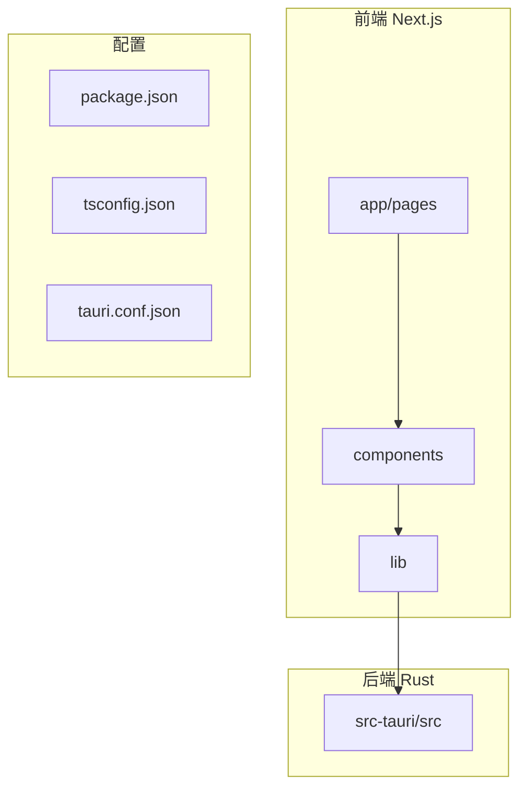
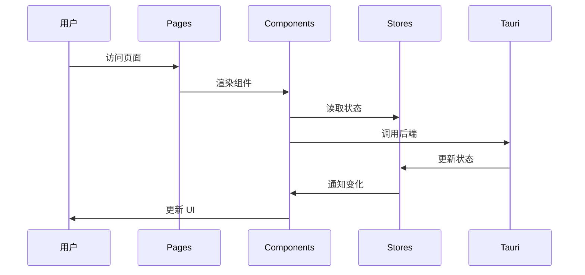

# 项目结构概览

本文档介绍 SkyMap Test 项目的整体结构和组织方式。

## 项目概览

SkyMap Test 是一个全栈桌面应用，结合了现代 Web 技术和 Rust 性能优势。



## 技术栈分层

### 表现层

- **Next.js 16**: 应用框架
- **React 19**: UI 库
- **Tailwind CSS**: 样式
- **shadcn/ui**: UI 组件

### 业务层

- **Zustand**: 状态管理
- **Custom Hooks**: 自定义钩子
- **Services**: 业务逻辑

### 数据层

- **Tauri 2.9**: 桌面框架
- **Rust**: 后端逻辑
- **SQLite**: 数据存储
- **文件系统**: 缓存管理

## 目录结构总览

```
skymap-test/
├── app/                    # Next.js 页面和路由
├── components/             # React 组件
│   ├── ui/                # shadcn/ui 基础组件
│   └── starmap/           # 星图功能组件
├── lib/                   # 工具库和业务逻辑
│   ├── astronomy/        # 天文学计算
│   ├── stores/           # Zustand 状态管理
│   ├── services/         # 服务层
│   └── tauri/            # Tauri API 封装
├── src-tauri/            # Rust 后端
│   └── src/             # Rust 源代码
├── public/               # 静态资源
├── i18n/                # 国际化
└── docs/                # 项目文档
```

## 核心模块

### 1. 星图核心 (app/starmap/)

**职责**: 星图显示和交互

**关键文件**:
- `page.tsx`: 星图主页面
- `layout.tsx`: 星图布局
- `components/`: 星图组件

### 2. 组件库 (components/)

**职责**: 可复用的 UI 组件

**子模块**:
- `ui/`: 基础组件（button, dialog等）
- `starmap/core/`: 星图核心组件
- `starmap/management/`: 管理组件
- `starmap/planning/`: 规划组件

### 3. 工具库 (lib/)

**职责**: 业务逻辑和工具函数

**子模块**:
- `astronomy/`: 天文计算
- `stores/`: 状态管理
- `services/`: 服务层
- `tauri/`: 后端 API

### 4. 后端 (src-tauri/)

**职责**: 桌面应用功能

**主要模块**:
- `storage.rs`: 数据存储
- `astronomy.rs`: 天文计算
- `offline_cache.rs`: 缓存管理

## 模块交互



## 代码规模

### 前端

- **页面**: ~10
- **组件**: ~80+
- **Hooks**: ~20
- **Stores**: 9
- **服务**: ~15

### 后端

- **Rust 模块**: 12
- **Tauri 命令**: 100+
- **代码行数**: ~5000 行

## 开发工作流

### 前端开发

```bash
# 1. 创建组件
touch components/my-component.tsx

# 2. 创建 Store
touch lib/stores/my-store.ts

# 3. 在页面中使用
# app/my-page/page.tsx
```

### 后端开发

```bash
# 1. 创建 Rust 模块
touch src-tauri/src/my_module.rs

# 2. 在 lib.rs 中注册
# mod my_module;

# 3. 添加 Tauri 命令
# #[tauri::command]
```

## 文档结构

```
docs/
├── getting-started/      # 快速开始
├── user-guide/          # 用户指南
├── developer-guide/     # 开发指南
│   ├── architecture/    # 架构设计
│   ├── project-structure/  # 项目结构
│   └── apis/           # API 参考
└── reference/          # 参考资料
```

## 扩展项目

### 添加新功能

1. **前端功能**:
   - 在 `components/` 创建组件
   - 在 `lib/stores/` 创建状态
   - 在 `app/` 创建页面

2. **后端功能**:
   - 在 `src-tauri/src/` 创建模块
   - 在 `lib/tauri/` 封装 API
   - 在组件中调用

3. **文档更新**:
   - 更新用户指南
   - 更新 API 文档
   - 添加代码注释

## 相关文档

- [目录布局详解](directory-layout.md)
- [前端模块](frontend-modules.md)
- [后端模块](backend-modules.md)

---

返回：[项目结构](index.md)
