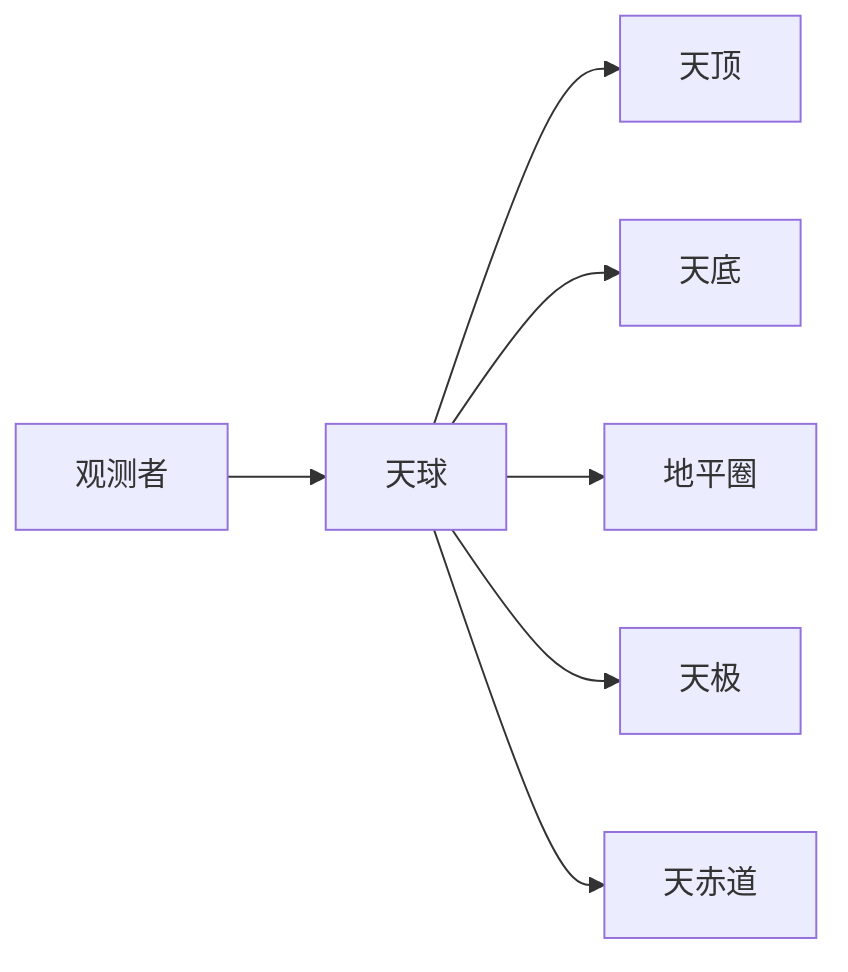

# 基本概念

本文档介绍使用 SkyMap Test 需要了解的天文学基本概念。

## 天球坐标系

### 什么是天球

天球是一个想象中的球体，以观测者为球心，所有天体都投影在这个球面上。天球是天文观测的基础概念。



### 地平坐标系

地平坐标系以观测者为基准，是最直观的坐标系统。

#### 主要元素

- **天顶**：观测者正上方的点
- **天底**：观测者正下方的点
- **地平圈**：天球与地平面相交的大圆
- **方位角**：从正北顺时针测量的角度（0°-360°）
- **高度角**：从地平圈向上测量的角度（-90° 到 +90°）

#### 使用场景

- 肉眼观测
- 寻星镜定位
- 判断天体可见性

### 赤道坐标系

赤道坐标系以天赤道为基准，是天文学中最重要的坐标系统。

#### 主要元素

- **天赤道**：地球赤道在天球上的投影
- **天极**：地球自转轴与天球的交点
- **赤经**：沿天赤道测量的经度（0h-24h）
- **赤纬**：沿天球测量的纬度（-90° 到 +90°）

#### 使用场景

- 星表和天文数据库
- 望远镜指向
- 长期天文观测

### 坐标系转换

SkyMap Test 支持多种坐标系统之间的转换：

- 地平坐标 ↔ 赤道坐标
- 赤道坐标 ↔ 银河坐标
- 赤道坐标 ↔ 黄道坐标

## 时间系统

### 世界时 (UT)

世界时是基于地球自转的时间系统：

- **UT0**：原始观测的世界时
- **UT1**：修正极移后的世界时
- **UTC**：协调世界时，使用跳秒保持与 UT1 接近

### 恒星时

恒星时基于地球相对于恒星的自转：

- **地方恒星时 (LST)**：观测者所在位置的恒星时
- **格林尼治恒星时 (GST)**：格林尼治的恒星时

**关系**：

```
LST = GST + 东经
```

### 儒略日

儒略日是天文计算中常用的时间表示方法：

- 从公元前4713年1月1日正午开始连续计数
- 便于计算两个日期之间的时间间隔
- SkyMap Test 内部使用儒略日进行时间计算

## 天体坐标表示

### 赤经表示

赤经有两种表示方式：

1. **小时制**（推荐）
   - 格式：`12h 34m 56.7s`
   - 范围：0h - 24h
   - 1小时 = 15度

2. **度数制**
   - 格式：`188.73625°`
   - 范围：0° - 360°

### 赤纬表示

赤纬的标准表示：

- 格式：`+12° 34' 56.7"`
- 范围：-90° 到 +90°
- 北天极为 +90°，南天极为 -90°

## 天体运动

### 周日运动

由于地球自转，天体每天东升西落：

- **东天区天体**：从东方升起
- **西天区天体**：向西方落下
- **拱极天体**：永不落下（取决于观测者纬度）

### 周年运动

由于地球公转，天体位置在一年中逐渐变化：

- 太阳沿黄道运动
- 恒星的观测时间每天提前约4分钟
- 季节星空的变化

### 行星运动

行星相对于恒星的复杂运动：

- **顺行**：正常的由西向东运动
- **逆行**：暂时的由东向西运动
- **留**：顺行和逆行之间的转折点

## 星等和亮度

### 星等的定义

星等是天体亮度的度量：

- 数值越小，天体越亮
- 每差5个星等，亮度相差100倍
- 每差1个星等，亮度相差约2.512倍

### 星等类型

- **视星等**：天体在地球上的观测亮度
- **绝对星等**：天体在10秒差距处的亮度
- **摄影星等**：通过特定滤镜测量的亮度

### 常见天体星等

- 太阳：-26.7
- 满月：-12.7
- 金星（最亮）：-4.6
- 天狼星（最亮恒星）：-1.46
- 肉眼可见极限：约 6.0

## 观测条件

### 大气消光

地球大气会吸收和散射星光：

- 天顶方向消光最小
- 地平方向消光最大（约3个星等）
- 蓝光比红光消光更严重

### 大气折射

大气折射会使天体位置看起来升高：

- 天顶处折射为0
- 地平处折射约0.5°
- SkyMap Test 自动修正大气折射

### 光污染

光污染影响观测效果：

- 城市中心：极限星等约3-4等
- 郊区：极限星等约5-6等
- 黑暗天空：极限星等7等以上

## 曙暮光

### 定义

曙暮光是日出前和日后的天空变亮现象。

### 类型

- **天文曙暮光**：太阳在地平下18°-12°
- **航海曙暮光**：太阳在地平下12°-6°
- **民用曙暮光**：太阳在地平下6°-0°

### 观测意义

- 天文曙暮光结束时才开始真正的夜间观测
- SkyMap Test 可计算曙暮光时间

## 下一步

了解这些基本概念后，您可以：

1. 阅读[功能导览](quick-tour.md)了解应用功能
2. 查看[用户指南](../user-guide/index.md)学习具体操作
3. 深入学习[天文学基础](../reference/astronomy-basics/index.md)

## 参考资料

- [天文学基础](../reference/astronomy-basics/index.md)
- [术语表](../reference/glossary.md)
- [坐标系统详细说明](../reference/astronomy-basics/coordinates.md)
