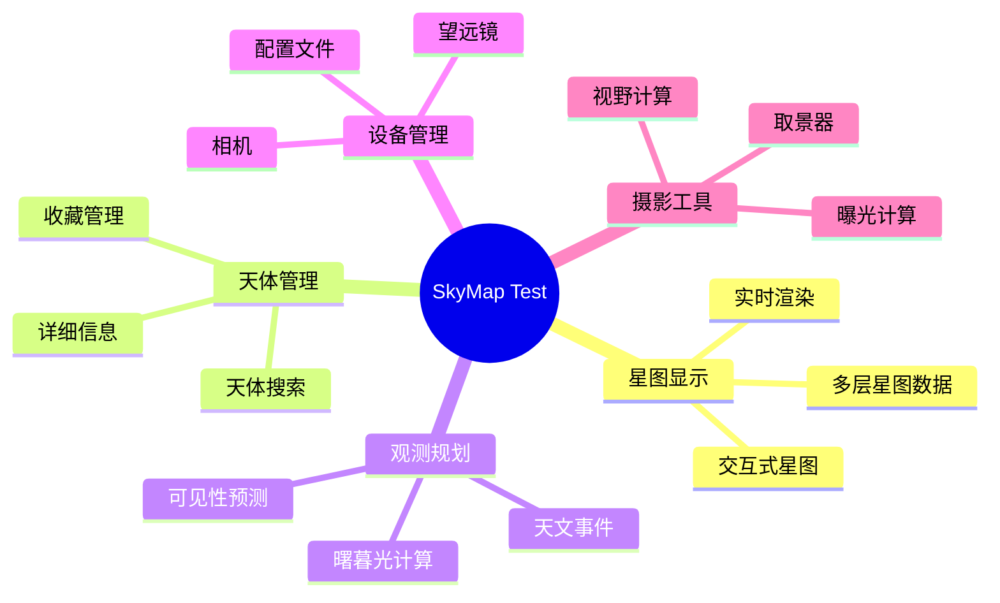

# 功能导览

本文档快速介绍 SkyMap Test 的主要功能。

## 入门引导流程（v2）

首次进入 `/starmap` 时，引导流程为：

1. 欢迎弹窗
2. 设置向导（位置/设备为软约束，可解释性跳过）
3. 核心导览（first-run-core）
4. 模块导览中心（可继续进入专题导览）

专题导览按模块提供：

- `module-discovery`（搜索、今晚推荐、星图图集、导航历史、视角书签）
- `module-planning`（会话规划、天文事件、计算器、观测日志、标记/位置）
- `module-imaging`（FOV、曝光、拍摄清单、设备管理、盲解、目镜模拟）
- `module-controls`（缩放、位置、卫星、赤道仪、主题/语言/夜视）
- `module-settings-help`（设置、快捷键、关于）
- `module-advanced`（盲解、卫星、赤道仪、目镜模拟、高级计算）

## 主要功能概览

SkyMap Test 包含以下主要功能模块：

## 1. 星图显示功能

### 实时星图渲染

- **动态星图**：实时显示当前星空
- **时间控制**：可以暂停、加速、倒流时间
- **平滑动画**：流畅的天体运动动画

### 多层星图数据

支持的星图图层：

- 恒星层（HIPPARCOS、Tycho等）
- 深空天体层（M、NGC、IC等）
- 太阳系天体（太阳、月亮、行星）
- 人造卫星（需要网络连接）
- 自定义标记层

### 交互控制

- **鼠标操作**：
  - 拖动旋转视角
  - 滚轮缩放
  - 右键平移

- **键盘快捷键**：
  - 方向键旋转
  - +/- 缩放
  - T 返回当前时间
  - Space 暂停/继续

### 辅助显示

- **坐标网格**：地平坐标、赤道坐标
- **星座图案**：星座连线、边界、名称
- **参考线**：黄道、银河、天赤道
- **方位标记**：东、南、西、北、天顶

## 2. 天体管理功能

### 天体搜索

快速查找天体：

- **智能搜索**：支持模糊匹配
- **多种编号**：支持梅西耶、NGC、IC等编号
- **天体名称**：支持通用名和学名
- **历史记录**：保存搜索历史

### 详细信息

查看天体的详细信息：

- **基本数据**：坐标、星等、大小
- **物理性质**：距离、类型、亮度
- **可见性**：当前和未来可见性
- **图像**：Deep Sky Survey 图像

### 收藏管理

管理常用天体：

- **添加收藏**：将感兴趣的天体加入收藏
- **分类管理**：创建收藏分类
- **快速定位**：一键定位到收藏天体

## 3. 观测规划功能

### 可见性预测

预测天体的可见情况：

- **升落时间**：计算天体的升起和落下时间
- **最高点**：计算天体到达最高点的时间和高度
- **可见时段**：显示最佳观测时段
- **全年可见性**：生成全年可见性图表

### 曙暮光计算

计算曙暮光时间：

- **天文曙暮光**：太阳在地平下18°
- **航海曙暮光**：太阳在地平下12°
- **民用曙暮光**：太阳在地平下6°
- **最佳观测时间**：天文曙暮光结束到开始

### 天文事件

预报天文事件：

- **月相**：满月、新月、上弦月、下弦月
- **日月食**：日食、月食的时间和可见地区
- **行星合**：行星相合的时间和位置
- **流星雨**：主要流星雨的时间和强度

### 目标列表

管理观测目标：

- **创建列表**：创建观测目标列表
- **优先级**：设置目标优先级
- **状态跟踪**：记录观测状态（未观测、已观测等）
- **导入导出**：支持导入导出目标列表

## 4. 设备管理功能

### 望远镜管理

管理望远镜配置：

- **添加望远镜**：记录望远镜参数
- **焦距和口径**：设置望远镜的焦距和口径
- **类型选择**：折射、反射、折反射等
- **默认设置**：设置默认望远镜

### 相机管理

管理天文相机：

- **添加相机**：记录相机参数
- **传感器尺寸**：设置相机传感器尺寸
- **像素大小**：设置像素大小
- **分辨率**：设置相机分辨率

### 配置文件

创建设备组合：

- **组合配置**：望远镜+相机+滤镜组合
- **快速切换**：在不同配置间快速切换
- **导出导入**：分享配置文件

## 5. 摄影工具功能

### 视野计算

计算摄影视野：

- **FOV计算**：根据设备参数计算视场大小
- **取景器**：在星图上显示相机视野范围
- **构图辅助**：帮助规划摄影构图

### 曝光计算

计算曝光参数：

- **天体亮度**：考虑天体亮度
- **焦比**：根据望远镜焦比
- **传感器**：考虑相机传感器性能
- **建议参数**：提供曝光建议

### 拍摄规划

规划拍摄任务：

- **拍摄序列**：创建拍摄序列
- **总时长**：计算总曝光时长
- **进度跟踪**：跟踪拍摄进度

## 6. 离线功能

### 数据缓存

缓存星图数据：

- **自动缓存**：自动缓存浏览过的区域
- **手动下载**：下载特定区域的数据
- **缓存管理**：管理缓存数据

### 离线模式

离线使用应用：

- **离线星图**：使用缓存数据显示星图
- **离线计算**：离线进行天文计算
- **同步更新**：联网后自动更新数据

## 7. 数据管理

### 数据导出

导出各类数据：

- **观测日志**：导出观测记录
- **目标列表**：导出观测目标
- **设备配置**：导出设备配置
- **图像**：导出星图截图

### 数据导入

导入外部数据：

- **星表**：导入自定义星表
- **目标列表**：导入其他软件的目标列表
- **配置**：导入配置文件

## 8. 自定义设置

### 显示设置

自定义显示选项：

- **星等限制**：调整显示的最暗星等
- **星图样式**：选择星图颜色和样式
- **标签显示**：自定义标签显示
- **网格样式**：自定义坐标网格

### 界面设置

自定义界面布局：

- **主题选择**：亮色/暗色主题
- **布局调整**：调整面板位置
- **快捷键**：自定义快捷键
- **语言**：选择界面语言

## 典型使用场景

### 场景1：今晚观测什么

1. 打开应用，设置观测位置和时间
2. 查看"今晚推荐"功能
3. 浏览推荐的天体
4. 添加到观测列表
5. 查看详细信息和可见性

### 场景2：规划深空摄影

1. 选择摄影目标
2. 配置设备（望远镜、相机）
3. 计算视野和构图
4. 确定最佳拍摄时间
5. 制定拍摄计划

### 场景3：学习星座

1. 显示星座连线
2. 逐个浏览星座
3. 查看星座详情
4. 学习星座内主要天体
5. 测试自己的知识

## 下一步

完成功能导览后，您可以：

1. 深入学习[用户指南](../user-guide/index.md)
2. 阅读[开发指南](../developer-guide/index.md)了解开发相关内容
3. 查看具体功能的详细文档

## 需要帮助？

- 查看[常见问题](../reference/faq.md)
- 阅读[故障排除](../reference/troubleshooting.md)
- 访问社区论坛
