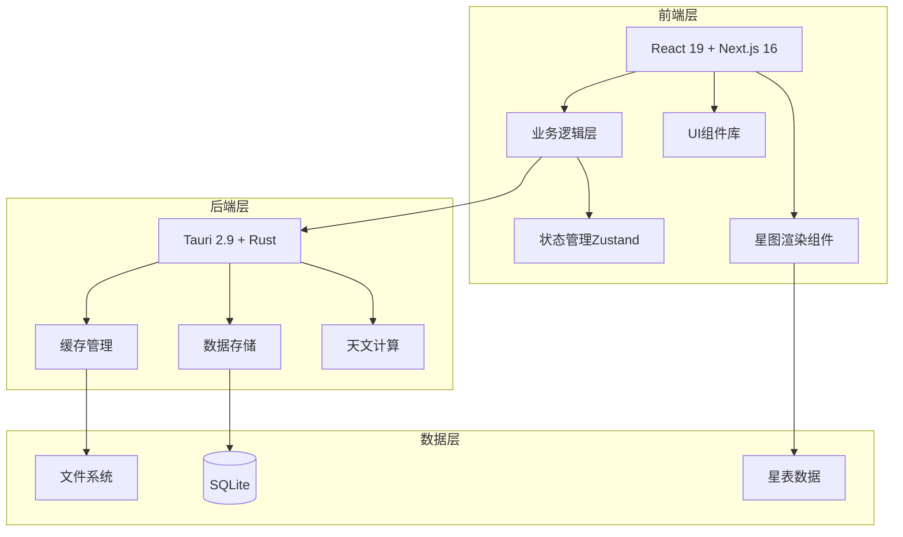

# SkyMap Test

## 项目简介

SkyMap Test 是一款功能强大的天文观测桌面应用程序，专为天文爱好者和业余天文学家设计。它提供了专业的星图显示、精确的天文计算、完善的设备管理以及智能的观测规划功能。

## 核心特性

### 专业的星图显示

- 实时渲染的交互式星图
- 支持多种星图 survey（HIPPARCOS、Tycho等）
- 精确的天体位置计算
- 支持自定义星表和数据源

### 智能观测规划

- 天体可见性预测
- 曙暮光时间计算
- 天文事件预报（日月食、行星合等）
- 目标列表管理
- 最佳观测时间推荐

### 完善的设备管理

- 望远镜配置和管理
- 相机参数设置
- 赤道仪控制
- 自定义设备配置文件

### 强大的天文摄影工具

- 视野计算器
- 取景器预览
- 曝光时间计算
- 构图辅助工具

### 离线工作支持

- 本地缓存星表数据
- 离线模式支持
- 智能缓存管理
- 统一缓存系统

### 跨平台支持

- Windows、macOS、Linux
- 基于现代 Web 技术栈
- 原生桌面体验

## 技术架构

### 前端技术栈

- **Next.js 16** - React 框架
- **React 19** - UI 库
- **TypeScript** - 类型安全
- **Tailwind CSS** - 样式框架
- **shadcn/ui** - UI 组件库
- **Zustand** - 状态管理

### 后端技术栈

- **Tauri 2.9** - 桌面应用框架
- **Rust** - 系统编程语言
- **SQLite** - 本地数据存储
- **统一缓存系统** - 数据缓存管理

## 系统架构图



## 快速开始

### 安装

```bash
# 克隆仓库
git clone https://github.com/yourusername/skymap-test.git
cd skymap-test

# 安装依赖
pnpm install
```

### 运行

```bash
# Web 开发模式
pnpm dev

# 桌面应用开发模式
pnpm tauri dev
```

### 构建

```bash
# 构建 Web 应用
pnpm build

# 构建桌面应用
pnpm tauri build
```

## 文档导航

### 用户指南

如果您是普通用户，想要学习如何使用 SkyMap Test：

- **[快速开始](getting-started/index.md)** - 快速上手指南
- **[用户指南](user-guide/index.md)** - 详细功能说明

### 开发者指南

如果您想参与开发或扩展功能：

- **[开发指南](developer-guide/index.md)** - 开发文档
- **[API 参考](developer-guide/apis/index.md)** - API 文档
- **[架构设计](developer-guide/architecture/index.md)** - 系统架构

### 部署指南

如果您想部署或分发应用：

- **[部署指南](deployment/index.md)** - 部署文档

### 参考资料

- **[天文学基础](reference/astronomy-basics/index.md)** - 天文学知识
- **[术语表](reference/glossary.md)** - 专业术语解释
- **[常见问题](reference/faq.md)** - 常见问题解答

## 社区与支持

- **GitHub**: [https://github.com/yourusername/skymap-test](https://github.com/yourusername/skymap-test)
- **问题反馈**: [GitHub Issues](https://github.com/yourusername/skymap-test/issues)
- **讨论区**: [GitHub Discussions](https://github.com/yourusername/skymap-test/discussions)

## 许可证

[MIT License](LICENSE)

---

**开始使用**: [快速开始指南](getting-started/index.md)
