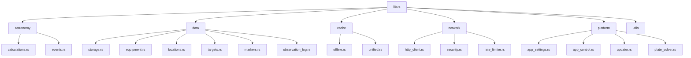

# rust-backend Module

[Root](../../CLAUDE.md) > **src-tauri/src**

> **Last Updated:** 2025-01-31
> **Module Type:** Rust (Tauri 2.9)

---

## Breadcrumb

`[Root](../../CLAUDE.md) > **src-tauri/src**`

---

## Module Responsibility

The `src-tauri/src` module is the Rust backend for the Tauri desktop application. It provides all Tauri commands that are called from the frontend via IPC, organized into feature modules.

**Design Principle:** Commands are organized by domain into separate modules. Each command is self-contained with proper error handling and logging.

---

## Entry Points

| File | Purpose |
|------|---------|
| `main.rs` | Application entry point |
| `lib.rs` | Module organization and command registration |

---

## Module Structure



---

## Module Descriptions

### astronomy/

Provides astronomical calculations and event data.

**See:** [astronomy/CLAUDE.md](./astronomy/CLAUDE.md)

### data/

Provides data persistence and management.

**See:** [data/CLAUDE.md](./data/CLAUDE.md)

### cache/

Provides caching functionality for offline operation and performance.

**See:** [cache/CLAUDE.md](./cache/CLAUDE.md)

### network/

Provides HTTP client with security and rate limiting.

**See:** [network/CLAUDE.md](./network/CLAUDE.md)

### platform/

Desktop-only features (not available on mobile).

**See:** [platform/CLAUDE.md](./platform/CLAUDE.md)

---

## Command Registration

All commands are registered in `lib.rs` using `tauri::generate_handler!`:

```rust
#[cfg_attr(mobile, tauri::mobile_entry_point)]
pub fn run() {
    tauri::Builder::default()
        .plugin(tauri_plugin_fs::init())
        .plugin(tauri_plugin_dialog::init())
        .setup(|app| {
            // Plugin initialization
            Ok(())
        })
        .invoke_handler(tauri::generate_handler![
            // Storage commands
            save_store_data,
            load_store_data,
            // ... many more
        ])
        .run(tauri::generate_context!())
        .expect("error while running tauri application");
}
```

---

## Tauri Commands

Commands are defined with `#[tauri::command]`:

```rust
#[tauri::command]
pub async fn save_store_data(
    app: AppHandle,
    store_name: String,
    data: String,
) -> Result<(), StorageError> {
    let path = get_store_path(&app, &store_name)?;
    validate_size(&data, MAX_JSON_SIZE)?;
    fs::write(&path, &data)?;
    Ok(())
}
```

---

## Error Handling

All modules use `thiserror` for error types:

```rust
use thiserror::Error;

#[derive(Error, Debug)]
pub enum StorageError {
    #[error("Failed to get app data directory")]
    AppDataDirNotFound,
    #[error("IO error: {0}")]
    Io(#[from] std::io::Error),
    #[error("JSON serialization error: {0}")]
    Json(#[from] serde_json::Error),
}

impl serde::Serialize for StorageError {
    fn serialize<S>(&self, serializer: S) -> Result<S::Ok, S::Error>
    where
        S: serde::Serializer,
    {
        serializer.serialize_str(&self.to_string())
    }
}
```

---

## Platform Configuration

### Desktop Only

Some modules are only available on desktop platforms:

```rust
#[cfg(desktop)]
pub mod platform;

#[cfg(desktop)]
use platform::{
    load_app_settings,
    save_app_settings,
    // ... other desktop commands
};
```

### Mobile Only

```rust
#[cfg(mobile)]
app.handle().plugin(tauri_plugin_geolocation::init())?;
```

---

## Dependencies

Key dependencies from `Cargo.toml`:

| Crate | Version | Purpose |
|-------|---------|---------|
| `tauri` | 2.9.0 | Desktop framework |
| `serde` | 1.0 | Serialization |
| `serde_json` | 1.0 | JSON handling |
| `tokio` | 1 | Async runtime |
| `chrono` | 0.4 | Date/time |
| `reqwest` | 0.12 | HTTP client |
| `regex-lite` | 0.1 | Regex (lightweight) |

---

## Testing

Run tests with:

```bash
cd src-tauri
cargo test
```

Run specific module tests:

```bash
cargo test --package app storage::tests
```

---

## Related Files

- [`lib.rs`](./lib.rs) - Module exports and command registration
- [`main.rs`](./main.rs) - Application entry point
- [`Cargo.toml`](../Cargo.toml) - Dependencies
- [Root CLAUDE.md](../../CLAUDE.md) - Project documentation
